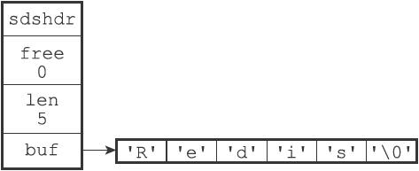
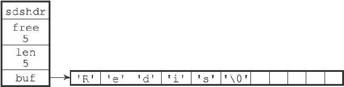

2.1 SDS的定义

每个sds.h/sdshdr结构表示一个SDS值：

---

>  
> struct sdshdr {  
> //   
> 记录buf  
> 数组中已使用字节的数量  
> //   
> 等于SDS  
> 所保存字符串的长度  
> int len;  
> //   
> 记录buf  
> 数组中未使用字节的数量  
> int free;  
> //   
> 字节数组，用于保存字符串  
> char buf\[\];  
> };  

---

图2-1展示了一个SDS示例：

图2-1 SDS示例

·free属性的值为0，表示这个SDS没有分配任何未使用空间。

·len属性的值为5，表示这个SDS保存了一个五字节长的字符串。

·buf属性是一个char类型的数组，数组的前五个字节分别保存了'R'、'e'、'd'、'i'、's'五个字符，而最后一个字节则保存了空字符'\\0'。

SDS遵循C字符串以空字符结尾的惯例，保存空字符的1字节空间不计算在SDS的len属性里面，并且为空字符分配额外的1字节空间，以及添加空字符到字符串末尾等操作，都是由SDS函数自动完成的，所以这个空字符对于SDS的使用者来说是完全透明的。遵循空字符结尾这一惯例的好处是，SDS可以直接重用一部分C字符串函数库里面的函数。

举个例子，如果我们有一个指向图2-1所示SDS的指针s，那么我们可以直接使用<stdio.h>/printf函数，通过执行以下语句：

---

>  
> printf("%s", s->buf);  

---

来打印出SDS保存的字符串值“Redis”，而无须为SDS编写专门的打印函数。

图2-2展示了另一个SDS示例。这个SDS和之前展示的SDS一样，都保存了字符串值“Redis”。这个SDS和之前展示的SDS的区别在于，这个SDS为buf数组分配了五字节未使用空间，所以它的free属性的值为5（图中使用五个空格来表示五字节的未使用空间）。

图2-2 带有未使用空间的SDS示例

接下来的一节将详细地说明未使用空间在SDS中的作用。
