2.2 SDS与C字符串的区别

根据传统，C语言使用长度为N+1的字符数组来表示长度为N的字符串，并且字符数组的最后一个元素总是空字符'\\0'。

例如，图2-3就展示了一个值为"Redis"的C字符串。

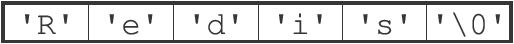

图2-3 C字符串

C语言使用的这种简单的字符串表示方式，并不能满足Redis对字符串在安全性、效率以及功能方面的要求，本节接下来的内容将详细对比C字符串和SDS之间的区别，并说明SDS比C字符串更适用于Redis的原因。

2.2.1 常数复杂度获取字符串长度   

因为C字符串并不记录自身的长度信息，所以为了获取一个C字符串的长度，程序必须遍历整个字符串，对遇到的每个字符进行计数，直到遇到代表字符串结尾的空字符为止，这个操作的复杂度为O（N）。

举个例子，图2-4展示了程序计算一个C字符串长度的过程。

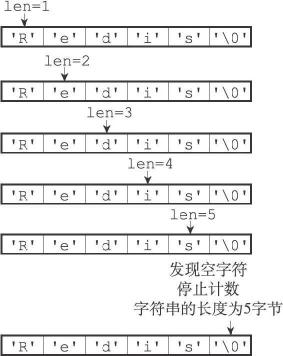

图2-4 计算C字符串长度的过程

和C字符串不同，因为SDS在len属性中记录了SDS本身的长度，所以获取一个SDS长度的复杂度仅为O（1）。

举个例子，对于图2-5所示的SDS来说，程序只要访问SDS的len属性，就可以立即知道SDS的长度为5字节。

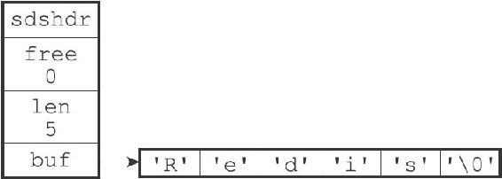

图2-5 5字节长的SDS

又例如，对于图2-6展示的SDS来说，程序只要访问SDS的len属性，就可以立即知道SDS的长度为11字节。

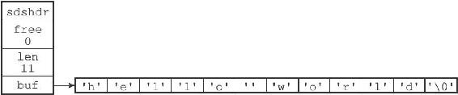

图2-6 11字节长的SDS

设置和更新SDS长度的工作是由SDS的API在执行时自动完成的，使用SDS无须进行任何手动修改长度的工作。

通过使用SDS而不是C字符串，Redis将获取字符串长度所需的复杂度从O（N）降低到了O（1），这确保了获取字符串长度的工作不会成为Redis的性能瓶颈。例如，因为字符串键在底层使用SDS来实现，所以即使我们对一个非常长的字符串键反复执行STRLEN命令，也不会对系统性能造成任何影响，因为STRLEN命令的复杂度仅为O（1）。

2.2.2 杜绝缓冲区溢出   

除了获取字符串长度的复杂度高之外，C字符串不记录自身长度带来的另一个问题是容易造成缓冲区溢出（buffer overflow）。举个例子，<string.h>/strcat函数可以将src字符串中的内容拼接到dest字符串的末尾：

---

>  
> char \*strcat(char \*dest, const char \*src);  

---

因为C字符串不记录自身的长度，所以strcat假定用户在执行这个函数时，已经为dest分配了足够多的内存，可以容纳src字符串中的所有内容，而一旦这个假定不成立时，就会产生缓冲区溢出。

举个例子，假设程序里有两个在内存中紧邻着的C字符串s1和s2，其中s1保存了字符串"Redis"，而s2则保存了字符串"MongoDB"，如图2-7所示。

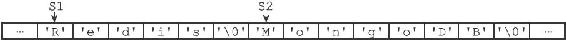

图2-7 在内存中紧邻的两个C字符串

如果一个程序员决定通过执行：

---

>  
> strcat(s1, " Cluster");  

---

将s1的内容修改为"Redis Cluster"，但粗心的他却忘了在执行strcat之前为s1分配足够的空间，那么在strcat函数执行之后，s1的数据将溢出到s2所在的空间中，导致s2保存的内容被意外地修改，如图2-8所示。

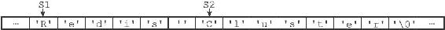

图2-8 S1的内容溢出到了S2所在的位置上

与C字符串不同，SDS的空间分配策略完全杜绝了发生缓冲区溢出的可能性：当SDS API需要对SDS进行修改时，API会先检查SDS的空间是否满足修改所需的要求，如果不满足的话，API会自动将SDS的空间扩展至执行修改所需的大小，然后才执行实际的修改操作，所以使用SDS既不需要手动修改SDS的空间大小，也不会出现前面所说的缓冲区溢出问题。

举个例子，SDS的API里面也有一个用于执行拼接操作的sdscat函数，它可以将一个C字符串拼接到给定SDS所保存的字符串的后面，但是在执行拼接操作之前，sdscat会先检查给定SDS的空间是否足够，如果不够的话，sdscat就会先扩展SDS的空间，然后才执行拼接操作。

例如，如果我们执行：

---

>  
> sdscat(s, " Cluster");  

---

其中SDS值s如图2-9所示，那么sdscat将在执行拼接操作之前检查s的长度是否足够，在发现s目前的空间不足以拼接"Cluster"之后，sdscat就会先扩展s的空间，然后才执行拼接"Cluster"的操作，拼接操作完成之后的SDS如图2-10所示。

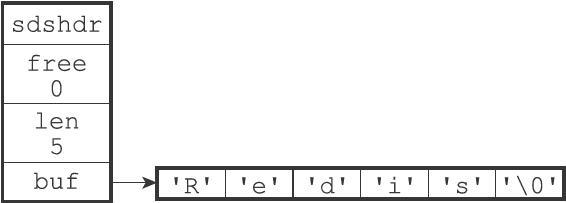

图2-9 sdscat执行之前的SDS

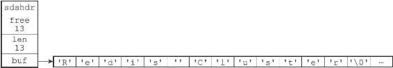

图2-10 sdscat执行之后的SDS

注意，图2-10所示的SDS，sdscat不仅对这个SDS进行了拼接操作，它还为SDS分配了13字节的未使用空间，并且拼接之后的字符串也正好是13字节长，这种现象既不是bug也不是巧合，它和SDS的空间分配策略有关，接下来的小节将对这一策略进行说明。

2.2.3 减少修改字符串时带来的内存重分配次数

正如前两个小节所说，因为C字符串并不记录自身的长度，所以对于一个包含了N个字符的C字符串来说，这个C字符串的底层实现总是一个N+1个字符长的数组（额外的一个字符空间用于保存空字符）。因为C字符串的长度和底层数组的长度之间存在着这种关联性，所以每次增长或者缩短一个C字符串，程序都总要对保存这个C字符串的数组进行一次内存重分配操作：

·如果程序执行的是增长字符串的操作，比如拼接操作（append），那么在执行这个操作之前，程序需要先通过内存重分配来扩展底层数组的空间大小——如果忘了这一步就会产生缓冲区溢出。

·如果程序执行的是缩短字符串的操作，比如截断操作（trim），那么在执行这个操作之后，程序需要通过内存重分配来释放字符串不再使用的那部分空间——如果忘了这一步就会产生内存泄漏。

举个例子，如果我们持有一个值为"Redis"的C字符串s，那么为了将s的值改为"Redis Cluster"，在执行：

---

>  
> strcat(s, " Cluster");  

---

之前，我们需要先使用内存重分配操作，扩展s的空间。

之后，如果我们又打算将s的值从"Redis Cluster"改为"Redis Cluster Tutorial"，那么在执行：

---

>  
> strcat(s, " Tutorial");  

---

之前，我们需要再次使用内存重分配扩展s的空间，诸如此类。

因为内存重分配涉及复杂的算法，并且可能需要执行系统调用，所以它通常是一个比较耗时的操作：

·在一般程序中，如果修改字符串长度的情况不太常出现，那么每次修改都执行一次内存重分配是可以接受的。

·但是Redis作为数据库，经常被用于速度要求严苛、数据被频繁修改的场合，如果每次修改字符串的长度都需要执行一次内存重分配的话，那么光是执行内存重分配的时间就会占去修改字符串所用时间的一大部分，如果这种修改频繁地发生的话，可能还会对性能造成影响。

为了避免C字符串的这种缺陷，SDS通过未使用空间解除了字符串长度和底层数组长度之间的关联：在SDS中，buf数组的长度不一定就是字符数量加一，数组里面可以包含未使用的字节，而这些字节的数量就由SDS的free属性记录。

通过未使用空间，SDS实现了空间预分配和惰性空间释放两种优化策略。

1.空间预分配

空间预分配用于优化SDS的字符串增长操作：当SDS的API对一个SDS进行修改，并且需要对SDS进行空间扩展的时候，程序不仅会为SDS分配修改所必须要的空间，还会为SDS分配额外的未使用空间。

其中，额外分配的未使用空间数量由以下公式决定：

·如果对SDS进行修改之后，SDS的长度（也即是len属性的值）将小于1MB，那么程序分配和len属性同样大小的未使用空间，这时SDS len属性的值将和free属性的值相同。举个例子，如果进行修改之后，SDS的len将变成13字节，那么程序也会分配13字节的未使用空间，SDS的buf数组的实际长度将变成13+13+1=27字节（额外的一字节用于保存空字符）。

·如果对SDS进行修改之后，SDS的长度将大于等于1MB，那么程序会分配1MB的未使用空间。举个例子，如果进行修改之后，SDS的len将变成30MB，那么程序会分配1MB的未使用空间，SDS的buf数组的实际长度将为30MB+1MB+1byte。

通过空间预分配策略，Redis可以减少连续执行字符串增长操作所需的内存重分配次数。

举个例子，对于图2-11所示的SDS值s来说，如果我们执行：

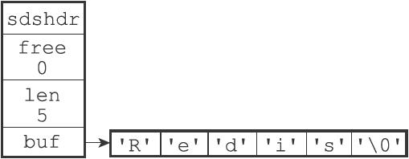

图2-11 执行sdscat之前的SDS

---

>  
> sdscat(s, " Cluster");  

---

那么sdscat将执行一次内存重分配操作，将SDS的长度修改为13字节，并将SDS的未使用空间同样修改为13字节，如图2-12所示。

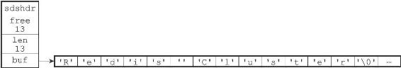

图2-12 执行sdscat之后SDS

如果这时，我们再次对s执行：

---

>  
> sdscat(s, " Tutorial");  

---

那么这次sdscat将不需要执行内存重分配，因为未使用空间里面的13字节足以保存9字节的"Tutorial"，执行sdscat之后的SDS如图2-13所示。

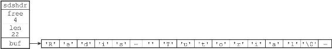

图2-13 再次执行sdscat之后的SDS

在扩展SDS空间之前，SDS API会先检查未使用空间是否足够，如果足够的话，API就会直接使用未使用空间，而无须执行内存重分配。

通过这种预分配策略，SDS将连续增长N次字符串所需的内存重分配次数从必定N次降低为最多N次。

2.惰性空间释放

惰性空间释放用于优化SDS的字符串缩短操作：当SDS的API需要缩短SDS保存的字符串时，程序并不立即使用内存重分配来回收缩短后多出来的字节，而是使用free属性将这些字节的数量记录起来，并等待将来使用。

举个例子，sdstrim函数接受一个SDS和一个C字符串作为参数，移除SDS中所有在C字符串中出现过的字符。

比如对于图2-14所示的SDS值s来说，执行：

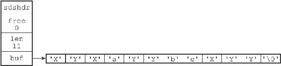

图2-14 执行sdstrim之前的SDS

---

>  
> sdstrim(s, "XY"); //   
> 移除SDS   
> 字符串中的所有'X'   
> 和'Y'   

---

会将SDS修改成图2-15所示的样子。

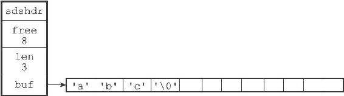

图2-15 执行sdstrim之后的SDS

注意执行sdstrim之后的SDS并没有释放多出来的8字节空间，而是将这8字节空间作为未使用空间保留在了SDS里面，如果将来要对SDS进行增长操作的话，这些未使用空间就可能会派上用场。

举个例子，如果现在对s执行：

---

>  
> sdscat(s, " Redis");  

---

那么完成这次sdscat操作将不需要执行内存重分配：因为SDS里面预留的8字节空间已经足以拼接6个字节长的"Redis"，如图2-16所示。

通过惰性空间释放策略，SDS避免了缩短字符串时所需的内存重分配操作，并为将来可能有的增长操作提供了优化。

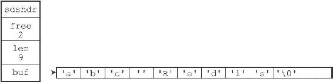

图2-16 执行sdscat之后的SDS

与此同时，SDS也提供了相应的API，让我们可以在有需要时，真正地释放SDS的未使用空间，所以不用担心惰性空间释放策略会造成内存浪费。

2.2.4 二进制安全

C字符串中的字符必须符合某种编码（比如ASCII），并且除了字符串的末尾之外，字符串里面不能包含空字符，否则最先被程序读入的空字符将被误认为是字符串结尾，这些限制使得C字符串只能保存文本数据，而不能保存像图片、音频、视频、压缩文件这样的二进制数据。

举个例子，如果有一种使用空字符来分割多个单词的特殊数据格式，如图2-17所示，那么这种格式就不能使用C字符串来保存，因为C字符串所用的函数只会识别出其中的"Redis"，而忽略之后的"Cluster"。

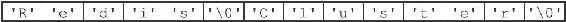

图2-17 使用空字符来分割单词的特殊数据格式

虽然数据库一般用于保存文本数据，但使用数据库来保存二进制数据的场景也不少见，因此，为了确保Redis可以适用于各种不同的使用场景，SDS的API都是二进制安全的（binary-safe），所有SDS API都会以处理二进制的方式来处理SDS存放在buf数组里的数据，程序不会对其中的数据做任何限制、过滤、或者假设，数据在写入时是什么样的，它被读取时就是什么样。

这也是我们将SDS的buf属性称为字节数组的原因——Redis不是用这个数组来保存字符，而是用它来保存一系列二进制数据。

例如，使用SDS来保存之前提到的特殊数据格式就没有任何问题，因为SDS使用len属性的值而不是空字符来判断字符串是否结束，如图2-18所示。

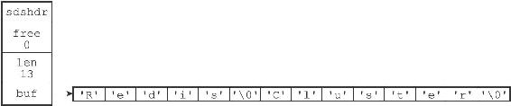

图2-18 保存了特殊数据格式的SDS

通过使用二进制安全的SDS，而不是C字符串，使得Redis不仅可以保存文本数据，还可以保存任意格式的二进制数据。

2.2.5 兼容部分C字符串函数

虽然SDS的API都是二进制安全的，但它们一样遵循C字符串以空字符结尾的惯例：这些API总会将SDS保存的数据的末尾设置为空字符，并且总会在为buf数组分配空间时多分配一个字节来容纳这个空字符，这是为了让那些保存文本数据的SDS可以重用一部分<string.h>库定义的函数。

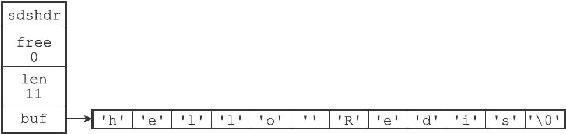

图2-19 一个保存着文本数据的SDS

举个例子，如图2-19所示，如果我们有一个保存文本数据的SDS值sds，那么我们就可以重用<string.h>/strcasecmp函数，使用它来对比SDS保存的字符串和另一个C字符串：

---

>  
> strcasecmp(sds->buf, "hello world");  

---

这样Redis就不用自己专门去写一个函数来对比SDS值和C字符串值了。

与此类似，我们还可以将一个保存文本数据的SDS作为strcat函数的第二个参数，将SDS保存的字符串追加到一个C字符串的后面：

---

>  
> strcat(c\_string, sds->buf);  

---

这样Redis就不用专门编写一个将SDS字符串追加到C字符串之后的函数了。

通过遵循C字符串以空字符结尾的惯例，SDS可以在有需要时重用<string.h>函数库，从而避免了不必要的代码重复。

2.2.6 总结

表2-1对C字符串和SDS之间的区别进行了总结。

表2-1 C字符串和SDS之间的区别

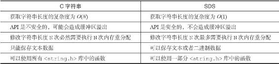
