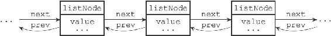
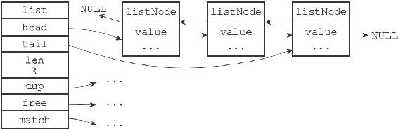

3.1 链表和链表节点的实现

每个链表节点使用一个adlist.h/listNode结构来表示：

---

>  
> typedef struct listNode {  
> //   
> 前置节点  
> struct listNode \* prev;  
> //   
> 后置节点  
> struct listNode \* next;  
> //   
> 节点的值  
> void \* value;  
> }listNode;  

---

多个listNode可以通过prev和next指针组成双端链表，如图3-1所示。

图3-1 由多个listNode组成的双端链表

虽然仅仅使用多个listNode结构就可以组成链表，但使用adlist.h/list来持有链表的话，操作起来会更方便：

---

>  
> typedef struct list {  
> //   
> 表头节点  
> listNode \* head;  
> //   
> 表尾节点  
> listNode \* tail;  
> //   
> 链表所包含的节点数量  
> unsigned long len;  
> //   
> 节点值复制函数  
> void \*(\*dup)(void \*ptr);  
> //   
> 节点值释放函数  
> void (\*free)(void \*ptr);  
> //   
> 节点值对比函数  
> int (\*match)(void \*ptr,void \*key);  
> } list;  

---

list结构为链表提供了表头指针head、表尾指针tail，以及链表长度计数器len，而dup、free和match成员则是用于实现多态链表所需的类型特定函数：

·dup函数用于复制链表节点所保存的值；

·free函数用于释放链表节点所保存的值；

·match函数则用于对比链表节点所保存的值和另一个输入值是否相等。

图3-2是由一个list结构和三个listNode结构组成的链表。

图3-2 由list结构和listNode结构组成的链表

Redis的链表实现的特性可以总结如下：

·双端：链表节点带有prev和next指针，获取某个节点的前置节点和后置节点的复杂度都是O（1）。

·无环：表头节点的prev指针和表尾节点的next指针都指向NULL，对链表的访问以NULL为终点。

·带表头指针和表尾指针：通过list结构的head指针和tail指针，程序获取链表的表头节点和表尾节点的复杂度为O（1）。

·带链表长度计数器：程序使用list结构的len属性来对list持有的链表节点进行计数，程序获取链表中节点数量的复杂度为O（1）。

·多态：链表节点使用void\*指针来保存节点值，并且可以通过list结构的dup、free、match三个属性为节点值设置类型特定函数，所以链表可以用于保存各种不同类型的值。
