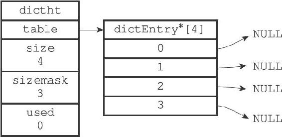
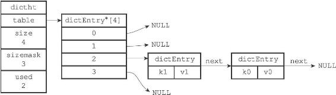
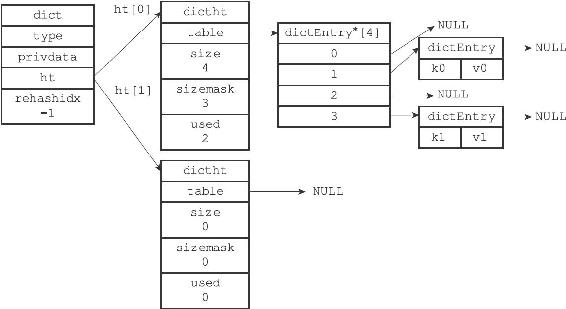

4.1 字典的实现

Redis的字典使用哈希表作为底层实现，一个哈希表里面可以有多个哈希表节点，而每个哈希表节点就保存了字典中的一个键值对。

接下来的三个小节将分别介绍Redis的哈希表、哈希表节点以及字典的实现。

4.1.1 哈希表

Redis字典所使用的哈希表由dict.h/dictht结构定义：

---

>  
> typedef struct dictht {  
> //   
> 哈希表数组  
> dictEntry \*\*table;  
> //   
> 哈希表大小  
> unsigned long size;  
> //  
> 哈希表大小掩码，用于计算索引值  
> //  
> 总是等于size-1  
> unsigned long sizemask;  
> //   
> 该哈希表已有节点的数量  
> unsigned long used;  
> } dictht;  

---

table属性是一个数组，数组中的每个元素都是一个指向dict.h/dictEntry结构的指针，每个dictEntry结构保存着一个键值对。size属性记录了哈希表的大小，也即是table数组的大小，而used属性则记录了哈希表目前已有节点（键值对）的数量。sizemask属性的值总是等于size-1，这个属性和哈希值一起决定一个键应该被放到table数组的哪个索引上面。

图4-1展示了一个大小为4的空哈希表（没有包含任何键值对）。

图4-1 一个空的哈希表

4.1.2 哈希表节点

哈希表节点使用dictEntry结构表示，每个dictEntry结构都保存着一个键值对：

---

>  
> typedef struct dictEntry {  
> //   
> 键  
> void \*key;  
> //   
> 值  
> union{  
> void \*val;  
> uint64\_tu64;  
> int64\_ts64;  
> } v;  
> //   
> 指向下个哈希表节点，形成链表  
> struct dictEntry \*next;  
> } dictEntry;  

---

key属性保存着键值对中的键，而v属性则保存着键值对中的值，其中键值对的值可以是一个指针，或者是一个uint64\_t整数，又或者是一个int64\_t整数。

next属性是指向另一个哈希表节点的指针，这个指针可以将多个哈希值相同的键值对连接在一次，以此来解决键冲突（collision）的问题。

举个例子，图4-2就展示了如何通过next指针，将两个索引值相同的键k1和k0连接在一起。

图4-2 连接在一起的键K1和键K0

4.1.3 字典

Redis中的字典由dict.h/dict结构表示：

---

>  
> typedef struct dict {  
> //   
> 类型特定函数  
> dictType \*type;  
> //   
> 私有数据  
> void \*privdata;  
> //   
> 哈希表  
> dictht ht\[2\];  
> // rehash  
> 索引  
> //  
> 当rehash  
> 不在进行时，值为-1  
> in trehashidx; /\* rehashing not in progress if rehashidx == -1 \*/  
> } dict;  

---

type属性和privdata属性是针对不同类型的键值对，为创建多态字典而设置的：

·type属性是一个指向dictType结构的指针，每个dictType结构保存了一簇用于操作特定类型键值对的函数，Redis会为用途不同的字典设置不同的类型特定函数。

·而privdata属性则保存了需要传给那些类型特定函数的可选参数。

---

>  
> typedef struct dictType {  
> //   
> 计算哈希值的函数  
> unsigned int (\*hashFunction)(const void \*key);  
> //   
> 复制键的函数  
> void \*(\*keyDup)(void \*privdata, const void \*key);  
> //   
> 复制值的函数  
> void \*(\*valDup)(void \*privdata, const void \*obj);  
> //   
> 对比键的函数  
> int (\*keyCompare)(void \*privdata, const void \*key1, const void \*key2);  
> //   
> 销毁键的函数  
> void (\*keyDestructor)(void \*privdata, void \*key);  
> //   
> 销毁值的函数  
> void (\*valDestructor)(void \*privdata, void \*obj);  
> } dictType;  

---

ht属性是一个包含两个项的数组，数组中的每个项都是一个dictht哈希表，一般情况下，字典只使用ht\[0\]哈希表，ht\[1\]哈希表只会在对ht\[0\]哈希表进行rehash时使用。

除了ht\[1\]之外，另一个和rehash有关的属性就是rehashidx，它记录了rehash目前的进度，如果目前没有在进行rehash，那么它的值为-1。

图4-3展示了一个普通状态下（没有进行rehash）的字典。

图4-3 普通状态下的字典
