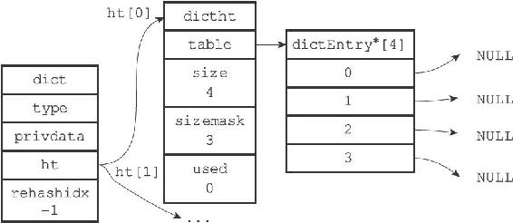
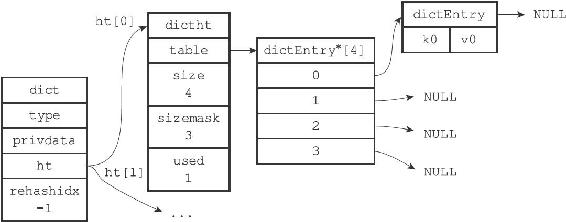

4.2 哈希算法

当要将一个新的键值对添加到字典里面时，程序需要先根据键值对的键计算出哈希值和索引值，然后再根据索引值，将包含新键值对的哈希表节点放到哈希表数组的指定索引上面。

Redis计算哈希值和索引值的方法如下：

---

>  
> #  
> 使用字典设置的哈希函数，计算键key  
> 的哈希值  
> hash = dict->type->hashFunction(key);  
> #  
> 使用哈希表的sizemask  
> 属性和哈希值，计算出索引值  
> #  
> 根据情况不同，ht\[x\]  
> 可以是ht\[0\]  
> 或者ht\[1\]  
> index = hash & dict->ht\[x\].sizemask;  

---

图4-4 空字典

举个例子，对于图4-4所示的字典来说，如果我们要将一个键值对k0和v0添加到字典里面，那么程序会先使用语句：

---

>  
> hash = dict->type->hashFunction(k0);  

---

计算键k0的哈希值。

假设计算得出的哈希值为8，那么程序会继续使用语句：

---

>  
> index = hash&dict->ht\[0\].sizemask = 8 & 3 = 0;  

---

计算出键k0的索引值0，这表示包含键值对k0和v0的节点应该被放置到哈希表数组的索引0位置上，如图4-5所示。

图4-5 添加键值对K0和v0之后的字典

当字典被用作数据库的底层实现，或者哈希键的底层实现时，Redis使用MurmurHash2算法来计算键的哈希值。

MurmurHash算法最初由Austin Appleby于2008年发明，这种算法的优点在于，即使输入的键是有规律的，算法仍能给出一个很好的随机分布性，并且算法的计算速度也非常快。

MurmurHash算法目前的最新版本为MurmurHash3，而Redis使用的是MurmurHash2，关于MurmurHash算法的更多信息可以参考该算法的主页：http://code.google.com/p/smhasher/。
