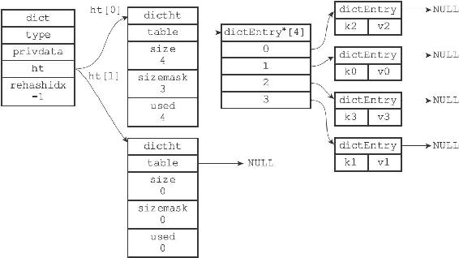
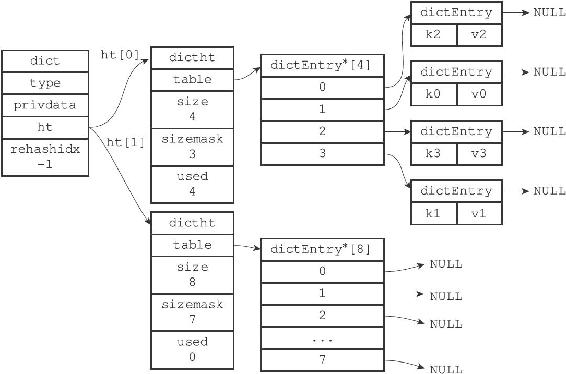
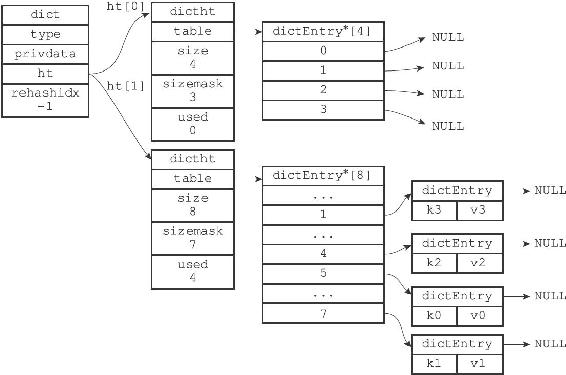
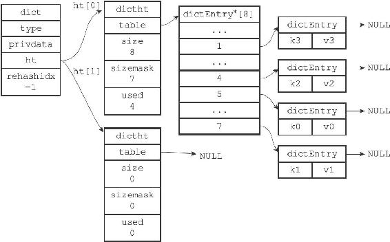

4.4 rehash

随着操作的不断执行，哈希表保存的键值对会逐渐地增多或者减少，为了让哈希表的负载因子（load factor）维持在一个合理的范围之内，当哈希表保存的键值对数量太多或者太少时，程序需要对哈希表的大小进行相应的扩展或者收缩。

扩展和收缩哈希表的工作可以通过执行rehash（重新散列）操作来完成，Redis对字典的哈希表执行rehash的步骤如下：

1）为字典的ht\[1\]哈希表分配空间，这个哈希表的空间大小取决于要执行的操作，以及ht\[0\]当前包含的键值对数量（也即是ht\[0\].used属性的值）：

·如果执行的是扩展操作，那么ht\[1\]的大小为第一个大于等于ht\[0\].used\*2的2 n（2的n次方幂）；

·如果执行的是收缩操作，那么ht\[1\]的大小为第一个大于等于ht\[0\].used的2 n。

2）将保存在ht\[0\]中的所有键值对rehash到ht\[1\]上面：rehash指的是重新计算键的哈希值和索引值，然后将键值对放置到ht\[1\]哈希表的指定位置上。

3）当ht\[0\]包含的所有键值对都迁移到了ht\[1\]之后（ht\[0\]变为空表），释放ht\[0\]，将ht\[1\]设置为ht\[0\]，并在ht\[1\]新创建一个空白哈希表，为下一次rehash做准备。

举个例子，假设程序要对图4-8所示字典的ht\[0\]进行扩展操作，那么程序将执行以下步骤：

图4-8 执行rehash之前的字典

1）ht\[0\].used当前的值为4，4\*2=8，而8（2 3）恰好是第一个大于等于4的2的n次方，所以程序会将ht\[1\]哈希表的大小设置为8。图4-9展示了ht\[1\]在分配空间之后，字典的样子。

图4-9 为字典的ht\[1\]哈希表分配空间

2）将ht\[0\]包含的四个键值对都rehash到ht\[1\]，如图4-10所示。

图4-10 ht\[0\]的所有键值对都已经被迁移到ht\[1\]

3）释放ht\[0\]，并将ht\[1\]设置为ht\[0\]，然后为ht\[1\]分配一个空白哈希表，如图4-11所示。至此，对哈希表的扩展操作执行完毕，程序成功将哈希表的大小从原来的4改为了现在的8。

图4-11 完成rehash之后的字典

哈希表的扩展与收缩

当以下条件中的任意一个被满足时，程序会自动开始对哈希表执行扩展操作：

1）服务器目前没有在执行BGSAVE命令或者BGREWRITEAOF命令，并且哈希表的负载因子大于等于1。

2）服务器目前正在执行BGSAVE命令或者BGREWRITEAOF命令，并且哈希表的负载因子大于等于5。

其中哈希表的负载因子可以通过公式：

---

>  
> \#   
> 负载因子=   
> 哈希表已保存节点数量/   
> 哈希表大小  
> load\_factor = ht\[0\].used / ht\[0\].size  

---

计算得出。

例如，对于一个大小为4，包含4个键值对的哈希表来说，这个哈希表的负载因子为：

---

>  
> load\_factor = 4 / 4 = 1  

---

又例如，对于一个大小为512，包含256个键值对的哈希表来说，这个哈希表的负载因子为：

---

>  
> load\_factor = 256 / 512 = 0.5  

---

根据BGSAVE命令或BGREWRITEAOF命令是否正在执行，服务器执行扩展操作所需的负载因子并不相同，这是因为在执行BGSAVE命令或BGREWRITEAOF命令的过程中，Redis需要创建当前服务器进程的子进程，而大多数操作系统都采用写时复制（copy-on-write）技术来优化子进程的使用效率，所以在子进程存在期间，服务器会提高执行扩展操作所需的负载因子，从而尽可能地避免在子进程存在期间进行哈希表扩展操作，这可以避免不必要的内存写入操作，最大限度地节约内存。

另一方面，当哈希表的负载因子小于0.1时，程序自动开始对哈希表执行收缩操作。
