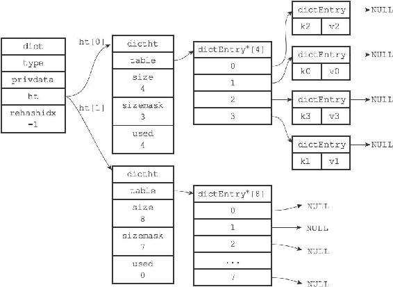
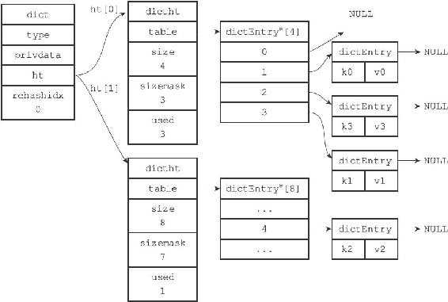
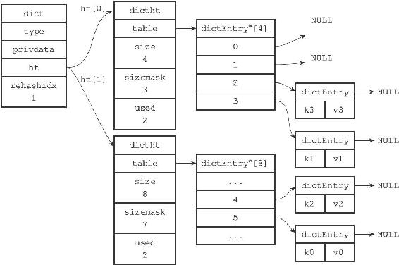
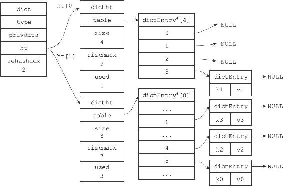
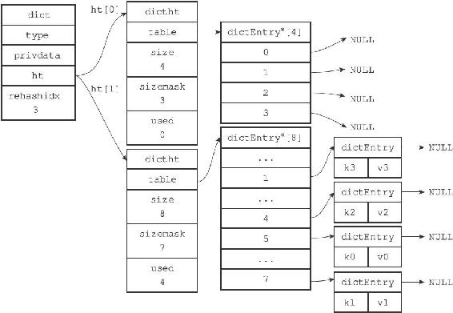
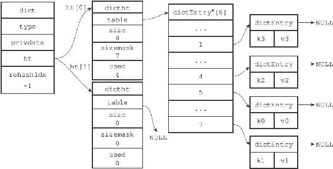

4.5 渐进式rehash

上一节说过，扩展或收缩哈希表需要将ht\[0\]里面的所有键值对rehash到ht\[1\]里面，但是，这个rehash动作并不是一次性、集中式地完成的，而是分多次、渐进式地完成的。

这样做的原因在于，如果ht\[0\]里只保存着四个键值对，那么服务器可以在瞬间就将这些键值对全部rehash到ht\[1\]；但是，如果哈希表里保存的键值对数量不是四个，而是四百万、四千万甚至四亿个键值对，那么要一次性将这些键值对全部rehash到ht\[1\]的话，庞大的计算量可能会导致服务器在一段时间内停止服务。

因此，为了避免rehash对服务器性能造成影响，服务器不是一次性将ht\[0\]里面的所有键值对全部rehash到ht\[1\]，而是分多次、渐进式地将ht\[0\]里面的键值对慢慢地rehash到ht\[1\]。

以下是哈希表渐进式rehash的详细步骤：

1）为ht\[1\]分配空间，让字典同时持有ht\[0\]和ht\[1\]两个哈希表。

2）在字典中维持一个索引计数器变量rehashidx，并将它的值设置为0，表示rehash工作正式开始。

3）在rehash进行期间，每次对字典执行添加、删除、查找或者更新操作时，程序除了执行指定的操作以外，还会顺带将ht\[0\]哈希表在rehashidx索引上的所有键值对rehash到ht\[1\]，当rehash工作完成之后，程序将rehashidx属性的值增一。

4）随着字典操作的不断执行，最终在某个时间点上，ht\[0\]的所有键值对都会被rehash至ht\[1\]，这时程序将rehashidx属性的值设为-1，表示rehash操作已完成。

渐进式rehash的好处在于它采取分而治之的方式，将rehash键值对所需的计算工作均摊到对字典的每个添加、删除、查找和更新操作上，从而避免了集中式rehash而带来的庞大计算量。

图4-12至图4-17展示了一次完整的渐进式rehash过程，注意观察在整个rehash过程中，字典的rehashidx属性是如何变化的。

图4-12 准备开始rehash

图4-13 rehash索引0上的键值对

图4-14 rehash索引1上的键值对

图4-15 rehash索引2上的键值对

图4-16 rehash索引3上的键值对

图4-17 rehash执行完毕

渐进式rehash执行期间的哈希表操作

因为在进行渐进式rehash的过程中，字典会同时使用ht\[0\]和ht\[1\]两个哈希表，所以在渐进式rehash进行期间，字典的删除（delete）、查找（find）、更新（update）等操作会在两个哈希表上进行。例如，要在字典里面查找一个键的话，程序会先在ht\[0\]里面进行查找，如果没找到的话，就会继续到ht\[1\]里面进行查找，诸如此类。

另外，在渐进式rehash执行期间，新添加到字典的键值对一律会被保存到ht\[1\]里面，而ht\[0\]则不再进行任何添加操作，这一措施保证了ht\[0\]包含的键值对数量会只减不增，并随着rehash操作的执行而最终变成空表。
