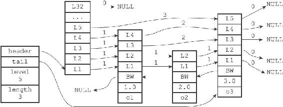
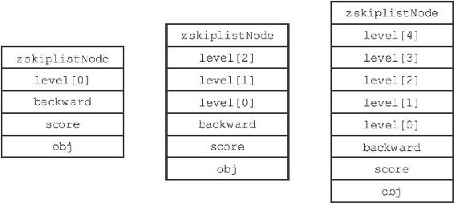
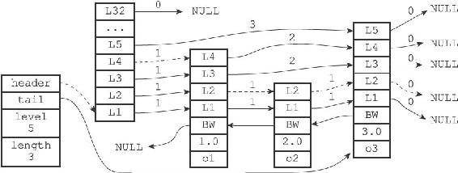
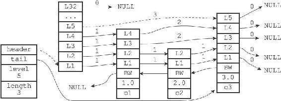
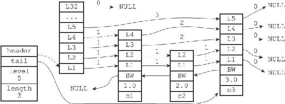
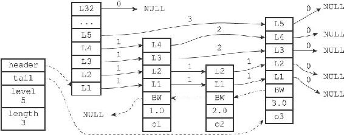
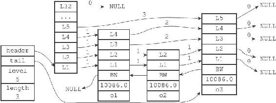
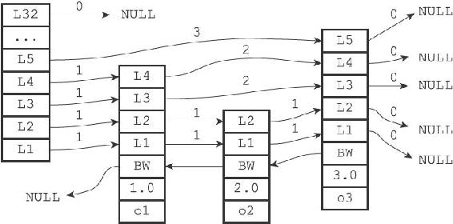
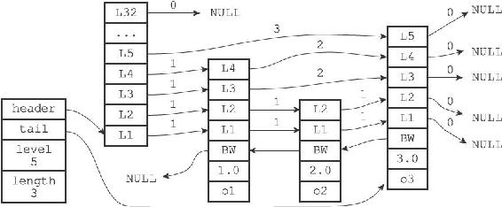

5.1 跳跃表的实现

Redis的跳跃表由redis.h/zskiplistNode和redis.h/zskiplist两个结构定义，其中zskiplistNode结构用于表示跳跃表节点，而zskiplist结构则用于保存跳跃表节点的相关信息，比如节点的数量，以及指向表头节点和表尾节点的指针等等。

图5-1 一个跳跃表

图5-1展示了一个跳跃表示例，位于图片最左边的是zskiplist结构，该结构包含以下属性：

·header：指向跳跃表的表头节点。

·tail：指向跳跃表的表尾节点。

·level：记录目前跳跃表内，层数最大的那个节点的层数（表头节点的层数不计算在内）。

·length：记录跳跃表的长度，也即是，跳跃表目前包含节点的数量（表头节点不计算在内）。

位于zskiplist结构右方的是四个zskiplistNode结构，该结构包含以下属性：

·层（level）：节点中用L1、L2、L3等字样标记节点的各个层，L1代表第一层，L2代表第二层，以此类推。每个层都带有两个属性：前进指针和跨度。前进指针用于访问位于表尾方向的其他节点，而跨度则记录了前进指针所指向节点和当前节点的距离。在上面的图片中，连线上带有数字的箭头就代表前进指针，而那个数字就是跨度。当程序从表头向表尾进行遍历时，访问会沿着层的前进指针进行。

·后退（backward）指针：节点中用BW字样标记节点的后退指针，它指向位于当前节点的前一个节点。后退指针在程序从表尾向表头遍历时使用。

·分值（score）：各个节点中的1.0、2.0和3.0是节点所保存的分值。在跳跃表中，节点按各自所保存的分值从小到大排列。

·成员对象（obj）：各个节点中的o1、o2和o3是节点所保存的成员对象。

注意表头节点和其他节点的构造是一样的：表头节点也有后退指针、分值和成员对象，不过表头节点的这些属性都不会被用到，所以图中省略了这些部分，只显示了表头节点的各个层。

本节接下来的内容将对zskiplistNode和zskiplist两个结构进行更详细的介绍。

5.1.1 跳跃表节点

跳跃表节点的实现由redis.h/zskiplistNode结构定义：

---

>  
> typedef struct zskiplistNode {  
> //   
> 层  
> struct zskiplistLevel {  
> //   
> 前进指针  
> struct zskiplistNode \*forward;  
> //   
> 跨度  
> unsigned int span;  
> } level\[\];  
> //   
> 后退指针  
> struct zskiplistNode \*backward;  
> //   
> 分值  
> double score;  
> //   
> 成员对象  
> robj \*obj;  
> } zskiplistNode;  

---

1.层

跳跃表节点的level数组可以包含多个元素，每个元素都包含一个指向其他节点的指针，程序可以通过这些层来加快访问其他节点的速度，一般来说，层的数量越多，访问其他节点的速度就越快。

每次创建一个新跳跃表节点的时候，程序都根据幂次定律（power law，越大的数出现的概率越小）随机生成一个介于1和32之间的值作为level数组的大小，这个大小就是层的“高度”。

图5-2分别展示了三个高度为1层、3层和5层的节点，因为C语言的数组索引总是从0开始的，所以节点的第一层是level\[0\]，而第二层是level\[1\]，以此类推。

2.前进指针

每个层都有一个指向表尾方向的前进指针（level\[i\].forward属性），用于从表头向表尾方向访问节点。图5-3用虚线表示出了程序从表头向表尾方向，遍历跳跃表中所有节点的路径：

图5-2 带有不同层高的节点

图5-3 遍历整个跳跃表

1）迭代程序首先访问跳跃表的第一个节点（表头），然后从第四层的前进指针移动到表中的第二个节点。

2）在第二个节点时，程序沿着第二层的前进指针移动到表中的第三个节点。

3）在第三个节点时，程序同样沿着第二层的前进指针移动到表中的第四个节点。

4）当程序再次沿着第四个节点的前进指针移动时，它碰到一个NULL，程序知道这时已经到达了跳跃表的表尾，于是结束这次遍历。

3.跨度

层的跨度（level\[i\].span属性）用于记录两个节点之间的距离：

·两个节点之间的跨度越大，它们相距得就越远。

·指向NULL的所有前进指针的跨度都为0，因为它们没有连向任何节点。

初看上去，很容易以为跨度和遍历操作有关，但实际上并不是这样，遍历操作只使用前进指针就可以完成了，跨度实际上是用来计算排位（rank）的：在查找某个节点的过程中，将沿途访问过的所有层的跨度累计起来，得到的结果就是目标节点在跳跃表中的排位。

举个例子，图5-4用虚线标记了在跳跃表中查找分值为3.0、成员对象为o3的节点时，沿途经历的层：查找的过程只经过了一个层，并且层的跨度为3，所以目标节点在跳跃表中的排位为3。

图5-4 计算节点的排位

再举个例子，图5-5用虚线标记了在跳跃表中查找分值为2.0、成员对象为o2的节点时，沿途经历的层：在查找节点的过程中，程序经过了两个跨度为1的节点，因此可以计算出，目标节点在跳跃表中的排位为2。

图5-5 另一个计算节点排位的例子

4.后退指针

节点的后退指针（backward属性）用于从表尾向表头方向访问节点：跟可以一次跳过多个节点的前进指针不同，因为每个节点只有一个后退指针，所以每次只能后退至前一个节点。

图5-6用虚线展示了如果从表尾向表头遍历跳跃表中的所有节点：程序首先通过跳跃表的tail指针访问表尾节点，然后通过后退指针访问倒数第二个节点，之后再沿着后退指针访问倒数第三个节点，再之后遇到指向NULL的后退指针，于是访问结束。

5.分值和成员

节点的分值（score属性）是一个double类型的浮点数，跳跃表中的所有节点都按分值从小到大来排序。

节点的成员对象（obj属性）是一个指针，它指向一个字符串对象，而字符串对象则保存着一个SDS值。

在同一个跳跃表中，各个节点保存的成员对象必须是唯一的，但是多个节点保存的分值却可以是相同的：分值相同的节点将按照成员对象在字典序中的大小来进行排序，成员对象较小的节点会排在前面（靠近表头的方向），而成员对象较大的节点则会排在后面（靠近表尾的方向）。

图5-6 从表尾向表头方向遍历跳跃表

举个例子，在图5-7所示的跳跃表中，三个跳跃表节点都保存了相同的分值10086.0，但保存成员对象o1的节点却排在保存成员对象o2和o3的节点之前，而保存成员对象o2的节点又排在保存成员对象o3的节点之前，由此可见，o1、o2、o3三个成员对象在字典中的排序为o1<=o2<=o3。

图5-7 三个带有相同分值的跳跃表节点

5.1.2 跳跃表

仅靠多个跳跃表节点就可以组成一个跳跃表，如图5-8所示。

但通过使用一个zskiplist结构来持有这些节点，程序可以更方便地对整个跳跃表进行处理，比如快速访问跳跃表的表头节点和表尾节点，或者快速地获取跳跃表节点的数量（也即是跳跃表的长度）等信息，如图5-9所示。

zskiplist结构的定义如下：

---

>  
> typedef struct zskiplist {  
> //   
> 表头节点和表尾节点  
> structz skiplistNode \*header, \*tail;  
> //   
> 表中节点的数量  
> unsigned long length;  
> //   
> 表中层数最大的节点的层数  
> int level;  
> } zskiplist;  

---

图5-8 由多个跳跃节点组成的跳跃表

图5-9 带有zskiplist结构的跳跃表

header和tail指针分别指向跳跃表的表头和表尾节点，通过这两个指针，程序定位表头节点和表尾节点的复杂度为O（1）。

通过使用length属性来记录节点的数量，程序可以在O（1）复杂度内返回跳跃表的长度。

level属性则用于在O（1）复杂度内获取跳跃表中层高最大的那个节点的层数量，注意表头节点的层高并不计算在内。
