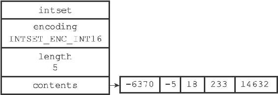
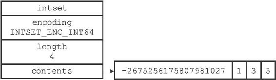

6.1 整数集合的实现

整数集合（intset）是Redis用于保存整数值的集合抽象数据结构，它可以保存类型为int16\_t、int32\_t或者int64\_t的整数值，并且保证集合中不会出现重复元素。

每个intset.h/intset结构表示一个整数集合：

---

>  
> typedef struct intset {  
> //   
> 编码方式  
> uint32\_t encoding;  
> //   
> 集合包含的元素数量  
> uint32\_t length;  
> //   
> 保存元素的数组  
> int8\_t contents\[\];  
> } intset;  

---

contents数组是整数集合的底层实现：整数集合的每个元素都是contents数组的一个数组项（item），各个项在数组中按值的大小从小到大有序地排列，并且数组中不包含任何重复项。

length属性记录了整数集合包含的元素数量，也即是contents数组的长度。

虽然intset结构将contents属性声明为int8\_t类型的数组，但实际上contents数组并不保存任何int8\_t类型的值，contents数组的真正类型取决于encoding属性的值：

·如果encoding属性的值为INTSET\_ENC\_INT16，那么contents就是一个int16\_t类型的数组，数组里的每个项都是一个int16\_t类型的整数值（最小值为-32768，最大值为32767）。

·如果encoding属性的值为INTSET\_ENC\_INT32，那么contents就是一个int32\_t类型的数组，数组里的每个项都是一个int32\_t类型的整数值（最小值为-2147483648，最大值为2147483647）。

·如果encoding属性的值为INTSET\_ENC\_INT64，那么contents就是一个int64\_t类型的数组，数组里的每个项都是一个int64\_t类型的整数值（最小值为-9223372036854775808，最大值为9223372036854775807）。

图6-1展示了一个整数集合示例：

图6-1 一个包含五个int16\_t类型整数值的整数集合

·encoding属性的值为INTSET\_ENC\_INT16，表示整数集合的底层实现为int16\_t类型的数组，而集合保存的都是int16\_t类型的整数值。

·length属性的值为5，表示整数集合包含五个元素。

·contents数组按从小到大的顺序保存着集合中的五个元素。

·因为每个集合元素都是int16\_t类型的整数值，所以contents数组的大小等于sizeof（int16\_t）\*5=16\*5=80位。

图6-2展示了另一个整数集合示例：

图6-2 一个包含四个int16\_t类型整数值的整数集合

·encoding属性的值为INTSET\_ENC\_INT64，表示整数集合的底层实现为int64\_t类型的数组，而数组中保存的都是int64\_t类型的整数值。

·length属性的值为4，表示整数集合包含四个元素。

·contents数组按从小到大的顺序保存着集合中的四个元素。

·因为每个集合元素都是int64\_t类型的整数值，所以contents数组的大小为sizeof（int64\_t）\*4=64\*4=256位。

虽然contents数组保存的四个整数值中，只有-2675256175807981027是真正需要用int64\_t类型来保存的，而其他的1、3、5三个值都可以用int16\_t类型来保存，不过根据整数集合的升级规则，当向一个底层为int16\_t数组的整数集合添加一个int64\_t类型的整数值时，整数集合已有的所有元素都会被转换成int64\_t类型，所以contents数组保存的四个整数值都是int64\_t类型的，不仅仅是-2675256175807981027。

接下来的一节将对整数集合的升级操作进行详细介绍。
