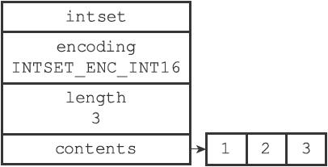
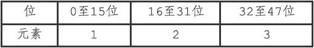
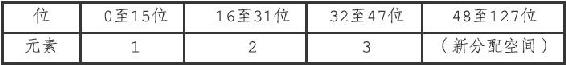
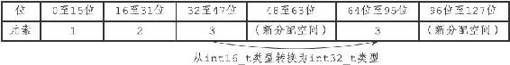
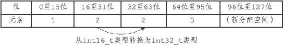
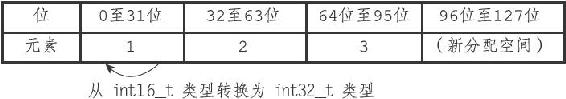
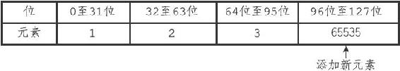
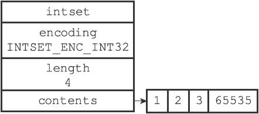

6.2 升级

每当我们要将一个新元素添加到整数集合里面，并且新元素的类型比整数集合现有所有元素的类型都要长时，整数集合需要先进行升级（upgrade），然后才能将新元素添加到整数集合里面。

升级整数集合并添加新元素共分为三步进行：

1）根据新元素的类型，扩展整数集合底层数组的空间大小，并为新元素分配空间。

2）将底层数组现有的所有元素都转换成与新元素相同的类型，并将类型转换后的元素放置到正确的位上，而且在放置元素的过程中，需要继续维持底层数组的有序性质不变。

3）将新元素添加到底层数组里面。

举个例子，假设现在有一个INTSET\_ENC\_INT16编码的整数集合，集合中包含三个int16\_t类型的元素，如图6-3所示。

图6-3 一个包含三个int16\_t类型的元素的整数集合

因为每个元素都占用16位空间，所以整数集合底层数组的大小为3\*16=48位，图6-4展示了整数集合的三个元素在这48位里的位置。

图6-4 contents数组的各个元素，以及它们所在的位

现在，假设我们要将类型为int32\_t的整数值65535添加到整数集合里面，因为65535的类型int32\_t比整数集合当前所有元素的类型都要长，所以在将65535添加到整数集合之前，程序需要先对整数集合进行升级。

升级首先要做的是，根据新类型的长度，以及集合元素的数量（包括要添加的新元素在内），对底层数组进行空间重分配。

整数集合目前有三个元素，再加上新元素65535，整数集合需要分配四个元素的空间，因为每个int32\_t整数值需要占用32位空间，所以在空间重分配之后，底层数组的大小将是32\*4=128位，如图6-5所示。虽然程序对底层数组进行了空间重分配，但数组原有的三个元素1、2、3仍然是int16\_t类型，这些元素还保存在数组的前48位里面，所以程序接下来要做的就是将这三个元素转换成int32\_t类型，并将转换后的元素放置到正确的位上面，而且在放置元素的过程中，需要维持底层数组的有序性质不变。

图6-5 进行空间重分配之后的数组

首先，因为元素3在1、2、3、65535四个元素中排名第三，所以它将被移动到contents数组的索引2位置上，也即是数组64位至95位的空间内，如图6-6所示。

图6-6 对元素3进行类型转换，并保存在适当的位上

接着，因为元素2在1、2、3、65535四个元素中排名第二，所以它将被移动到contents数组的索引1位置上，也即是数组的32位至63位的空间内，如图6-7所示。

图6-7 对元素2进行类型转换，并保存在适当的位上

之后，因为元素1在1、2、3、65535四个元素中排名第一，所以它将被移动到contents数组的索引0位置上，即数组的0位至31位的空间内，如图6-8所示。

图6-8 对元素1进行类型转换，并保存在适当的位上

然后，因为元素65535在1、2、3、65535四个元素中排名第四，所以它将被添加到contents数组的索引3位置上，也即是数组的96位至127位的空间内，如图6-9所示。

图6-9 添加65535到数组

最后，程序将整数集合encoding属性的值从INTSET\_ENC\_INT16改为INTSET\_ENC\_INT32，并将length属性的值从3改为4，设置完成之后的整数集合如图6-10所示。

图6-10 完成添加操作之后的整数集合

因为每次向整数集合添加新元素都可能会引起升级，而每次升级都需要对底层数组中已有的所有元素进行类型转换，所以向整数集合添加新元素的时间复杂度为O（N）。

其他类型的升级操作，比如从INTSET\_ENC\_INT16编码升级为INTSET\_ENC\_INT64编码，或者从INTSET\_ENC\_INT32编码升级为INTSET\_ENC\_INT64编码，升级的过程都和上面展示的升级过程类似。

> 升级之后新元素的摆放位置

> 因为引发升级的新元素的长度总是比整数集合现有所有元素的长度都大，所以这个新元素的值要么就大于所有现有元素，要么就小于所有现有元素：

> ·在新元素小于所有现有元素的情况下，新元素会被放置在底层数组的最开头（索引0）；

> ·在新元素大于所有现有元素的情况下，新元素会被放置在底层数组的最末尾（索引length-1）。
