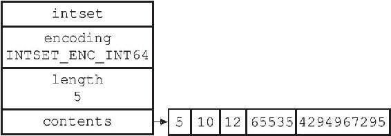
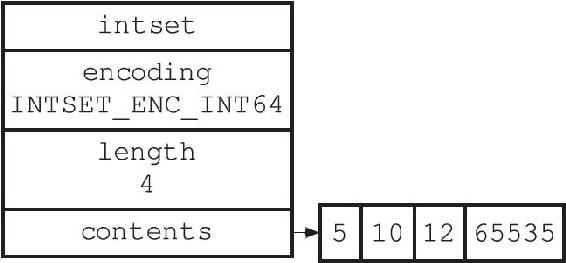

6.4 降级

整数集合不支持降级操作，一旦对数组进行了升级，编码就会一直保持升级后的状态。

举个例子，对于图6-11所示的整数集合来说，即使我们将集合里唯一一个真正需要使用int64\_t类型来保存的元素4294967295删除了，整数集合的编码仍然会维持INTSET\_ENC\_INT64，底层数组也仍然会是int64\_t类型的，如图6-12所示。

图6-11 数组编码为INTSET\_ENC\_INT64的整数集合

图6-12 删除4 294 967 295的整数集合
