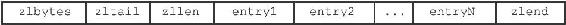
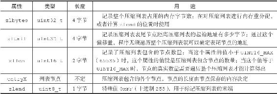
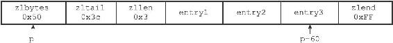
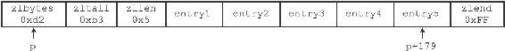

7.1 压缩列表的构成

压缩列表是Redis为了节约内存而开发的，是由一系列特殊编码的连续内存块组成的顺序型（sequential）数据结构。一个压缩列表可以包含任意多个节点（entry），每个节点可以保存一个字节数组或者一个整数值。

图7-1展示了压缩列表的各个组成部分，表7-1则记录了各个组成部分的类型、长度以及用途。

图7-1 压缩列表的各个组成部分

表7-1 压缩列表各个组成部分的详细说明

图7-2展示了一个压缩列表示例：

·列表zlbytes属性的值为0x50（十进制80），表示压缩列表的总长为80字节。

·列表zltail属性的值为0x3c（十进制60），这表示如果我们有一个指向压缩列表起始地址的指针p，那么只要用指针p加上偏移量60，就可以计算出表尾节点entry3的地址。

·列表zllen属性的值为0x3（十进制3），表示压缩列表包含三个节点。

图7-2 包含三个节点的压缩列表

图7-3展示了另一个压缩列表示例：

图7-3 包含五个节点的压缩列表

·列表zlbytes属性的值为0xd2（十进制210），表示压缩列表的总长为210字节。

·列表zltail属性的值为0xb3（十进制179），这表示如果我们有一个指向压缩列表起始地址的指针p，那么只要用指针p加上偏移量179，就可以计算出表尾节点entry5的地址。

·列表zllen属性的值为0x5（十进制5），表示压缩列表包含五个节点。
