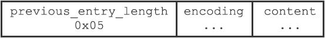
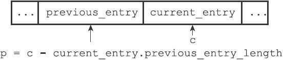
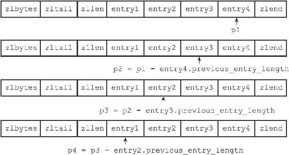
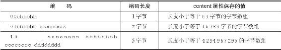
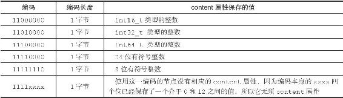
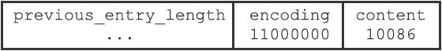

7.2 压缩列表节点的构成

每个压缩列表节点可以保存一个字节数组或者一个整数值，其中，字节数组可以是以下三种长度的其中一种：

·长度小于等于63（2 6–1）字节的字节数组；

·长度小于等于16383（2 14–1）字节的字节数组；

·长度小于等于4294967295（2 32–1）字节的字节数组；

而整数值则可以是以下六种长度的其中一种：

·4位长，介于0至12之间的无符号整数；

·1字节长的有符号整数；

·3字节长的有符号整数；

·int16\_t类型整数；

·int32\_t类型整数；

·int64\_t类型整数。

每个压缩列表节点都由previous\_entry\_length、encoding、content三个部分组成，如图7-4所示。

图7-4 压缩列表节点的各个组成部分

接下来的内容将分别介绍这三个组成部分。

7.2.1 previous\_entry\_length

节点的previous\_entry\_length属性以字节为单位，记录了压缩列表中前一个节点的长度。previous\_entry\_length属性的长度可以是1字节或者5字节：

·如果前一节点的长度小于254字节，那么previous\_entry\_length属性的长度为1字节：前一节点的长度就保存在这一个字节里面。

·如果前一节点的长度大于等于254字节，那么previous\_entry\_length属性的长度为5字节：其中属性的第一字节会被设置为0xFE（十进制值254），而之后的四个字节则用于保存前一节点的长度。

图7-5展示了一个包含一字节长previous\_entry\_length属性的压缩列表节点，属性的值为0x05，表示前一节点的长度为5字节。

图7-5 当前节点的前一节点的长度为5字节

图7-6展示了一个包含五字节长previous\_entry\_length属性的压缩节点，属性的值为0xFE00002766，其中值的最高位字节0xFE表示这是一个五字节长的previous\_entry\_length属性，而之后的四字节0x00002766（十进制值10086）才是前一节点的实际长度。

图7-6 当前节点的前一节点的长度为10086字节

因为节点的previous\_entry\_length属性记录了前一个节点的长度，所以程序可以通过指针运算，根据当前节点的起始地址来计算出前一个节点的起始地址。

举个例子，如果我们有一个指向当前节点起始地址的指针c，那么我们只要用指针c减去当前节点previous\_entry\_length属性的值，就可以得出一个指向前一个节点起始地址的指针p，如图7-7所示。

图7-7 通过指针运算计算出前一个节点的地址

压缩列表的从表尾向表头遍历操作就是使用这一原理实现的，只要我们拥有了一个指向某个节点起始地址的指针，那么通过这个指针以及这个节点的previous\_entry\_length属性，程序就可以一直向前一个节点回溯，最终到达压缩列表的表头节点。

图7-8展示了一个从表尾节点向表头节点进行遍历的完整过程：

·首先，我们拥有指向压缩列表表尾节点entry4起始地址的指针p1（指向表尾节点的指针可以通过指向压缩列表起始地址的指针加上zltail属性的值得出）；

·通过用p1减去entry4节点previous\_entry\_length属性的值，我们得到一个指向entry4前一节点entry3起始地址的指针p2；

·通过用p2减去entry3节点previous\_entry\_length属性的值，我们得到一个指向entry3前一节点entry2起始地址的指针p3；

·通过用p3减去entry2节点previous\_entry\_length属性的值，我们得到一个指向entry2前一节点entry1起始地址的指针p4，entry1为压缩列表的表头节点；

·最终，我们从表尾节点向表头节点遍历了整个列表。

图7-8 一个从表尾向表头遍历的例子

7.2.2 encoding

节点的encoding属性记录了节点的content属性所保存数据的类型以及长度：

·一字节、两字节或者五字节长，值的最高位为00、01或者10的是字节数组编码：这种编码表示节点的content属性保存着字节数组，数组的长度由编码除去最高两位之后的其他位记录；

·一字节长，值的最高位以11开头的是整数编码：这种编码表示节点的content属性保存着整数值，整数值的类型和长度由编码除去最高两位之后的其他位记录；

表7-2记录了所有可用的字节数组编码，而表7-3则记录了所有可用的整数编码。表格中的下划线“\_”表示留空，而b、x等变量则代表实际的二进制数据，为了方便阅读，多个字节之间用空格隔开。

表7-2 字节数组编码

表7-3 整数编码

7.2.3 content

节点的content属性负责保存节点的值，节点值可以是一个字节数组或者整数，值的类型和长度由节点的encoding属性决定。

图7-9展示了一个保存字节数组的节点示例：

·编码的最高两位00表示节点保存的是一个字节数组；

·编码的后六位001011记录了字节数组的长度11；

·content属性保存着节点的值"hello world"。 

图7-9 保存着节数组"hello world"的节点

图7-10展示了一个保存整数值的节点示例：

图7-10 保存着整数值10086的节点

·编码11000000表示节点保存的是一个int16\_t类型的整数值；

·content属性保存着节点的值10086。
