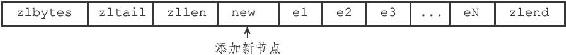
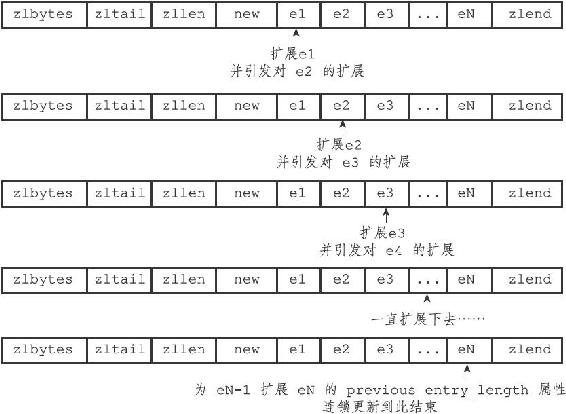
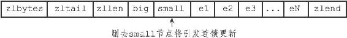

7.3 连锁更新

前面说过，每个节点的previous\_entry\_length属性都记录了前一个节点的长度：

·如果前一节点的长度小于254字节，那么previous\_entry\_length属性需要用1字节长的空间来保存这个长度值。

·如果前一节点的长度大于等于254字节，那么previous\_entry\_length属性需要用5字节长的空间来保存这个长度值。

现在，考虑这样一种情况：在一个压缩列表中，有多个连续的、长度介于250字节到253字节之间的节点e1至eN，如图7-11所示。

图7-11 包含节点el至eN的压缩列表

因为e1至eN的所有节点的长度都小于254字节，所以记录这些节点的长度只需要1字节长的previous\_entry\_length属性，换句话说，e1至eN的所有节点的previous\_entry\_length属性都是1字节长的。

这时，如果我们将一个长度大于等于254字节的新节点new设置为压缩列表的表头节点，那么new将成为e1的前置节点，如图7-12所示。

图7-12 添加新节点到压缩列表

因为e1的previous\_entry\_length属性仅长1字节，它没办法保存新节点new的长度，所以程序将对压缩列表执行空间重分配操作，并将e1节点的previous\_entry\_length属性从原来的1字节长扩展为5字节长。

现在，麻烦的事情来了，e1原本的长度介于250字节至253字节之间，在为previous\_entry\_length属性新增四个字节的空间之后，e1的长度就变成了介于254字节至257字节之间，而这种长度使用1字节长的previous\_entry\_length属性是没办法保存的。

因此，为了让e2的previous\_entry\_length属性可以记录下e1的长度，程序需要再次对压缩列表执行空间重分配操作，并将e2节点的previous\_entry\_length属性从原来的1字节长扩展为5字节长。

正如扩展e1引发了对e2的扩展一样，扩展e2也会引发对e3的扩展，而扩展e3又会引发对e4的扩展……为了让每个节点的previous\_entry\_length属性都符合压缩列表对节点的要求，程序需要不断地对压缩列表执行空间重分配操作，直到eN为止。

Redis将这种在特殊情况下产生的连续多次空间扩展操作称之为“连锁更新”（cascade update），图7-13展示了这一过程。

除了添加新节点可能会引发连锁更新之外，删除节点也可能会引发连锁更新。

考虑图7-14所示的压缩列表，如果e1至eN都是大小介于250字节至253字节的节点，big节点的长度大于等于254字节（需要5字节的previous\_entry\_length来保存），而small节点的长度小于254字节（只需要1字节的previous\_entry\_length来保存），那么当我们将small节点从压缩列表中删除之后，为了让e1的previous\_entry\_length属性可以记录big节点的长度，程序将扩展e1的空间，并由此引发之后的连锁更新。

图7-13 连锁更新过程

图7-14 另一种引起连锁更新的情况

因为连锁更新在最坏情况下需要对压缩列表执行N次空间重分配操作，而每次空间重分配的最坏复杂度为O（N），所以连锁更新的最坏复杂度为O（N 2）。

要注意的是，尽管连锁更新的复杂度较高，但它真正造成性能问题的几率是很低的：

·首先，压缩列表里要恰好有多个连续的、长度介于250字节至253字节之间的节点，连锁更新才有可能被引发，在实际中，这种情况并不多见；

·其次，即使出现连锁更新，但只要被更新的节点数量不多，就不会对性能造成任何影响：比如说，对三五个节点进行连锁更新是绝对不会影响性能的；

因为以上原因，ziplistPush等命令的平均复杂度仅为O（N），在实际中，我们可以放心地使用这些函数，而不必担心连锁更新会影响压缩列表的性能。
