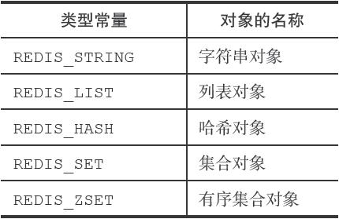
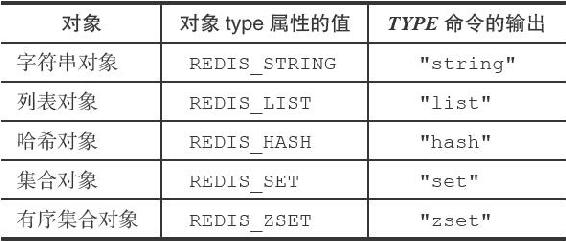
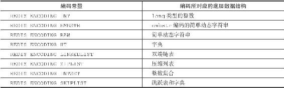
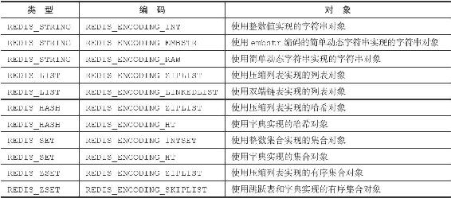
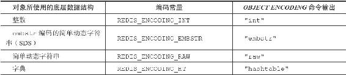
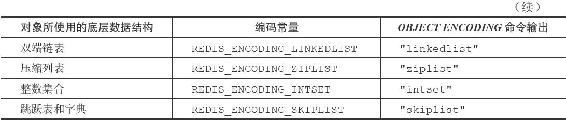

8.1 对象的类型与编码

Redis使用对象来表示数据库中的键和值，每次当我们在Redis的数据库中新创建一个键值对时，我们至少会创建两个对象，一个对象用作键值对的键（键对象），另一个对象用作键值对的值（值对象）。

举个例子，以下SET命令在数据库中创建了一个新的键值对，其中键值对的键是一个包含了字符串值"msg"的对象，而键值对的值则是一个包含了字符串值"hello world"的对象：

---

>  
> redis> SET msg "hello world"  
> OK  

---

Redis中的每个对象都由一个redisObject结构表示，该结构中和保存数据有关的三个属性分别是type属性、encoding属性和ptr属性：

---

>  
> typedef struct redisObject {  
> //   
> 类型  
> unsigned type:4;  
> //   
> 编码  
> unsigned encoding:4;  
> //   
> 指向底层实现数据结构的指针  
> void \*ptr;  
> // ...  
> } robj;  

---

8.1.1 类型

对象的type属性记录了对象的类型，这个属性的值可以是表8-1列出的常量的其中一个。

表8-1 对象的类型

对于Redis数据库保存的键值对来说，键总是一个字符串对象，而值则可以是字符串对象、列表对象、哈希对象、集合对象或者有序集合对象的其中一种，因此：

·当我们称呼一个数据库键为“字符串键”时，我们指的是“这个数据库键所对应的值为字符串对象”；

·当我们称呼一个键为“列表键”时，我们指的是“这个数据库键所对应的值为列表对象”。

TYPE命令的实现方式也与此类似，当我们对一个数据库键执行TYPE命令时，命令返回的结果为数据库键对应的值对象的类型，而不是键对象的类型：

---

>  
> \#   
> 键为字符串对象，值为字符串对象  
> redis> SET msg "hello world"  
> OK  
> redis> TYPE msg  
> string  
> \#   
> 键为字符串对象，值为列表对象  
> redis> RPUSH numbers 1 3 5  
> (integer) 6  
> redis> TYPE numbers  
> list  
> \#   
> 键为字符串对象，值为哈希对象  
> redis> HMSET profile name Tom age 25 career Programmer  
> OK  
> redis> TYPE profile  
> hash  
> \#   
> 键为字符串对象，值为集合对象  
> redis> SADD fruits apple banana cherry  
> (integer) 3  
> redis> TYPE fruits  
> set  
> \#   
> 键为字符串对象，值为有序集合对象  
> redis> ZADD price 8.5 apple 5.0 banana 6.0 cherry  
> (integer) 3  
> redis> TYPE price  
> zset  

---

表8-2列出了TYPE命令在面对不同类型的值对象时所产生的输出。

表8-2 不同类型值对象的TYPE命令输出

8.1.2 编码和底层实现

对象的ptr指针指向对象的底层实现数据结构，而这些数据结构由对象的encoding属性决定。

encoding属性记录了对象所使用的编码，也即是说这个对象使用了什么数据结构作为对象的底层实现，这个属性的值可以是表8-3列出的常量的其中一个。

表8-3 对象的编码

每种类型的对象都至少使用了两种不同的编码，表8-4列出了每种类型的对象可以使用的编码。

表8-4 不同类型和编码的对象

使用OBJECT ENCODING命令可以查看一个数据库键的值对象的编码：

---

>  
> redis> SET msg "hello wrold"  
> OK  
> redis> OBJECT ENCODING msg  
> "embstr"  
> redis> SET story "long long long long long long ago ..."  
> OK  
> redis> OBJECT ENCODING story  
> "raw"  
> redis> SADD numbers 1 3 5  
> (integer) 3  
> redis> OBJECT ENCODING numbers  
> "intset"  
> redis> SADD numbers "seven"  
> (integer) 1  
> redis> OBJECT ENCODING numbers  
> "hashtable"  

---

表8-5列出了不同编码的对象所对应的OBJECT ENCODING命令输出。

表8-5 OBJECT ENCODING对不同编码的输出

通过encoding属性来设定对象所使用的编码，而不是为特定类型的对象关联一种固定的编码，极大地提升了Redis的灵活性和效率，因为Redis可以根据不同的使用场景来为一个对象设置不同的编码，从而优化对象在某一场景下的效率。

举个例子，在列表对象包含的元素比较少时，Redis使用压缩列表作为列表对象的底层实现：

·因为压缩列表比双端链表更节约内存，并且在元素数量较少时，在内存中以连续块方式保存的压缩列表比起双端链表可以更快被载入到缓存中；

·随着列表对象包含的元素越来越多，使用压缩列表来保存元素的优势逐渐消失时，对象就会将底层实现从压缩列表转向功能更强、也更适合保存大量元素的双端链表上面；

其他类型的对象也会通过使用多种不同的编码来进行类似的优化。

在接下来的内容中，我们将分别介绍Redis中的五种不同类型的对象，说明这些对象底层所使用的编码方式，列出对象从一种编码转换成另一种编码所需的条件，以及同一个命令在多种不同编码上的实现方法。
