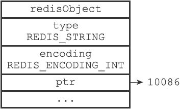
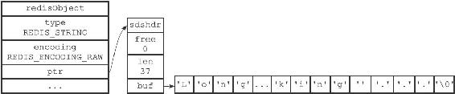
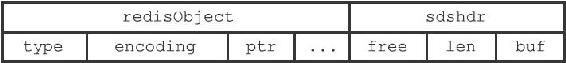
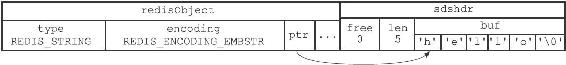
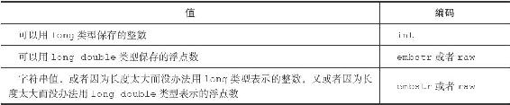
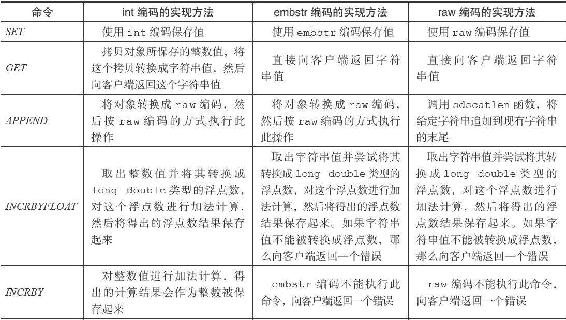
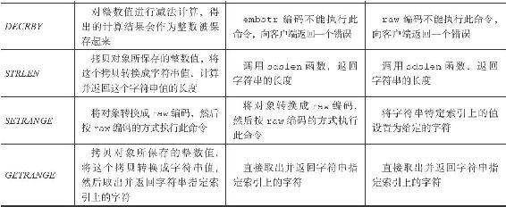

8.2 字符串对象

字符串对象的编码可以是int、raw或者embstr。

如果一个字符串对象保存的是整数值，并且这个整数值可以用long类型来表示，那么字符串对象会将整数值保存在字符串对象结构的ptr属性里面（将void\*转换成long），并将字符串对象的编码设置为int。

图8-1 int编码的字符串对象

举个例子，如果我们执行以下SET命令，那么服务器将创建一个如图8-1所示的int编码的字符串对象作为number键的值：

---

>  
> redis> SET number 10086  
> OK  
> redis> OBJECT ENCODING number  
> "int"  

---

如果字符串对象保存的是一个字符串值，并且这个字符串值的长度大于32字节，那么字符串对象将使用一个简单动态字符串（SDS）来保存这个字符串值，并将对象的编码设置为raw。

举个例子，如果我们执行以下命令，那么服务器将创建一个如图8-2所示的raw编码的字符串对象作为story键的值：

图8-2 raw编码的字符串对象

---

>  
> redis> SET story "Long, long ago there lived a king ..."  
> OK  
> redis> STRLEN story  
> (integer) 37  
> redis> OBJECT ENCODING story  
> "raw"  

---

如果字符串对象保存的是一个字符串值，并且这个字符串值的长度小于等于32字节，那么字符串对象将使用embstr编码的方式来保存这个字符串值。

embstr编码是专门用于保存短字符串的一种优化编码方式，这种编码和raw编码一样，都使用redisObject结构和sdshdr结构来表示字符串对象，但raw编码会调用两次内存分配函数来分别创建redisObject结构和sdshdr结构，而embstr编码则通过调用一次内存分配函数来分配一块连续的空间，空间中依次包含redisObject和sdshdr两个结构，如图8-3所示。

图8-3 embstr编码创建的内存块结构

embstr编码的字符串对象在执行命令时，产生的效果和raw编码的字符串对象执行命令时产生的效果是相同的，但使用embstr编码的字符串对象来保存短字符串值有以下好处：

·embstr编码将创建字符串对象所需的内存分配次数从raw编码的两次降低为一次。

·释放embstr编码的字符串对象只需要调用一次内存释放函数，而释放raw编码的字符串对象需要调用两次内存释放函数。

·因为embstr编码的字符串对象的所有数据都保存在一块连续的内存里面，所以这种编码的字符串对象比起raw编码的字符串对象能够更好地利用缓存带来的优势。

作为例子，以下命令创建了一个embstr编码的字符串对象作为msg键的值，值对象的样子如图8-4所示：

---

>  
> redis> SET msg "hello"  
> OK  
> redis> OBJECT ENCODING msg  
> "embstr"  

---

图8-4 embstr编码的字符串对象

最后要说的是，可以用long double类型表示的浮点数在Redis中也是作为字符串值来保存的。如果我们要保存一个浮点数到字符串对象里面，那么程序会先将这个浮点数转换成字符串值，然后再保存转换所得的字符串值。

举个例子，执行以下代码将创建一个包含3.14的字符串表示“3.14”的字符串对象：

---

>  
> redis> SET pi 3.14  
> OK  
> redis> OBJECT ENCODING pi  
> "embstr"  

---

在有需要的时候，程序会将保存在字符串对象里面的字符串值转换回浮点数值，执行某些操作，然后再将执行操作所得的浮点数值转换回字符串值，并继续保存在字符串对象里面。

举个例子，如果我们执行以下代码：

---

>  
> redis> INCRBYFLOAT pi 2.0  
> "5.14"  
> redis> OBJECT ENCODING pi  
> "embstr"  

---

那么程序首先会取出字符串对象里面保存的字符串值"3.14"，将它转换回浮点数值3.14，然后把3.14和2.0相加得出的值5.14转换成字符串"5.14"，并将这个"5.14"保存到字符串对象里面。表8-6总结并列出了字符串对象保存各种不同类型的值所使用的编码方式。

表8-6 字符串对象保存各类型值的编码方式

8.2.1 编码的转换

int编码的字符串对象和embstr编码的字符串对象在条件满足的情况下，会被转换为raw编码的字符串对象。

对于int编码的字符串对象来说，如果我们向对象执行了一些命令，使得这个对象保存的不再是整数值，而是一个字符串值，那么字符串对象的编码将从int变为raw。

在下面的示例中，我们通过APPEND命令，向一个保存整数值的字符串对象追加了一个字符串值，因为追加操作只能对字符串值执行，所以程序会先将之前保存的整数值10086转换为字符串值"10086"，然后再执行追加操作，操作的执行结果就是一个raw编码的、保存了字符串值的字符串对象：

---

>  
> redis> SET number 10086  
> OK  
> redis> OBJECT ENCODING number  
> "int"  
> redis> APPEND number " is a good number!"  
> (integer) 23  
> redis> GET number  
> "10086 is a good number!"  
> redis> OBJECT ENCODING number  
> "raw"  

---

另外，因为Redis没有为embstr编码的字符串对象编写任何相应的修改程序（只有int编码的字符串对象和raw编码的字符串对象有这些程序），所以embstr编码的字符串对象实际上是只读的。当我们对embstr编码的字符串对象执行任何修改命令时，程序会先将对象的编码从embstr转换成raw，然后再执行修改命令。因为这个原因，embstr编码的字符串对象在执行修改命令之后，总会变成一个raw编码的字符串对象。

以下代码展示了一个embstr编码的字符串对象在执行APPEND命令之后，对象的编码从embstr变为raw的例子：

---

>  
> redis> SET msg "hello world"  
> OK  
> redis> OBJECT ENCODING msg  
> "embstr"  
> redis> APPEND msg " again!"  
> (integer) 18  
> redis> OBJECT ENCODING msg  
> "raw"  

---

8.2.2 字符串命令的实现

因为字符串键的值为字符串对象，所以用于字符串键的所有命令都是针对字符串对象来构建的，表8-7列举了其中一部分字符串命令，以及这些命令在不同编码的字符串对象下的实现方法。

表8-7 字符串命令的实现

