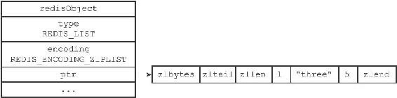
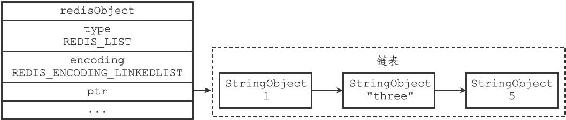
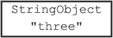
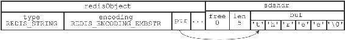
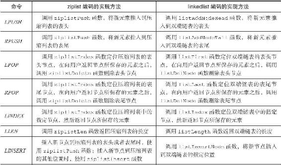
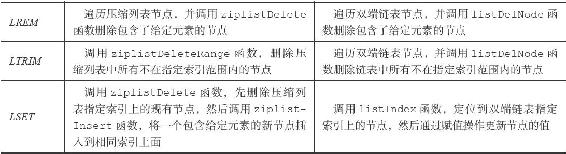

8.3 列表对象

列表对象的编码可以是ziplist或者linkedlist。

ziplist编码的列表对象使用压缩列表作为底层实现，每个压缩列表节点（entry）保存了一个列表元素。举个例子，如果我们执行以下RPUSH命令，那么服务器将创建一个列表对象作为numbers键的值：

---

>  
> redis> RPUSH numbers 1 "three" 5  
> (integer) 3  

---

如果numbers键的值对象使用的是ziplist编码，这个这个值对象将会是图8-5所展示的样子。

图8-5 ziplist编码的numbers列表对象

另一方面，linkedlist编码的列表对象使用双端链表作为底层实现，每个双端链表节点（node）都保存了一个字符串对象，而每个字符串对象都保存了一个列表元素。

举个例子，如果前面所说的numbers键创建的列表对象使用的不是ziplist编码，而是linkedlist编码，那么numbers键的值对象将是图8-6所示的样子。

图8-6 linkedlist编码的numbers列表对象

注意，linkedlist编码的列表对象在底层的双端链表结构中包含了多个字符串对象，这种嵌套字符串对象的行为在稍后介绍的哈希对象、集合对象和有序集合对象中都会出现，字符串对象是Redis五种类型的对象中唯一一种会被其他四种类型对象嵌套的对象。

注意

为了简化字符串对象的表示，我们在图8-6使用了一个带有StringObject字样的格子来表示一个字符串对象，而StringObject字样下面的是字符串对象所保存的值。比如说，图8-7代表的就是一个包含了字符串值"three"的字符串对象，它是图8-8的简化表示。

图8-7 简化的字符串对象表示

图8-8 完整的字符串对象表示

本书接下来的内容将继续沿用这一简化表示。

8.3.1 编码转换

当列表对象可以同时满足以下两个条件时，列表对象使用ziplist编码：

·列表对象保存的所有字符串元素的长度都小于64字节；

·列表对象保存的元素数量小于512个；不能满足这两个条件的列表对象需要使用linkedlist编码。

注意

以上两个条件的上限值是可以修改的，具体请看配置文件中关于list-max-ziplist-value选项和list-max-ziplist-entries选项的说明。

对于使用ziplist编码的列表对象来说，当使用ziplist编码所需的两个条件的任意一个不能被满足时，对象的编码转换操作就会被执行，原本保存在压缩列表里的所有列表元素都会被转移并保存到双端链表里面，对象的编码也会从ziplist变为linkedlist。

以下代码展示了列表对象因为保存了长度太大的元素而进行编码转换的情况：

---

>  
> #  
> 所有元素的长度都小于64  
> 字节  
> redis> RPUSH blah "hello" "world" "again"  
> (integer)3  
> redis> OBJECT ENCODING blah  
> "ziplist"  
> #  
> 将一个65  
> 字节长的元素推入列表对象中  
> redis> RPUSH blah "wwwwwwwwwwwwwwwwwwwwwwwwwwwwwwwwwwwww"  
> (integer) 4  
> \#   
> 编码已改变  
> redis> OBJECT ENCODING blah  
> "linkedlist"  

---

除此之外，以下代码展示了列表对象因为保存的元素数量过多而进行编码转换的情况：

---

>  
> #  
> 列表对象包含512  
> 个元素  
> redis> EVAL "for i=1, 512 do redis.call('RPUSH', KEYS\[1\],i)end" 1 "integers"  
> (nil)  
> redis> LLEN integers  
> (integer) 512  
> redis> OBJECT ENCODING integers  
> "ziplist"  
> #  
> 再向列表对象推入一个新元素，使得对象保存的元素数量达到513  
> 个  
> redis> RPUSH integers 513  
> (integer) 513  
> \#   
> 编码已改变  
> redis> OBJECT ENCODING integers  
> "linkedlist"  

---

8.3.2 列表命令的实现

因为列表键的值为列表对象，所以用于列表键的所有命令都是针对列表对象来构建的，表8-8列出了其中一部分列表键命令，以及这些命令在不同编码的列表对象下的实现方法。

表8-8 列表命令的实现

