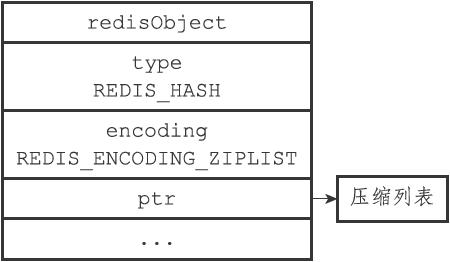
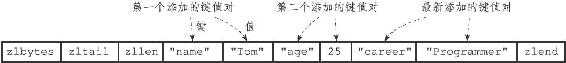
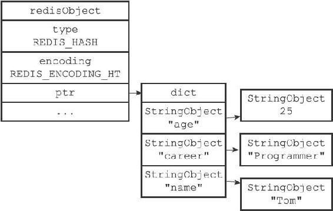
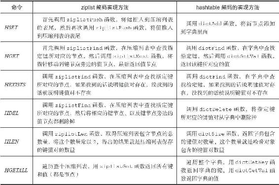

8.4 哈希对象

哈希对象的编码可以是ziplist或者hashtable。

ziplist编码的哈希对象使用压缩列表作为底层实现，每当有新的键值对要加入到哈希对象时，程序会先将保存了键的压缩列表节点推入到压缩列表表尾，然后再将保存了值的压缩列表节点推入到压缩列表表尾，因此：

·保存了同一键值对的两个节点总是紧挨在一起，保存键的节点在前，保存值的节点在后；

·先添加到哈希对象中的键值对会被放在压缩列表的表头方向，而后来添加到哈希对象中的键值对会被放在压缩列表的表尾方向。

举个例子，如果我们执行以下HSET命令，那么服务器将创建一个列表对象作为profile键的值：

---

>  
> redis> HSET profile name "Tom"  
> (integer) 1  
> redis> HSET profile age 25  
> (integer) 1  
> redis> HSET profile career "Programmer"  
> (integer) 1  

---

如果profile键的值对象使用的是ziplist编码，那么这个值对象将会是图8-9所示的样子，其中对象所使用的压缩列表如图8-10所示。

图8-9 ziplist编码的profile哈希对象

图8-10 profile哈希对象的压缩列表底层实现

另一方面，hashtable编码的哈希对象使用字典作为底层实现，哈希对象中的每个键值对都使用一个字典键值对来保存：

·字典的每个键都是一个字符串对象，对象中保存了键值对的键；

·字典的每个值都是一个字符串对象，对象中保存了键值对的值。

举个例子，如果前面profile键创建的不是ziplist编码的哈希对象，而是hashtable编码的哈希对象，那么这个哈希对象应该会是图8-11所示的样子。

图8-11 hashtable编码的profile哈希对象

8.4.1 编码转换

当哈希对象可以同时满足以下两个条件时，哈希对象使用ziplist编码：

·哈希对象保存的所有键值对的键和值的字符串长度都小于64字节；

·哈希对象保存的键值对数量小于512个；不能满足这两个条件的哈希对象需要使用hashtable编码。

注意

这两个条件的上限值是可以修改的，具体请看配置文件中关于hash-max-ziplist-value选项和hash-max-ziplist-entries选项的说明。

对于使用ziplist编码的列表对象来说，当使用ziplist编码所需的两个条件的任意一个不能被满足时，对象的编码转换操作就会被执行，原本保存在压缩列表里的所有键值对都会被转移并保存到字典里面，对象的编码也会从ziplist变为hashtable。

以下代码展示了哈希对象因为键值对的键长度太大而引起编码转换的情况：

---

>  
> #  
> 哈希对象只包含一个键和值都不超过64  
> 个字节的键值对  
> redis> HSET book name "Mastering C++ in 21 days"  
> (integer) 1  
> redis> OBJECT ENCODING book  
> "ziplist"  
> #  
> 向哈希对象添加一个新的键值对，键的长度为66  
> 字节  
> redis> HSET book long\_long\_long\_long\_long\_long\_long\_long\_long\_long\_long\_description "content"  
> (integer) 1  
> \#   
> 编码已改变  
> redis> OBJECT ENCODING book  
> "hashtable"  

---

除了键的长度太大会引起编码转换之外，值的长度太大也会引起编码转换，以下代码展示了这种情况的一个示例：

---

>  
> #  
> 哈希对象只包含一个键和值都不超过64  
> 个字节的键值对  
> redis> HSET blah greeting "hello world"  
> (integer) 1  
> redis> OBJECT ENCODING blah  
> "ziplist"  
> #  
> 向哈希对象添加一个新的键值对，值的长度为68  
> 字节  
> redis> HSET blah story "many string ... many string ... many string ... many string ... many"  
> (integer) 1  
> \#   
> 编码已改变  
> redis> OBJECT ENCODING blah  
> "hashtable"  

---

最后，以下代码展示了哈希对象因为包含的键值对数量过多而引起编码转换的情况：

---

>  
> #  
> 创建一个包含512  
> 个键值对的哈希对象  
> redis> EVAL "for i=1, 512 do redis.call('HSET', KEYS\[1\], i, i)end" 1 "numbers"  
> (nil)  
> redis> HLEN numbers  
> (integer) 512  
> redis> OBJECT ENCODING numbers  
> "ziplist"  
> #  
> 再向哈希对象添加一个新的键值对，使得键值对的数量变成513  
> 个  
> redis> HMSET numbers "key" "value"  
> OK  
> redis> HLEN numbers  
> (integer) 513  
> \#   
> 编码改变  
> redis> OBJECT ENCODING numbers  
> "hashtable"  

---

8.4.2 哈希命令的实现

因为哈希键的值为哈希对象，所以用于哈希键的所有命令都是针对哈希对象来构建的，表8-9列出了其中一部分哈希键命令，以及这些命令在不同编码的哈希对象下的实现方法。

表8-9 哈希命令的实现

