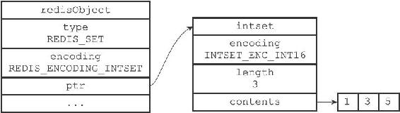
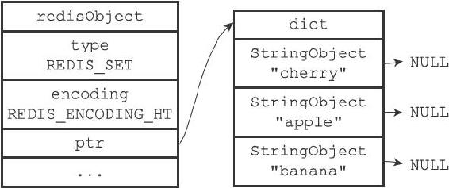
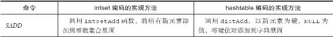
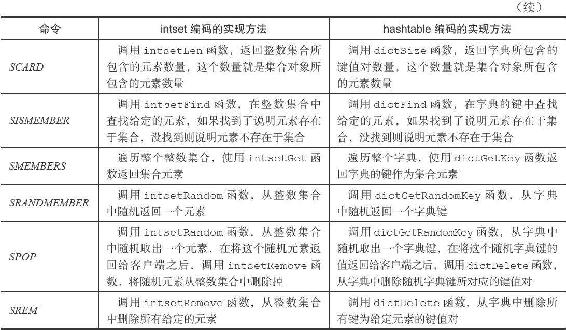

8.5 集合对象

集合对象的编码可以是intset或者hashtable。

intset编码的集合对象使用整数集合作为底层实现，集合对象包含的所有元素都被保存在整数集合里面。

举个例子，以下代码将创建一个如图8-12所示的intset编码集合对象：

---

>  
> redis> SADD numbers 1 3 5  
> (integer) 3  

---

另一方面，hashtable编码的集合对象使用字典作为底层实现，字典的每个键都是一个字符串对象，每个字符串对象包含了一个集合元素，而字典的值则全部被设置为NULL。

举个例子，以下代码将创建一个如图8-13所示的hashtable编码集合对象：

---

>  
> redis> SAD Dfruits "apple" "banana" "cherry"  
> (integer)3  

---

图8-12 intset编码的numbers集合对象

图8-13 hashtable编码的fruits集合对象

8.5.1 编码的转换

当集合对象可以同时满足以下两个条件时，对象使用intset编码：

·集合对象保存的所有元素都是整数值；

·集合对象保存的元素数量不超过512个。

不能满足这两个条件的集合对象需要使用hashtable编码。

注意

第二个条件的上限值是可以修改的，具体请看配置文件中关于set-max-intset-entries选项的说明。

对于使用intset编码的集合对象来说，当使用intset编码所需的两个条件的任意一个不能被满足时，就会执行对象的编码转换操作，原本保存在整数集合中的所有元素都会被转移并保存到字典里面，并且对象的编码也会从intset变为hashtable。

举个例子，以下代码创建了一个只包含整数元素的集合对象，该对象的编码为intset：

---

>  
> redis> SADD numbers 1 3 5  
> (integer) 3  
> redis> OBJECT ENCODING numbers  
> "intset"  

---

不过，只要我们向这个只包含整数元素的集合对象添加一个字符串元素，集合对象的编码转移操作就会被执行：

---

>  
> redis> SADD numbers "seven"  
> (integer) 1  
> redis> OBJECT ENCODING numbers  
> "hashtable"  

---

除此之外，如果我们创建一个包含512个整数元素的集合对象，那么对象的编码应该会是intset：

---

>  
> redis> EVAL "for i=1, 512 do redis.call('SADD', KEYS\[1\], i) end" 1 integers  
> (nil)  
> redis> SCARD integers  
> (integer) 512  
> redis> OBJECT ENCODING integers  
> "intset"  

---

但是，只要我们再向集合添加一个新的整数元素，使得这个集合的元素数量变成513，那么对象的编码转换操作就会被执行：

---

>  
> redis> SADD integers 10086  
> (integer) 1  
> redis> SCARD integers  
> (integer) 513  
> redis> OBJECT ENCODING integers  
> "hashtable"  

---

8.5.2 集合命令的实现

因为集合键的值为集合对象，所以用于集合键的所有命令都是针对集合对象来构建的，表8-10列出了其中一部分集合键命令，以及这些命令在不同编码的集合对象下的实现方法。

表8-10 集合命令的实现方法

