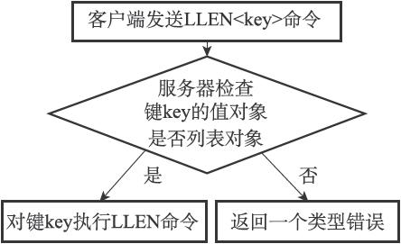
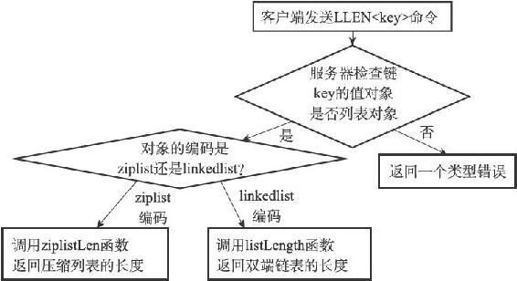

8.7 类型检查与命令多态

Redis中用于操作键的命令基本上可以分为两种类型。

其中一种命令可以对任何类型的键执行，比如说DEL命令、EXPIRE命令、RENAME命令、TYPE命令、OBJECT命令等。

举个例子，以下代码就展示了使用DEL命令来删除三种不同类型的键：

---

>  
> \#   
> 字符串键  
> redis> SET msg "hello"  
> OK  
> \#   
> 列表键  
> redis> RPUSH numbers 1 2 3  
> (integer) 3  
> \#   
> 集合键  
> redis> SADD fruits apple banana cherry  
> (integer) 3  
> redis> DEL msg  
> (integer) 1  
> redis> DEL numbers  
> (integer) 1  
> redis> DEL fruits  
> (integer) 1  

---

而另一种命令只能对特定类型的键执行，比如说：

·SET、GET、APPEND、STRLEN等命令只能对字符串键执行；

·HDEL、HSET、HGET、HLEN等命令只能对哈希键执行；

·RPUSH、LPOP、LINSERT、LLEN等命令只能对列表键执行；

·SADD、SPOP、SINTER、SCARD等命令只能对集合键执行；

·ZADD、ZCARD、ZRANK、ZSCORE等命令只能对有序集合键执行；

举个例子，我们可以用SET命令创建一个字符串键，然后用GET命令和APPEND命令操作这个键，但如果我们试图对这个字符串键执行只有列表键才能执行的LLEN命令，那么Redis将向我们返回一个类型错误：

---

>  
> redis> SET msg "hello world"  
> OK  
> redis> GET msg  
> "hello world"  
> redis> APPEND msg " again!"  
> (integer) 18  
> redis> GET msg  
> "hello world again!"  
> redis> LLEN msg  
> (error) WRONGTYPE Operation against a key holding the wrong kind of value  

---

8.7.1 类型检查的实现

从上面发生类型错误的代码示例可以看出，为了确保只有指定类型的键可以执行某些特定的命令，在执行一个类型特定的命令之前，Redis会先检查输入键的类型是否正确，然后再决定是否执行给定的命令。

类型特定命令所进行的类型检查是通过redisObject结构的type属性来实现的：

·在执行一个类型特定命令之前，服务器会先检查输入数据库键的值对象是否为执行命令所需的类型，如果是的话，服务器就对键执行指定的命令；

·否则，服务器将拒绝执行命令，并向客户端返回一个类型错误。

举个例子，对于LLEN命令来说：

·在执行LLEN命令之前，服务器会先检查输入数据库键的值对象是否为列表类型，也即是，检查值对象redisObject结构type属性的值是否为REDIS\_LIST，如果是的话，服务器就对键执行LLEN命令；

·否则的话，服务器就拒绝执行命令并向客户端返回一个类型错误；图8-18展示了这一类型检查过程。

图8-18 LLEN命令执行时的类型检查过程

其他类型特定命令的类型检查过程也和这里展示的LLEN命令的类型检查过程类似。

8.7.2 多态命令的实现

Redis除了会根据值对象的类型来判断键是否能够执行指定命令之外，还会根据值对象的编码方式，选择正确的命令实现代码来执行命令。

举个例子，在前面介绍列表对象的编码时我们说过，列表对象有ziplist和linkedlist两种编码可用，其中前者使用压缩列表API来实现列表命令，而后者则使用双端链表API来实现列表命令。

现在，考虑这样一个情况，如果我们对一个键执行LLEN命令，那么服务器除了要确保执行命令的是列表键之外，还需要根据键的值对象所使用的编码来选择正确的LLEN命令实现：

·如果列表对象的编码为ziplist，那么说明列表对象的实现为压缩列表，程序将使用ziplistLen函数来返回列表的长度；

·如果列表对象的编码为linkedlist，那么说明列表对象的实现为双端链表，程序将使用listLength函数来返回双端链表的长度；

借用面向对象方面的术语来说，我们可以认为LLEN命令是多态（polymorphism）的，只要执行LLEN命令的是列表键，那么无论值对象使用的是ziplist编码还是linkedlist编码，命令都可以正常执行。

图8-19展示了LLEN命令从类型检查到根据编码选择实现函数的整个执行过程，其他类型特定命令的执行过程也是类似的。

实际上，我们可以将DEL、EXPIRE、TYPE等命令也称为多态命令，因为无论输入的键是什么类型，这些命令都可以正确地执行。

DEL、EXPIRE等命令和LLEN等命令的区别在于，前者是基于类型的多态——一个命令可以同时用于处理多种不同类型的键，而后者是基于编码的多态——一个命令可以同时用于处理多种不同编码。

图8-19 LLEN命令的执行过程
