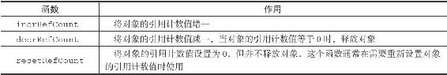

8.8 内存回收

因为C语言并不具备自动内存回收功能，所以Redis在自己的对象系统中构建了一个引用计数（reference counting）技术实现的内存回收机制，通过这一机制，程序可以通过跟踪对象的引用计数信息，在适当的时候自动释放对象并进行内存回收。

每个对象的引用计数信息由redisObject结构的refcount属性记录：

---

>  
> typedef struct redisObject {  
> // ...  
> //   
> 引用计数  
> int refcount;  
> // ...  
> } robj;  

---

对象的引用计数信息会随着对象的使用状态而不断变化：

·在创建一个新对象时，引用计数的值会被初始化为1；

·当对象被一个新程序使用时，它的引用计数值会被增一；

·当对象不再被一个程序使用时，它的引用计数值会被减一；

·当对象的引用计数值变为0时，对象所占用的内存会被释放。

表8-12列出了修改对象引用计数的API，这些API分别用于增加、减少、重置对象的引用计数。

表8-12 修改对象引用计数的API

对象的整个生命周期可以划分为创建对象、操作对象、释放对象三个阶段。作为例子，以下代码展示了一个字符串对象从创建到释放的整个过程：

---

>  
> //   
> 创建一个字符串对象s  
> ，对象的引用计数为1   
> robj \*s = createStringObject(...)  
> //  
> 对象s  
> 执行各种操作...  
> //   
> 将对象s   
> 的引用计数减一，使得对象的引用计数变为0   
> //   
> 导致对象s   
> 被释放  
> decrRefCount(s)  

---

其他不同类型的对象也会经历类似的过程。
