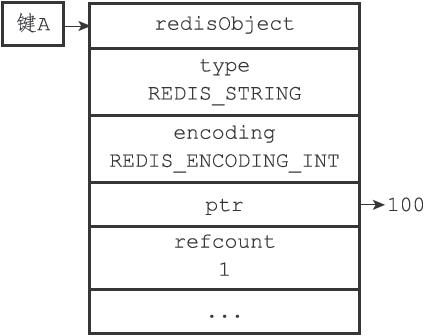
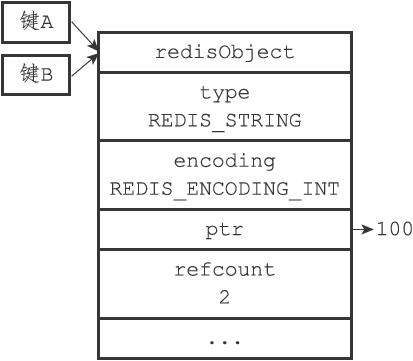
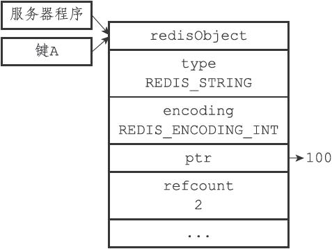
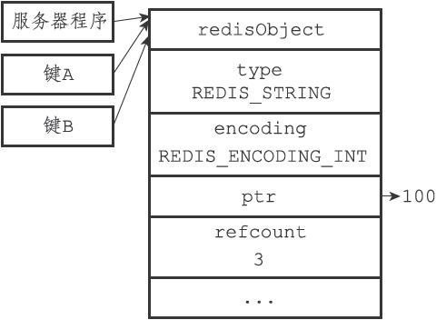

8.9 对象共享

除了用于实现引用计数内存回收机制之外，对象的引用计数属性还带有对象共享的作用。举个例子，假设键A创建了一个包含整数值100的字符串对象作为值对象，如图8-20所示。

如果这时键B也要创建一个同样保存了整数值100的字符串对象作为值对象，那么服务器有以下两种做法：

1）为键B新创建一个包含整数值100的字符串对象；

2）让键A和键B共享同一个字符串对象；

以上两种方法很明显是第二种方法更节约内存。

在Redis中，让多个键共享同一个值对象需要执行以下两个步骤：

1）将数据库键的值指针指向一个现有的值对象；

2）将被共享的值对象的引用计数增一。

举个例子，图8-21就展示了包含整数值100的字符串对象同时被键A和键B共享之后的样子，可以看到，除了对象的引用计数从之前的1变成了2之外，其他属性都没有变化。共享对象机制对于节约内存非常有帮助，数据库中保存的相同值对象越多，对象共享机制就能节约越多的内存。

图8-20 未被共享的字符串对象

图8-21 被共享的字符串对象

例如，假设数据库中保存了整数值100的键不只有键A和键B两个，而是有一百个，那么服务器只需要用一个字符串对象的内存就可以保存原本需要使用一百个字符串对象的内存才能保存的数据。

目前来说，Redis会在初始化服务器时，创建一万个字符串对象，这些对象包含了从0到9999的所有整数值，当服务器需要用到值为0到9999的字符串对象时，服务器就会使用这些共享对象，而不是新创建对象。

注意

创建共享字符串对象的数量可以通过修改redis.h/REDIS\_SHARED\_INTEGERS常量来修改。

举个例子，如果我们创建一个值为100的键A，并使用OBJECT REFCOUNT命令查看键A的值对象的引用计数，我们会发现值对象的引用计数为2：

---

>  
> redis> SET A 100  
> OK  
> redis> OBJECT REFCOUNT A  
> (integer) 2  

---

引用这个值对象的两个程序分别是持有这个值对象的服务器程序，以及共享这个值对象的键A，如图8-22所示。

如果这时我们再创建一个值为100的键B，那么键B也会指向包含整数值100的共享对象，使得共享对象的引用计数值变为3：

---

>  
> redis> SET B 100  
> OK  
> redis> OBJECT REFCOUNT A  
> (integer) 3  
> redis> OBJECT REFCOUNT B  
> (integer) 3  

---

图8-23展示了共享值对象的三个程序。

图8-22 引用数为2的共享对象

图8-23 引用数为3的共享对象

另外，这些共享对象不单单只有字符串键可以使用，那些在数据结构中嵌套了字符串对象的对象（linkedlist编码的列表对象、hashtable编码的哈希对象、hashtable编码的集合对象，以及zset编码的有序集合对象）都可以使用这些共享对象。

> 为什么Redis不共享包含字符串的对象？

> 当服务器考虑将一个共享对象设置为键的值对象时，程序需要先检查给定的共享对象和键想创建的目标对象是否完全相同，只有在共享对象和目标对象完全相同的情况下，程序才会将共享对象用作键的值对象，而一个共享对象保存的值越复杂，验证共享对象和目标对象是否相同所需的复杂度就会越高，消耗的CPU时间也会越多：

> ·如果共享对象是保存整数值的字符串对象，那么验证操作的复杂度为O（1）；

> ·如果共享对象是保存字符串值的字符串对象，那么验证操作的复杂度为O（N）；

> ·如果共享对象是包含了多个值（或者对象的）对象，比如列表对象或者哈希对象，那么验证操作的复杂度将会是O（N 2）。

> 因此，尽管共享更复杂的对象可以节约更多的内存，但受到CPU时间的限制，Redis只对包含整数值的字符串对象进行共享。
