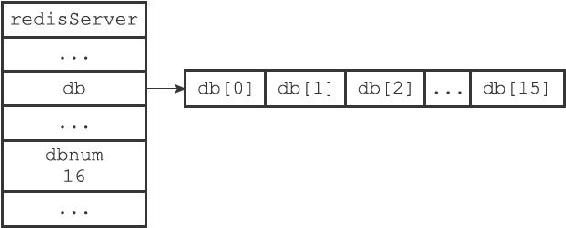

9.1 服务器中的数据库

Redis服务器将所有数据库都保存在服务器状态redis.h/redisServer结构的db数组中，db数组的每个项都是一个redis.h/redisDb结构，每个redisDb结构代表一个数据库：

---

>  
> struct redisServer {  
> // ...  
> //   
> 一个数组，保存着服务器中的所有数据库  
> redisDb \*db;  
> // ...  
> };  

---

在初始化服务器时，程序会根据服务器状态的dbnum属性来决定应该创建多少个数据库：

---

>  
> struct redisServer {  
> // ...  
> //   
> 服务器的数据库数量  
> int dbnum;  
> // ...  
> };  

---

dbnum属性的值由服务器配置的database选项决定，默认情况下，该选项的值为16，所以Redis服务器默认会创建16个数据库，如图9-1所示。

图9-1 服务器数据库示例
