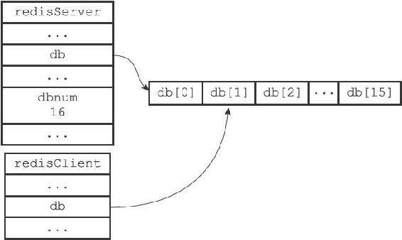
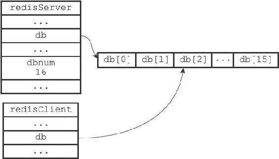

9.2 切换数据库

每个Redis客户端都有自己的目标数据库，每当客户端执行数据库写命令或者数据库读命令的时候，目标数据库就会成为这些命令的操作对象。

默认情况下，Redis客户端的目标数据库为0号数据库，但客户端可以通过执行SELECT命令来切换目标数据库。

以下代码示例演示了客户端在0号数据库设置并读取键msg，之后切换到2号数据库并执行类似操作的过程：

---

>  
> redis> SET msg "hello world"  
> OK  
> redis> GET msg  
> "hello world"  
> redis> SELECT 2  
> OK  
> redis\[2\]> GET msg  
> (nil)  
> redis\[2\]> SET msg"another world"  
> OK  
> redis\[2\]> GET msg  
> "another world"  

---

在服务器内部，客户端状态redisClient结构的db属性记录了客户端当前的目标数据库，这个属性是一个指向redisDb结构的指针：

---

>  
> typedef struct redisClient {  
> // ...  
> //   
> 记录客户端当前正在使用的数据库  
> redisDb \*db;  
> // ...  
> } redisClient;  

---

redisClient.db指针指向redisServer.db数组的其中一个元素，而被指向的元素就是客户端的目标数据库。

比如说，如果某个客户端的目标数据库为1号数据库，那么这个客户端所对应的客户端状态和服务器状态之间的关系如图9-2所示。

图9-2 客户端的目标数据库为1号数据库

如果这时客户端执行命令SELECT 2，将目标数据库改为2号数据库，那么客户端状态和服务器状态之间的关系将更新成图9-3。

图9-3 客户端的目标数据库为2号数据库

通过修改redisClient.db指针，让它指向服务器中的不同数据库，从而实现切换目标数据库的功能——这就是SELECT命令的实现原理。

> 谨慎处理多数据库程序

> 到目前为止，Redis仍然没有可以返回客户端目标数据库的命令。虽然redis-cli客户端会在输入符旁边提示当前所使用的目标数据库：

---

>  
> redis> SELECT 1  
> OK  
> redis\[1\]> SELECT 2  
> OK  
> redis\[2\]>  

---

> 但如果你在其他语言的客户端中执行Redis命令，并且该客户端没有像redis-cli那样一直显示目标数据库的号码，那么在数次切换数据库之后，你很可能会忘记自己当前正在使用的是哪个数据库。当出现这种情况时，为了避免对数据库进行误操作，在执行Redis命令特别是像FLUSHDB这样的危险命令之前，最好先执行一个SELECT命令，显式地切换到指定的数据库，然后才执行别的命令。
