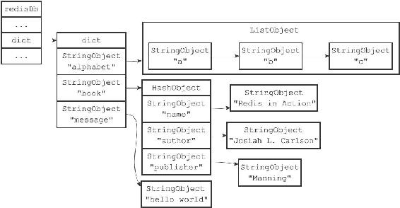
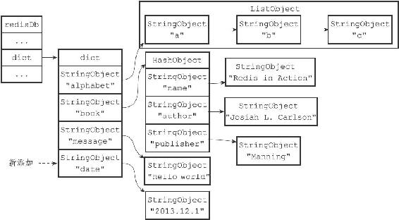
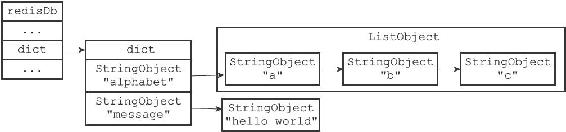
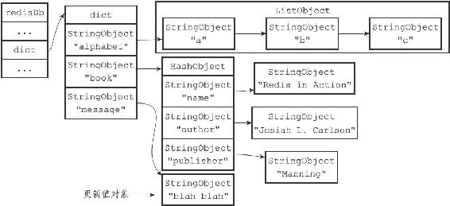
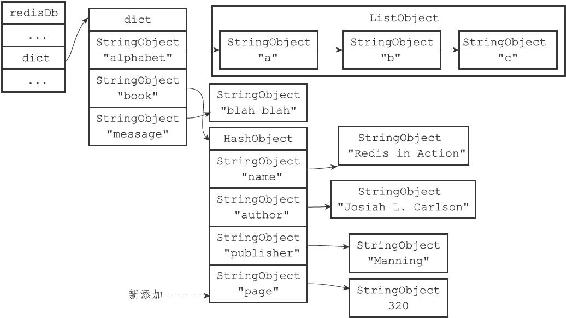
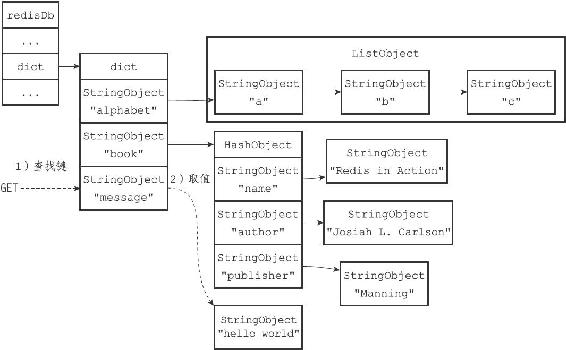
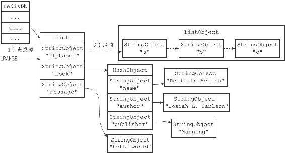

9.3 数据库键空间

Redis是一个键值对（key-value pair）数据库服务器，服务器中的每个数据库都由一个redis.h/redisDb结构表示，其中，redisDb结构的dict字典保存了数据库中的所有键值对，我们将这个字典称为键空间（key space）：

---

>  
> typedef struct redisDb {  
> // ...  
> //   
> 数据库键空间，保存着数据库中的所有键值对  
> dict \*dict;  
> // ...  
> } redisDb;  

---

键空间和用户所见的数据库是直接对应的：

·键空间的键也就是数据库的键，每个键都是一个字符串对象。

·键空间的值也就是数据库的值，每个值可以是字符串对象、列表对象、哈希表对象、集合对象和有序集合对象中的任意一种Redis对象。

举个例子，如果我们在空白的数据库中执行以下命令：

---

>  
> redis> SET message "hello world"  
> OK  
> redis> RPUSH alphabet "a" "b" "c"  
> (integer)3  
> redis> HSET book name "Redis in Action"  
> (integer) 1  
> redis> HSET book author "Josiah L. Carlson"  
> (integer) 1  
> redis> HSET book publisher "Manning"  
> (integer) 1  

---

那么在这些命令执行之后，数据库的键空间将会是图9-4所展示的样子：

·alphabet是一个列表键，键的名字是一个包含字符串"alphabet"的字符串对象，键的值则是一个包含三个元素的列表对象。

·book是一个哈希表键，键的名字是一个包含字符串"book"的字符串对象，键的值则是一个包含三个键值对的哈希表对象。

·message是一个字符串键，键的名字是一个包含字符串"message"的字符串对象，键的值则是一个包含字符串"hello world"的字符串对象。

图9-4 数据库键空间例子

因为数据库的键空间是一个字典，所以所有针对数据库的操作，比如添加一个键值对到数据库，或者从数据库中删除一个键值对，又或者在数据库中获取某个键值对等，实际上都是通过对键空间字典进行操作来实现的，以下几个小节将分别介绍数据库的添加、删除、更新、取值等操作的实现原理。

9.3.1 添加新键

添加一个新键值对到数据库，实际上就是将一个新键值对添加到键空间字典里面，其中键为字符串对象，而值则为任意一种类型的Redis对象。

举个例子，如果键空间当前的状态如图9-4所示，那么在执行以下命令之后：

---

>  
> redis> SET date "2013.12.1"  
> OK  

---

键空间将添加一个新的键值对，这个新键值对的键是一个包含字符串"date"的字符串对象，而键值对的值则是一个包含字符串"2013.12.1"的字符串对象，如图9-5所示。

图9-5 添加date键之后的键空间

9.3.2 删除键

删除数据库中的一个键，实际上就是在键空间里面删除键所对应的键值对对象。

举个例子，如果键空间当前的状态如图9-4所示，那么在执行以下命令之后：

---

>  
> redis> DEL book  
> (integer) 1  

---

键book以及它的值将从键空间中被删除，如图9-6所示。

图9-6 删除book键之后的键空间

9.3.3 更新键

对一个数据库键进行更新，实际上就是对键空间里面键所对应的值对象进行更新，根据值对象的类型不同，更新的具体方法也会有所不同。

举个例子，如果键空间当前的状态如图9-4所示，那么在执行以下命令之后：

---

>  
> redis> SET message "blah blah"  
> OK  

---

键message的值对象将从之前包含"hello world"字符串更新为包含"blah blah"字符串，如图9-7所示。

图9-7 使用SET命令更新message键

再举个例子，如果我们继续执行以下命令：

---

>  
> redis> HSET book page 320  
> (integer) 1  

---

那么键空间中book键的值对象（一个哈希对象）将被更新，新的键值对page和320会被添加到值对象里面，如图9-8所示。

图9-8 使用HSET更新book键

9.3.4 对键取值

对一个数据库键进行取值，实际上就是在键空间中取出键所对应的值对象，根据值对象的类型不同，具体的取值方法也会有所不同。

举个例子，如果键空间当前的状态如图9-4所示，那么当执行以下命令时：

---

>  
> redis> GET message  
> "hello world"  

---

GET命令将首先在键空间中查找键message，找到键之后接着取得该键所对应的字符串对象值，之后再返回值对象所包含的字符串"hello world"，取值过程如图9-9所示。

图9-9 使用GET命令取值的过程

再举一个例子，当执行以下命令时：

---

>  
> redis> LRANGE alphabet 0 -1  
> 1)"a"  
> 2)"b"  
> 3)"c"  

---

LRANGE命令将首先在键空间中查找键alphabet，找到键之后接着取得该键所对应的列表对象值，之后再返回列表对象中包含的三个字符串对象的值，取值过程如图9-10所示。

图9-10 使用LRANGE命令取值的过程

9.3.5 其他键空间操作

除了上面列出的添加、删除、更新、取值操作之外，还有很多针对数据库本身的Redis命令，也是通过对键空间进行处理来完成的。

比如说，用于清空整个数据库的FLUSHDB命令，就是通过删除键空间中的所有键值对来实现的。又比如说，用于随机返回数据库中某个键的RANDOMKEY命令，就是通过在键空间中随机返回一个键来实现的。

另外，用于返回数据库键数量的DBSIZE命令，就是通过返回键空间中包含的键值对的数量来实现的。类似的命令还有EXISTS、RENAME、KEYS等，这些命令都是通过对键空间进行操作来实现的。

9.3.6 读写键空间时的维护操作

当使用Redis命令对数据库进行读写时，服务器不仅会对键空间执行指定的读写操作，还会执行一些额外的维护操作，其中包括：

·在读取一个键之后（读操作和写操作都要对键进行读取），服务器会根据键是否存在来更新服务器的键空间命中（hit）次数或键空间不命中（miss）次数，这两个值可以在INFO stats命令的keyspace\_hits属性和keyspace\_misses属性中查看。

·在读取一个键之后，服务器会更新键的LRU（最后一次使用）时间，这个值可以用于计算键的闲置时间，使用OBJECT idletime命令可以查看键key的闲置时间。

·如果服务器在读取一个键时发现该键已经过期，那么服务器会先删除这个过期键，然后才执行余下的其他操作，本章稍后对过期键的讨论会详细说明这一点。

·如果有客户端使用WATCH命令监视了某个键，那么服务器在对被监视的键进行修改之后，会将这个键标记为脏（dirty），从而让事务程序注意到这个键已经被修改过，第19章会详细说明这一点。

·服务器每次修改一个键之后，都会对脏（dirty）键计数器的值增1，这个计数器会触发服务器的持久化以及复制操作，第10章、第11章和第15章都会说到这一点。

·如果服务器开启了数据库通知功能，那么在对键进行修改之后，服务器将按配置发送相应的数据库通知，本章稍后讨论数据库通知功能的实现时会详细说明这一点。
