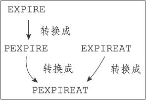
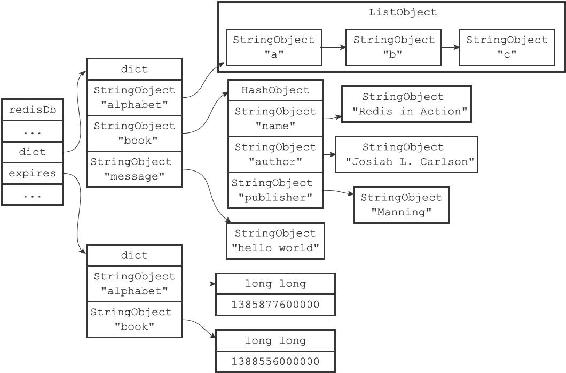
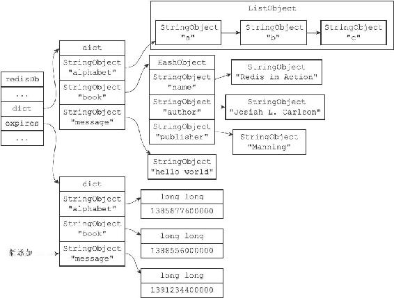
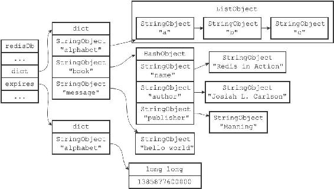

9.4 设置键的生存时间或过期时间

通过EXPIRE命令或者PEXPIRE命令，客户端可以以秒或者毫秒精度为数据库中的某个键设置生存时间（Time To Live，TTL），在经过指定的秒数或者毫秒数之后，服务器就会自动删除生存时间为0的键：

---

>  
> redis> SET key value  
> OK  
> redis> EXPIRE key 5  
> (integer) 1  
> redis> GET key // 5  
> 秒之内  
> "value"  
> redis> GET key // 5  
> 秒之后  
> (nil)  

---

注意

SETEX命令可以在设置一个字符串键的同时为键设置过期时间，因为这个命令是一个类型限定的命令（只能用于字符串键），所以本章不会对这个命令进行介绍，但SETEX命令设置过期时间的原理和本章介绍的EXPIRE命令设置过期时间的原理是完全一样的。

与EXPIRE命令和PEXPIRE命令类似，客户端可以通过EXPIREAT命令或PEXPIREAT命令，以秒或者毫秒精度给数据库中的某个键设置过期时间（expire time）。

过期时间是一个UNIX时间戳，当键的过期时间来临时，服务器就会自动从数据库中删除这个键：

---

>  
> redis> SET key value  
> OK  
> redis> EXPIREAT key 1377257300  
> (integer) 1  
> redis> TIME  
> 1)"1377257296"  
> 2)"296543"  
> redis> GET key // 1377257300  
> 之前  
> "value"  
> redis> TIME  
> 1)"1377257303"  
> 2)"230656"  
> redis> GET key // 1377257300  
> 之后  
> (nil)  

---

TTL命令和PTTL命令接受一个带有生存时间或者过期时间的键，返回这个键的剩余生存时间，也就是，返回距离这个键被服务器自动删除还有多长时间：

---

>  
> redis> SET key value  
> OK  
> redis> EXPIRE key 1000  
> (integer) 1  
> redis> TTL key  
> (integer) 997  
> redis> SET another\_key another\_value  
> OK  
> redis> TIME  
> 1)"1377333070"  
> 2)"761687"  
> redis> EXPIREAT another\_key 1377333100  
> (integer) 1  
> redis> TTL another\_key  
> (integer) 10  

---

在上一节我们讨论了数据库的底层实现，以及各种数据库操作的实现原理，但是，关于数据库如何保存键的生存时间和过期时间，以及服务器如何自动删除那些带有生存时间和过期时间的键这两个问题，我们还没有讨论。

本节将对服务器保存键的生存时间和过期时间的方法进行介绍，并在下一节介绍服务器自动删除过期键的方法。

9.4.1 设置过期时间

Redis有四个不同的命令可以用于设置键的生存时间（键可以存在多久）或过期时间（键什么时候会被删除）：

·EXPIRE<key><ttl>命令用于将键key的生存时间设置为ttl秒。

·PEXPIRE<key><ttl>命令用于将键key的生存时间设置为ttl毫秒。

·EXPIREAT<key><timestamp>命令用于将键key的过期时间设置为timestamp所指定的秒数时间戳。

·PEXPIREAT<key><timestamp>命令用于将键key的过期时间设置为timestamp所指定的毫秒数时间戳。

虽然有多种不同单位和不同形式的设置命令，但实际上EXPIRE、PEXPIRE、EXPIREAT三个命令都是使用PEXPIREAT命令来实现的：无论客户端执行的是以上四个命令中的哪一个，经过转换之后，最终的执行效果都和执行PEXPIREAT命令一样。

首先，EXPIRE命令可以转换成PEXPIRE命令：

---

>  
> def EXPIRE(key,ttl\_in\_sec):  
> #  
> 将TTL  
> 从秒转换成毫秒  
> ttl\_in\_ms = sec\_to\_ms(ttl\_in\_sec)  
> PEXPIRE(key, ttl\_in\_ms)  

---

接着，PEXPIRE命令又可以转换成PEXPIREAT命令：

---

>  
> def PEXPIRE(key,ttl\_in\_ms):  
> #  
> 获取以毫秒计算的当前UNIX  
> 时间戳  
> now\_ms = get\_current\_unix\_timestamp\_in\_ms()  
> #  
> 当前时间加上TTL  
> ，得出毫秒格式的键过期时间  
> PEXPIREAT(key,now\_ms+ttl\_in\_ms)  

---

并且，EXPIREAT命令也可以转换成PEXPIREAT命令：

---

>  
> def EXPIREAT(key,expire\_time\_in\_sec):  
> \#   
> 将过期时间从秒转换为毫秒  
> expire\_time\_in\_ms = sec\_to\_ms(expire\_time\_in\_sec)  
> PEXPIREAT(key, expire\_time\_in\_ms)  

---

最终，EXPIRE、PEXPIRE和EXPIREAT三个命令都会转换成PEXPIREAT命令来执行，如图9-11所示。

图9-11 设置生存时间和设置过期时间的命令之间的转换

9.4.2 保存过期时间

redisDb结构的expires字典保存了数据库中所有键的过期时间，我们称这个字典为过期字典：

·过期字典的键是一个指针，这个指针指向键空间中的某个键对象（也即是某个数据库键）。

·过期字典的值是一个long long类型的整数，这个整数保存了键所指向的数据库键的过期时间——一个毫秒精度的UNIX时间戳。

---

>  
> typedef struct redisDb {  
> // ...  
> //   
> 过期字典，保存着键的过期时间  
> dict \*expires;  
> // ...  
> } redisDb;  

---

图9-12展示了一个带有过期字典的数据库例子，在这个例子中，键空间保存了数据库中的所有键值对，而过期字典则保存了数据库键的过期时间。

注意

为了展示方便，图9-12的键空间和过期字典中重复出现了两次alphabet键对象和book键对象。在实际中，键空间的键和过期字典的键都指向同一个键对象，所以不会出现任何重复对象，也不会浪费任何空间。

图9-12 带有过期字典的数据库例子

图9-12中的过期字典保存了两个键值对：

·第一个键值对的键为alphabet键对象，值为1385877600000，这表示数据库键alphabet的过期时间为1385877600000（2013年12月1日零时）。

·第二个键值对的键为book键对象，值为1388556000000，这表示数据库键book的过期时间为1388556000000（2014年1月1日零时）。

当客户端执行PEXPIREAT命令（或者其他三个会转换成PEXPIREAT命令的命令）为一个数据库键设置过期时间时，服务器会在数据库的过期字典中关联给定的数据库键和过期时间。

举个例子，如果数据库当前的状态如图9-12所示，那么在服务器执行以下命令之后：

---

>  
> redis> PEXPIREAT message 1391234400000  
> (integer) 1  

---

过期字典将新增一个键值对，其中键为message键对象，而值则为1391234400000（2014年2月1日零时），如图9-13所示。

图9-13 执行PEXPIREAT命令之后的数据库

以下是PEXPIREAT命令的伪代码定义：

---

>  
> def PEXPIREAT(key, expire\_time\_in\_ms):  
> \#   
> 如果给定的键不存在于键空间，那么不能设置过期时间  
> if key not in redisDb.dict:  
> return0  
> \#   
> 在过期字典中关联键和过期时间  
> redisDb.expires\[key\] = expire\_time\_in\_ms  
> \#   
> 过期时间设置成功  
> return 1  

---

9.4.3 移除过期时间

PERSIST命令可以移除一个键的过期时间：

---

>  
> redis> PEXPIREAT message 1391234400000  
> (integer) 1  
> redis> TTL message  
> (integer) 13893281  
> redis> PERSIST message  
> (integer) 1  
> redis> TTL message  
> (integer) -1  

---

PERSIST命令就是PEXPIREAT命令的反操作：PERSIST命令在过期字典中查找给定的键，并解除键和值（过期时间）在过期字典中的关联。

举个例子，如果数据库当前的状态如图9-12所示，那么当服务器执行以下命令之后：

---

>  
> redis> PERSIST book  
> (integer) 1  

---

数据库将更新成图9-14所示的状态。

图9-14 执行PERSIST之后的数据库

可以看到，当PERSIST命令执行之后，过期字典中原来的book键值对消失了，这代表数据库键book的过期时间已经被移除。

以下是PERSIST命令的伪代码定义：

---

>  
> def PERSIST(key):  
> \#   
> 如果键不存在，或者键没有设置过期时间，那么直接返回  
> if key not in redisDb.expires:  
> return0  
> \#   
> 移除过期字典中给定键的键值对关联  
> redisDb.expires.remove(key)  
> \#   
> 键的过期时间移除成功  
> return 1  

---

9.4.4 计算并返回剩余生存时间

TTL命令以秒为单位返回键的剩余生存时间，而PTTL命令则以毫秒为单位返回键的剩余生存时间：

---

>  
> redis> PEXPIREAT alphabet 1385877600000  
> (integer) 1  
> redis> TTL alphabet  
> (integer) 8549007  
> redis> PTTL alphabet  
> (integer) 8549001011  

---

TTL和PTTL两个命令都是通过计算键的过期时间和当前时间之间的差来实现的，以下是这两个命令的伪代码实现：

---

>  
> def PTTL(key):  
> \#   
> 键不存在于数据库  
> if key not in redisDb.dict:  
> return-2  
> \#   
> 尝试取得键的过期时间  
> \#   
> 如果键没有设置过期时间，那么 expire\_time\_in\_ms   
> 将为 None  
> expire\_time\_in\_ms = redisDb.expires.get(key)  
> \#   
> 键没有设置过期时间  
> if expire\_time\_in\_ms is None:  
> return -1  
> \#   
> 获得当前时间  
> now\_ms = get\_current\_unix\_timestamp\_in\_ms()  
> \#   
> 过期时间减去当前时间，得出的差就是键的剩余生存时间  
> return(expire\_time\_in\_ms - now\_ms)  
> def TTL(key):  
> \#   
> 获取以毫秒为单位的剩余生存时间  
> ttl\_in\_ms = PTTL(key)  
> if ttl\_in\_ms < 0:  
> #  
> 处理返回值为-2  
> 和-1  
> 的情况  
> return ttl\_in\_ms  
> else:  
> \#   
> 将毫秒转换为秒  
> return ms\_to\_sec(ttl\_in\_ms)  

---

举个例子，对于一个过期时间为1385877600000（2013年12月1日零时）的键alphabet来说：

·如果当前时间为1383282000000（2013年11月1日零时），那么对键alphabet执行PTTL命令将返回2595600000，这个值是通过用alphabet键的过期时间减去当前时间计算得出的：1385877600000-1383282000000=2595600000。

·另一方面，如果当前时间为1383282000000（2013年11月1日零时），那么对键alphabet执行TTL命令将返回2595600，这个值是通过计算alphabet键的过期时间减去当前时间的差，然后将差值从毫秒转换为秒之后得出的。

9.4.5 过期键的判定

通过过期字典，程序可以用以下步骤检查一个给定键是否过期：

1）检查给定键是否存在于过期字典：如果存在，那么取得键的过期时间。

2）检查当前UNIX时间戳是否大于键的过期时间：如果是的话，那么键已经过期；否则的话，键未过期。

可以用伪代码来描述这一过程：

---

>  
> def is\_expired(key):  
> \#   
> 取得键的过期时间  
> expire\_time\_in\_ms = redisDb.expires.get(key)  
> \#   
> 键没有设置过期时间  
> if expire\_time\_in\_ms is None:  
> return False  
> \#   
> 取得当前时间的UNIX  
> 时间戳  
> now\_ms = get\_current\_unix\_timestamp\_in\_ms()  
> \#   
> 检查当前时间是否大于键的过期时间  
> if now\_ms > expire\_time\_in\_ms:  
> \#   
> 是，键已经过期  
> return True  
> else:  
> \#   
> 否，键未过期  
> return False  

---

举个例子，对于一个过期时间为1385877600000（2013年12月1日零时）的键alphabet来说：

·如果当前时间为1383282000000（2013年11月1日零时），那么调用is\_expired（alphabet）将返回False，因为当前时间小于alphabet键的过期时间。

·另一方面，如果当前时间为1385964000000（2013年12月2日零时），那么调用is\_expired（alphabet）将返回True，因为当前时间大于alphabet键的过期时间。

注意

实现过期键判定的另一种方法是使用TTL命令或者PTTL命令，比如说，如果对某个键执行TTL命令，并且命令返回的值大于等于0，那么说明该键未过期。在实际中，Redis检查键是否过期的方法和is\_expired函数所描述的方法一致，因为直接访问字典比执行一个命令稍微快一些。
