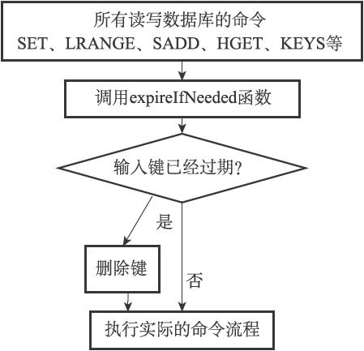
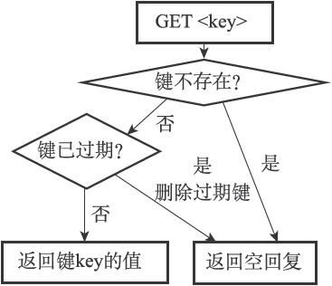

9.6 Redis的过期键删除策略

在前一节，我们讨论了定时删除、惰性删除和定期删除三种过期键删除策略，Redis服务器实际使用的是惰性删除和定期删除两种策略：通过配合使用这两种删除策略，服务器可以很好地在合理使用CPU时间和避免浪费内存空间之间取得平衡。

因为前一节已经介绍过惰性删除和定期删除两种策略的概念了，在接下来的两个小节中，我们将对Redis服务器中惰性删除和定期删除的具体实现进行说明。

9.6.1 惰性删除策略的实现

过期键的惰性删除策略由db.c/expireIfNeeded函数实现，所有读写数据库的Redis命令在执行之前都会调用expireIfNeeded函数对输入键进行检查：

·如果输入键已经过期，那么expireIfNeeded函数将输入键从数据库中删除。

·如果输入键未过期，那么expireIfNeeded函数不做动作。

命令调用expireIfNeeded函数的过程如图9-15所示。

expireIfNeeded函数就像一个过滤器，它可以在命令真正执行之前，过滤掉过期的输入键，从而避免命令接触到过期键。

另外，因为每个被访问的键都可能因为过期而被expireIfNeeded函数删除，所以每个命令的实现函数都必须能同时处理键存在以及键不存在这两种情况：

·当键存在时，命令按照键存在的情况执行。

·当键不存在或者键因为过期而被expireIfNeeded函数删除时，命令按照键不存在的情况执行。

举个例子，图9-16展示了GET命令的执行过程，在这个执行过程中，命令需要判断键是否存在以及键是否过期，然后根据判断来执行合适的动作。

图9-15 命令调用expireIfNeeded来删除过期键

图9-16 GET命令的执行过程

9.6.2 定期删除策略的实现

过期键的定期删除策略由redis.c/activeExpireCycle函数实现，每当Redis的服务器周期性操作redis.c/serverCron函数执行时，activeExpireCycle函数就会被调用，它在规定的时间内，分多次遍历服务器中的各个数据库，从数据库的expires字典中随机检查一部分键的过期时间，并删除其中的过期键。

整个过程可以用伪代码描述如下：

---

>  
> \#   
> 默认每次检查的数据库数量  
> DEFAULT\_DB\_NUMBERS = 16  
> \#   
> 默认每个数据库检查的键数量  
> DEFAULT\_KEY\_NUMBERS = 20  
> \#   
> 全局变量，记录检查进度  
> current\_db = 0  
> def activeExpireCycle():  
> \#   
> 初始化要检查的数据库数量  
> \#   
> 如果服务器的数据库数量比 DEFAULT\_DB\_NUMBERS   
> 要小  
> \#   
> 那么以服务器的数据库数量为准  
> if server.dbnum < DEFAULT\_DB\_NUMBERS:  
> db\_numbers = server.dbnum  
> else:  
> db\_numbers = DEFAULT\_DB\_NUMBERS  
> \#   
> 遍历各个数据库  
> for i in range(db\_numbers):  
> \#   
> 如果current\_db  
> 的值等于服务器的数据库数量  
> \#   
> 这表示检查程序已经遍历了服务器的所有数据库一次  
> \#   
> 将current\_db  
> 重置为0  
> ，开始新的一轮遍历  
> if current\_db == server.dbnum:  
> current\_db = 0  
> \#   
> 获取当前要处理的数据库  
> redisDb = server.db\[current\_db\]  
> \#   
> 将数据库索引增1  
> ，指向下一个要处理的数据库  
> current\_db += 1  
> \#   
> 检查数据库键  
> for j in range(DEFAULT\_KEY\_NUMBERS):  
> \#   
> 如果数据库中没有一个键带有过期时间，那么跳过这个数据库  
> if redisDb.expires.size() == 0: break  
> \#   
> 随机获取一个带有过期时间的键  
> key\_with\_ttl = redisDb.expires.get\_random\_key()  
> \#   
> 检查键是否过期，如果过期就删除它  
> if is\_expired(key\_with\_ttl):  
> delete\_key(key\_with\_ttl)  
> \#   
> 已达到时间上限，停止处理  
> if reach\_time\_limit(): return  

---

activeExpireCycle函数的工作模式可以总结如下：

·函数每次运行时，都从一定数量的数据库中取出一定数量的随机键进行检查，并删除其中的过期键。

·全局变量current\_db会记录当前activeExpireCycle函数检查的进度，并在下一次activeExpireCycle函数调用时，接着上一次的进度进行处理。比如说，如果当前activeExpireCycle函数在遍历10号数据库时返回了，那么下次activeExpireCycle函数执行时，将从11号数据库开始查找并删除过期键。

·随着activeExpireCycle函数的不断执行，服务器中的所有数据库都会被检查一遍，这时函数将current\_db变量重置为0，然后再次开始新一轮的检查工作。
