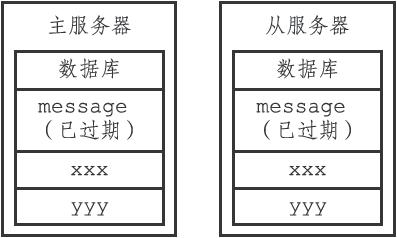
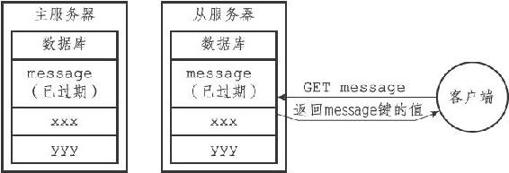
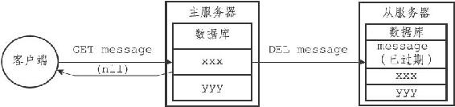
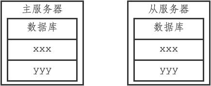

9.7 AOF、RDB和复制功能对过期键的处理

在这一节，我们将探讨过期键对Redis服务器中其他模块的影响，看看RDB持久化功能、AOF持久化功能以及复制功能是如何处理数据库中的过期键的。

9.7.1 生成RDB文件

在执行SAVE命令或者BGSAVE命令创建一个新的RDB文件时，程序会对数据库中的键进行检查，已过期的键不会被保存到新创建的RDB文件中。

举个例子，如果数据库中包含三个键k1、k2、k3，并且k2已经过期，那么当执行SAVE命令或者BGSAVE命令时，程序只会将k1和k3的数据保存到RDB文件中，而k2则会被忽略。

因此，数据库中包含过期键不会对生成新的RDB文件造成影响。

9.7.2 载入RDB文件

在启动Redis服务器时，如果服务器开启了RDB功能，那么服务器将对RDB文件进行载入：

·如果服务器以主服务器模式运行，那么在载入RDB文件时，程序会对文件中保存的键进行检查，未过期的键会被载入到数据库中，而过期键则会被忽略，所以过期键对载入RDB文件的主服务器不会造成影响。

·如果服务器以从服务器模式运行，那么在载入RDB文件时，文件中保存的所有键，不论是否过期，都会被载入到数据库中。不过，因为主从服务器在进行数据同步的时候，从服务器的数据库就会被清空，所以一般来讲，过期键对载入RDB文件的从服务器也不会造成影响。

举个例子，如果数据库中包含三个键k1、k2、k3，并且k2已经过期，那么当服务器启动时：

·如果服务器以主服务器模式运行，那么程序只会将k1和k3载入到数据库，k2会被忽略。

·如果服务器以从服务器模式运行，那么k1、k2和k3都会被载入到数据库。

9.7.3 AOF文件写入

当服务器以AOF持久化模式运行时，如果数据库中的某个键已经过期，但它还没有被惰性删除或者定期删除，那么AOF文件不会因为这个过期键而产生任何影响。

当过期键被惰性删除或者定期删除之后，程序会向AOF文件追加（append）一条DEL命令，来显式地记录该键已被删除。

举个例子，如果客户端使用GET message命令，试图访问过期的message键，那么服务器将执行以下三个动作：

1）从数据库中删除message键。

2）追加一条DEL message命令到AOF文件。

3）向执行GET命令的客户端返回空回复。

9.7.4 AOF重写

和生成RDB文件时类似，在执行AOF重写的过程中，程序会对数据库中的键进行检查，已过期的键不会被保存到重写后的AOF文件中。

举个例子，如果数据库中包含三个键k1、k2、k3，并且k2已经过期，那么在进行重写工作时，程序只会对k1和k3进行重写，而k2则会被忽略。

因此，数据库中包含过期键不会对AOF重写造成影响。

9.7.5 复制

当服务器运行在复制模式下时，从服务器的过期键删除动作由主服务器控制：

·主服务器在删除一个过期键之后，会显式地向所有从服务器发送一个DEL命令，告知从服务器删除这个过期键。

·从服务器在执行客户端发送的读命令时，即使碰到过期键也不会将过期键删除，而是继续像处理未过期的键一样来处理过期键。

·从服务器只有在接到主服务器发来的DEL命令之后，才会删除过期键。

通过由主服务器来控制从服务器统一地删除过期键，可以保证主从服务器数据的一致性，也正是因为这个原因，当一个过期键仍然存在于主服务器的数据库时，这个过期键在从服务器里的复制品也会继续存在。

举个例子，有一对主从服务器，它们的数据库中都保存着同样的三个键message、xxx和yyy，其中message为过期键，如图9-17所示。

图9-17 主从服务器删除过期键（1）

如果这时有客户端向从服务器发送命令GET message，那么从服务器将发现message键已经过期，但从服务器并不会删除message键，而是继续将message键的值返回给客户端，就好像message键并没有过期一样，如图9-18所示。

图9-18 主从服务器删除过期键（2）

假设在此之后，有客户端向主服务器发送命令GET message，那么主服务器将发现键message已经过期：主服务器会删除message键，向客户端返回空回复，并向从服务器发送DEL message命令，如图9-19所示。

图9-19 主从服务器删除过期键（3）

从服务器在接收到主服务器发来的DEL message命令之后，也会从数据库中删除message键，在这之后，主从服务器都不再保存过期键message了，如图9-20所示。

图9-20 主从服务器删除过期键（4）
