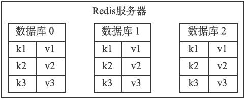
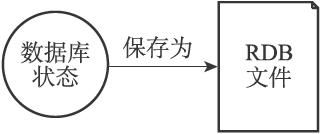
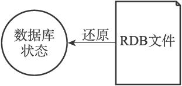

第10章 RDB持久化

Redis是一个键值对数据库服务器，服务器中通常包含着任意个非空数据库，而每个非空数据库中又可以包含任意个键值对，为了方便起见，我们将服务器中的非空数据库以及它们的键值对统称为数据库状态。

举个例子，图10-1展示了一个包含三个非空数据库的Redis服务器，这三个数据库以及数据库中的键值对就是该服务器的数据库状态。

图10-1 数据库状态示例

因为Redis是内存数据库，它将自己的数据库状态储存在内存里面，所以如果不想办法将储存在内存中的数据库状态保存到磁盘里面，那么一旦服务器进程退出，服务器中的数据库状态也会消失不见。

为了解决这个问题，Redis提供了RDB持久化功能，这个功能可以将Redis在内存中的数据库状态保存到磁盘里面，避免数据意外丢失。

RDB持久化既可以手动执行，也可以根据服务器配置选项定期执行，该功能可以将某个时间点上的数据库状态保存到一个RDB文件中，如图10-2所示。

RDB持久化功能所生成的RDB文件是一个经过压缩的二进制文件，通过该文件可以还原生成RDB文件时的数据库状态，如图10-3所示。

图10-2 将数据库状态保存为RDB文件

图10-3 用RDB文件来还原数据库状态

因为RDB文件是保存在硬盘里面的，所以即使Redis服务器进程退出，甚至运行Redis服务器的计算机停机，但只要RDB文件仍然存在，Redis服务器就可以用它来还原数据库状态。

本章首先介绍Redis服务器保存和载入RDB文件的方法，重点说明SAVE命令和BGSAVE命令的实现方式。

之后，本章会继续介绍Redis服务器自动保存功能的实现原理。

在介绍完关于保存和载入RDB文件方面的内容之后，我们会详细分析RDB文件中的各个组成部分，并说明这些部分的结构和含义。

在本章的最后，我们将对实际的RDB文件进行分析和解读，将之前学到的关于RDB文件的知识投入到实际应用中。
