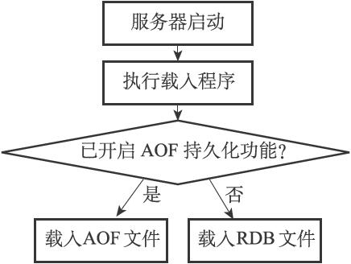

10.1 RDB文件的创建与载入

有两个Redis命令可以用于生成RDB文件，一个是SAVE，另一个是BGSAVE。

SAVE命令会阻塞Redis服务器进程，直到RDB文件创建完毕为止，在服务器进程阻塞期间，服务器不能处理任何命令请求：

---

>  
> redis> SAVE //  
> 等待直到RDB  
> 文件创建完毕  
> OK  

---

和SAVE命令直接阻塞服务器进程的做法不同，BGSAVE命令会派生出一个子进程，然后由子进程负责创建RDB文件，服务器进程（父进程）继续处理命令请求：

---

>  
> redis> BGSAVE //  
> 派生子进程，并由子进程创建RDB  
> 文件  
> Background saving started  

---

创建RDB文件的实际工作由rdb.c/rdbSave函数完成，SAVE命令和BGSAVE命令会以不同的方式调用这个函数，通过以下伪代码可以明显地看出这两个命令之间的区别：

---

>  
> def SAVE():  
> \#   
> 创建RDB  
> 文件  
> rdbSave()  
> def BGSAVE():  
> \#   
> 创建子进程  
> pid = fork()  
> if pid == 0:  
> \#   
> 子进程负责创建RDB  
> 文件  
> rdbSave()  
> \#   
> 完成之后向父进程发送信号  
> signal\_parent()  
> elif pid > 0:  
> \#   
> 父进程继续处理命令请求，并通过轮询等待子进程的信号  
> handle\_request\_and\_wait\_signal()  
> else:  
> \#   
> 处理出错情况  
> handle\_fork\_error()  

---

和使用SAVE命令或者BGSAVE命令创建RDB文件不同，RDB文件的载入工作是在服务器启动时自动执行的，所以Redis并没有专门用于载入RDB文件的命令，只要Redis服务器在启动时检测到RDB文件存在，它就会自动载入RDB文件。

以下是Redis服务器启动时打印的日志记录，其中第二条日志DB loaded from disk:...就是服务器在成功载入RDB文件之后打印的：

---

>  
> $ redis-server  
> \[7379\] 30 Aug 21:07:01.270 # Server started, Redis version 2.9.11  
> \[7379\] 30 Aug 21:07:01.289 \* DB loaded from disk: 0.018 seconds  
> \[7379\] 30 Aug 21:07:01.289 \* The server is now ready to accept connections on port 6379  

---

另外值得一提的是，因为AOF文件的更新频率通常比RDB文件的更新频率高，所以：

·如果服务器开启了AOF持久化功能，那么服务器会优先使用AOF文件来还原数据库状态。

·只有在AOF持久化功能处于关闭状态时，服务器才会使用RDB文件来还原数据库状态。

服务器判断该用哪个文件来还原数据库状态的流程如图10-4所示。

载入RDB文件的实际工作由rdb.c/rdbLoad函数完成，这个函数和rdbSave函数之间的关系可以用图10-5表示。

图10-4 服务器载入文件时的判断流程

图10-5 创建和载入RDB文件

10.1.1 SAVE命令执行时的服务器状态

前面提到过，当SAVE命令执行时，Redis服务器会被阻塞，所以当SAVE命令正在执行时，客户端发送的所有命令请求都会被拒绝。

只有在服务器执行完SAVE命令、重新开始接受命令请求之后，客户端发送的命令才会被处理。

10.1.2 BGSAVE命令执行时的服务器状态

因为BGSAVE命令的保存工作是由子进程执行的，所以在子进程创建RDB文件的过程中，Redis服务器仍然可以继续处理客户端的命令请求，但是，在BGSAVE命令执行期间，服务器处理SAVE、BGSAVE、BGREWRITEAOF三个命令的方式会和平时有所不同。

首先，在BGSAVE命令执行期间，客户端发送的SAVE命令会被服务器拒绝，服务器禁止SAVE命令和BGSAVE命令同时执行是为了避免父进程（服务器进程）和子进程同时执行两个rdbSave调用，防止产生竞争条件。

其次，在BGSAVE命令执行期间，客户端发送的BGSAVE命令会被服务器拒绝，因为同时执行两个BGSAVE命令也会产生竞争条件。

最后，BGREWRITEAOF和BGSAVE两个命令不能同时执行：

·如果BGSAVE命令正在执行，那么客户端发送的BGREWRITEAOF命令会被延迟到BGSAVE命令执行完毕之后执行。

·如果BGREWRITEAOF命令正在执行，那么客户端发送的BGSAVE命令会被服务器拒绝。

因为BGREWRITEAOF和BGSAVE两个命令的实际工作都由子进程执行，所以这两个命令在操作方面并没有什么冲突的地方，不能同时执行它们只是一个性能方面的考虑——并发出两个子进程，并且这两个子进程都同时执行大量的磁盘写入操作，这怎么想都不会是一个好主意。

10.1.3 RDB文件载入时的服务器状态

服务器在载入RDB文件期间，会一直处于阻塞状态，直到载入工作完成为止。
