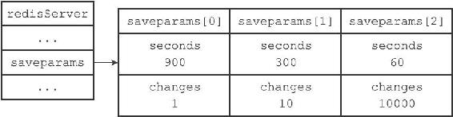
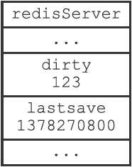
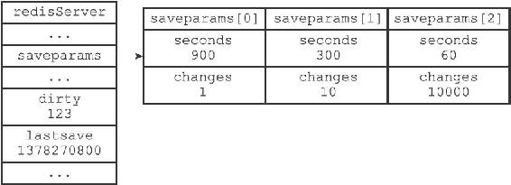
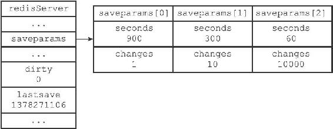

10.2 自动间隔性保存

在上一节，我们介绍了SAVE命令和BGSAVE的实现方法，并且说明了这两个命令在实现方面的主要区别：SAVE命令由服务器进程执行保存工作，BGSAVE命令则由子进程执行保存工作，所以SAVE命令会阻塞服务器，而BGSAVE命令则不会。

因为BGSAVE命令可以在不阻塞服务器进程的情况下执行，所以Redis允许用户通过设置服务器配置的save选项，让服务器每隔一段时间自动执行一次BGSAVE命令。

用户可以通过save选项设置多个保存条件，但只要其中任意一个条件被满足，服务器就会执行BGSAVE命令。

举个例子，如果我们向服务器提供以下配置：

---

>  
> save 900 1  
> save 300 10  
> save 60 10000  

---

那么只要满足以下三个条件中的任意一个，BGSAVE命令就会被执行：

·服务器在900秒之内，对数据库进行了至少1次修改。

·服务器在300秒之内，对数据库进行了至少10次修改。

·服务器在60秒之内，对数据库进行了至少10000次修改。

举个例子，以下是Redis服务器在60秒之内，对数据库进行了至少10000次修改之后，服务器自动执行BGSAVE命令时打印出来的日志：

---

>  
> \[5085\] 03 Sep 17:09:49.463 \* 10000 changes in 60 seconds. Saving...  
> \[5085\] 03 Sep 17:09:49.463 \* Background saving started by pid 5189  
> \[5189\] 03 Sep 17:09:49.522 \* DB saved on disk  
> \[5189\] 03 Sep 17:09:49.522 \* RDB: 0 MB of memory used by copy-on-write  
> \[5085\] 03 Sep 17:09:49.563 \* Background saving terminated with success  

---

在本节接下来的内容中，我们将介绍Redis服务器是如何根据save选项设置的保存条件，自动执行BGSAVE命令的。

10.2.1 设置保存条件

当Redis服务器启动时，用户可以通过指定配置文件或者传入启动参数的方式设置save选项，如果用户没有主动设置save选项，那么服务器会为save选项设置默认条件：

---

>  
> save 900 1  
> save 300 10  
> save 60 10000  

---

接着，服务器程序会根据save选项所设置的保存条件，设置服务器状态redisServer结构的saveparams属性：

---

>  
> struct redisServer {  
> // ...  
> //   
> 记录了保存条件的数组  
> struct saveparam \*saveparams;  
> // ...  
> };  

---

saveparams属性是一个数组，数组中的每个元素都是一个saveparam结构，每个saveparam结构都保存了一个save选项设置的保存条件：

---

>  
> struct saveparam {  
> //   
> 秒数  
> time\_t seconds;  
> //   
> 修改数  
> int changes;  
> };  

---

比如说，如果save选项的值为以下条件：

---

>  
> save 900 1  
> save 300 10  
> save 60 10000  

---

那么服务器状态中的saveparams数组将会是图10-6所示的样子。

图10-6 服务器状态中的保存条件

10.2.2 dirty计数器和lastsave属性

除了saveparams数组之外，服务器状态还维持着一个dirty计数器，以及一个lastsave属性：

·dirty计数器记录距离上一次成功执行SAVE命令或者BGSAVE命令之后，服务器对数据库状态（服务器中的所有数据库）进行了多少次修改（包括写入、删除、更新等操作）。

·lastsave属性是一个UNIX时间戳，记录了服务器上一次成功执行SAVE命令或者BGSAVE命令的时间。

---

>  
> struct redisServer {  
> // ...  
> //   
> 修改计数器  
> long long dirty;  
> //   
> 上一次执行保存的时间  
> time\_t lastsave;  
> // ...  
> };  

---

当服务器成功执行一个数据库修改命令之后，程序就会对dirty计数器进行更新：命令修改了多少次数据库，dirty计数器的值就增加多少。

例如，如果我们为一个字符串键设置值：

---

>  
> redis> SET message "hello"  
> OK  

---

那么程序会将dirty计数器的值增加1。

又例如，如果我们向一个集合键增加三个新元素：

---

>  
> redis> SADD database Redis MongoDB MariaDB  
> (integer) 3  

---

那么程序会将dirty计数器的值增加3。

图10-7 服务器状态示例

图10-7展示了服务器状态中包含的dirty计数器和lastsave属性，说明如下：

·dirty计数器的值为123，表示服务器在上次保存之后，对数据库状态共进行了123次修改。

·lastsave属性则记录了服务器上次执行保存操作的时间1378270800（2013年9月4日零时）。

10.2.3 检查保存条件是否满足

Redis的服务器周期性操作函数serverCron默认每隔100毫秒就会执行一次，该函数用于对正在运行的服务器进行维护，它的其中一项工作就是检查save选项所设置的保存条件是否已经满足，如果满足的话，就执行BGSAVE命令。

以下伪代码展示了serverCron函数检查保存条件的过程：

---

>  
> def serverCron():  
> \# ...  
> \#   
> 遍历所有保存条件  
> for saveparam in server.saveparams:  
> \#   
> 计算距离上次执行保存操作有多少秒  
> save\_interval = unixtime\_now()-server.lastsave  
> \#   
> 如果数据库状态的修改次数超过条件所设置的次数  
> \#   
> 并且距离上次保存的时间超过条件所设置的时间  
> \#   
> 那么执行保存操作  
> if server.dirty >= saveparam.changes and \\  
> save\_interval > saveparam.seconds:  
> BGSAVE()  
> \# ...  

---

程序会遍历并检查saveparams数组中的所有保存条件，只要有任意一个条件被满足，那么服务器就会执行BGSAVE命令。

举个例子，如果Redis服务器的当前状态如图10-8所示。

图10-8 服务器状态

那么当时间来到1378271101，也即是1378270800的301秒之后，服务器将自动执行一次BGSAVE命令，因为saveparams数组的第二个保存条件——300秒之内有至少10次修改——已经被满足。

假设BGSAVE在执行5秒之后完成，那么图10-8所示的服务器状态将更新为图10-9，其中dirty计数器已经被重置为0，而lastsave属性也被更新为1378271106。

图10-9 执行BGSAVE之后的服务器状态

以上就是Redis服务器根据save选项所设置的保存条件，自动执行BGSAVE命令，进行间隔性数据保存的实现原理。
