10.3 RDB文件结构

在本章之前的内容中，我们介绍了Redis服务器保存和载入RDB文件的方法，在这一节，我们将对RDB文件本身进行介绍，并详细说明文件各个部分的结构和意义。

图10-10展示了一个完整RDB文件所包含的各个部分。

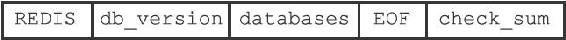

图10-10 RDB文件结构

注意

为了方便区分变量、数据、常量，图10-10中用全大写单词标示常量，用全小写单词标示变量和数据。本章展示的所有RDB文件结构图都遵循这一规则。

RDB文件的最开头是REDIS部分，这个部分的长度为5字节，保存着“REDIS”五个字符。通过这五个字符，程序可以在载入文件时，快速检查所载入的文件是否RDB文件。

注意

因为RDB文件保存的是二进制数据，而不是C字符串，为了简便起见，我们用"REDIS"符号代表'R'、'E'、'D'、'I'、'S'五个字符，而不是带'\\0'结尾符号的C字符串'R'、'E'、'D'、'I'、'S'、'\\0'。本章介绍的所有内容，以及展示的所有RDB文件结构图都遵循这一规则。

db\_version长度为4字节，它的值是一个字符串表示的整数，这个整数记录了RDB文件的版本号，比如"0006"就代表RDB文件的版本为第六版。本章只介绍第六版RDB文件的结构。

databases部分包含着零个或任意多个数据库，以及各个数据库中的键值对数据：

·如果服务器的数据库状态为空（所有数据库都是空的），那么这个部分也为空，长度为0字节。

·如果服务器的数据库状态为非空（有至少一个数据库非空），那么这个部分也为非空，根据数据库所保存键值对的数量、类型和内容不同，这个部分的长度也会有所不同。

EOF常量的长度为1字节，这个常量标志着RDB文件正文内容的结束，当读入程序遇到这个值的时候，它知道所有数据库的所有键值对都已经载入完毕了。

check\_sum是一个8字节长的无符号整数，保存着一个校验和，这个校验和是程序通过对REDIS、db\_version、databases、EOF四个部分的内容进行计算得出的。服务器在载入RDB文件时，会将载入数据所计算出的校验和与check\_sum所记录的校验和进行对比，以此来检查RDB文件是否有出错或者损坏的情况出现。

作为例子，图10-11展示了一个databases部分为空的RDB文件：文件开头的"REDIS"表示这是一个RDB文件，之后的"0006"表示这是第六版的RDB文件，因为databases为空，所以版本号之后直接跟着EOF常量，最后的6265312314761917404是文件的校验和。

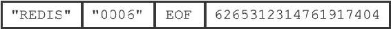

图10-11 databases部分为空的RDB文件

10.3.1 databases部分

一个RDB文件的databases部分可以保存任意多个非空数据库。

例如，如果服务器的0号数据库和3号数据库非空，那么服务器将创建一个如图10-12所示的RDB文件，图中的database 0代表0号数据库中的所有键值对数据，而database 3则代表3号数据库中的所有键值对数据。

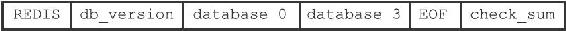

图10-12 带有两个非空数据库的RDB文件示例

每个非空数据库在RDB文件中都可以保存为SELECTDB、db\_number、key\_value\_pairs三个部分，如图10-13所示。

图10-13 RDB文件中的数据库结构

SELECTDB常量的长度为1字节，当读入程序遇到这个值的时候，它知道接下来要读入的将是一个数据库号码。

db\_number保存着一个数据库号码，根据号码的大小不同，这个部分的长度可以是1字节、2字节或者5字节。当程序读入db\_number部分之后，服务器会调用SELECT命令，根据读入的数据库号码进行数据库切换，使得之后读入的键值对可以载入到正确的数据库中。

key\_value\_pairs部分保存了数据库中的所有键值对数据，如果键值对带有过期时间，那么过期时间也会和键值对保存在一起。根据键值对的数量、类型、内容以及是否有过期时间等条件的不同，key\_value\_pairs部分的长度也会有所不同。

作为例子，图10-14展示了RDB文件中，0号数据库的结构。

图10-14 数据库结构示例

另外，图10-15则展示了一个完整的RDB文件，文件中包含了0号数据库和3号数据库。

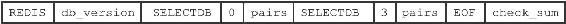

图10-15 RDB文件中的数据库结构示例

10.3.2 key\_value\_pairs部分

RDB文件中的每个key\_value\_pairs部分都保存了一个或以上数量的键值对，如果键值对带有过期时间的话，那么键值对的过期时间也会被保存在内。

不带过期时间的键值对在RDB文件中由TYPE、key、value三部分组成，如图10-16所示。

图10-16 不带过期时间的键值对

TYPE记录了value的类型，长度为1字节，值可以是以下常量的其中一个：

·REDIS\_RDB\_TYPE\_STRING

·REDIS\_RDB\_TYPE\_LIST

·REDIS\_RDB\_TYPE\_SET

·REDIS\_RDB\_TYPE\_ZSET

·REDIS\_RDB\_TYPE\_HASH

·REDIS\_RDB\_TYPE\_LIST\_ZIPLIST

·REDIS\_RDB\_TYPE\_SET\_INTSET

·REDIS\_RDB\_TYPE\_ZSET\_ZIPLIST

·REDIS\_RDB\_TYPE\_HASH\_ZIPLIST

以上列出的每个TYPE常量都代表了一种对象类型或者底层编码，当服务器读入RDB文件中的键值对数据时，程序会根据TYPE的值来决定如何读入和解释value的数据。key和value分别保存了键值对的键对象和值对象：

·其中key总是一个字符串对象，它的编码方式和REDIS\_RDB\_TYPE\_STRING类型的value一样。根据内容长度的不同，key的长度也会有所不同。

·根据TYPE类型的不同，以及保存内容长度的不同，保存value的结构和长度也会有所不同，本节稍后会详细说明每种TYPE类型的value结构保存方式。

带有过期时间的键值对在RDB文件中的结构如图10-17所示。

图10-17 带有过期时间的键值对

带有过期时间的键值对中的TYPE、key、value三个部分的意义，和前面介绍的不带过期时间的键值对的TYPE、key、value三个部分的意义完全相同，至于新增的EXPIRETIME\_MS和ms，它们的意义如下：

·EXPIRETIME\_MS常量的长度为1字节，它告知读入程序，接下来要读入的将是一个以毫秒为单位的过期时间。

·ms是一个8字节长的带符号整数，记录着一个以毫秒为单位的UNIX时间戳，这个时间戳就是键值对的过期时间。 

图10-18 无过期时间的字符串键值对示例

作为例子，图10-18展示了一个没有过期时间的字符串键值对。

图10-19展示了一个带有过期时间的集合键值对，其中键的过期时间为1388556000000（2014年1月1日零时）。

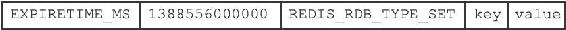

图10-19 带有过期时间的集合键值对示例

10.3.3 value的编码

RDB文件中的每个value部分都保存了一个值对象，每个值对象的类型都由与之对应的TYPE记录，根据类型的不同，value部分的结构、长度也会有所不同。

在接下来的各个小节中，我们将分别介绍各种不同类型的值对象在RDB文件中的保存结构。

注意

本节接下来说到的各种REDIS\_ENCODING\_\*编码曾经在第8章中介绍过，如果忘记了可以去回顾一下。

1.字符串对象

如果TYPE的值为REDIS\_RDB\_TYPE\_STRING，那么value保存的就是一个字符串对象，字符串对象的编码可以是REDIS\_ENCODING\_INT或者REDIS\_ENCODING\_RAW。

如果字符串对象的编码为REDIS\_ENCODING\_INT，那么说明对象中保存的是长度不超过32位的整数，这种编码的对象将以图10-20所示的结构保存。

其中，ENCODING的值可以是REDIS\_RDB\_ENC\_INT8、REDIS\_RDB\_ENC\_INT16或者REDIS\_RDB\_ENC\_INT32三个常量的其中一个，它们分别代表RDB文件使用8位（bit）、16位或者32位来保存整数值integer。

举个例子，如果字符串对象中保存的是可以用8位来保存的整数123，那么这个对象在RDB文件中保存的结构将如图10-21所示。

图10-20 INT编码字符串对象的保存结构

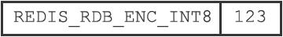

图10-21 用8位来保存整数的例子

如果字符串对象的编码为REDIS\_ENCODING\_RAW，那么说明对象所保存的是一个字符串值，根据字符串长度的不同，有压缩和不压缩两种方法来保存这个字符串：

·如果字符串的长度小于等于20字节，那么这个字符串会直接被原样保存。

·如果字符串的长度大于20字节，那么这个字符串会被压缩之后再保存。

注意

以上两个条件是在假设服务器打开了RDB文件压缩功能的情况下进行的，如果服务器关闭了RDB文件压缩功能，那么RDB程序总以无压缩的方式保存字符串值。

具体信息可以参考redis.conf文件中关于rdbcompression选项的说明。

对于没有被压缩的字符串，RDB程序会以图10-22所示的结构来保存该字符串。

图10-22 无压缩字符串的保存结构

其中，string部分保存了字符串值本身，而len保存了字符串值的长度。对于压缩后的字符串，RDB程序会以图10-23所示的结构来保存该字符串。

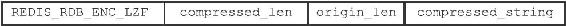

图10-23 压缩后字符串的保存结构

其中，REDIS\_RDB\_ENC\_LZF常量标志着字符串已经被LZF算法（http://liblzf.plan9.de）压缩过了，读入程序在碰到这个常量时，会根据之后的compressed\_len、origin\_len和compressed\_string三部分，对字符串进行解压缩：其中compressed\_len记录的是字符串被压缩之后的长度，而origin\_len记录的是字符串原来的长度，compressed\_string记录的则是被压缩之后的字符串。

图10-24展示了一个保存无压缩字符串的例子，其中字符串的长度为5，字符串的值为"hello"。

图10-25展示了一个压缩后的字符串示例，从图中可以看出，字符串原本的长度为21，压缩之后的长度为6，压缩之后的字符串内容为"?aa???"，其中?代表的是无法用字符串形式打印出来的字节。

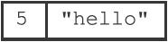

图10-24 无压缩的字符串

图10-25 压缩后的字符串

2.列表对象

如果TYPE的值为REDIS\_RDB\_TYPE\_LIST，那么value保存的就是一个REDIS\_ENCODING\_LINKEDLIST编码的列表对象，RDB文件保存这种对象的结构如图10-26所示。

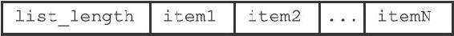

图10-26 LINKEDLIST编码列表对象的保存结构

list\_length记录了列表的长度，它记录列表保存了多少个项（item），读入程序可以通过这个长度知道自己应该读入多少个列表项。

图中以item开头的部分代表列表的项，因为每个列表项都是一个字符串对象，所以程序会以处理字符串对象的方式来保存和读入列表项。

作为示例，图10-27展示了一个包含三个元素的列表。

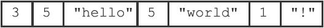

图10-27 保存LINKEDLIST编码列表的例子

结构中的第一个数字3是列表的长度，之后跟着的分别是第一个列表项、第二个列表项和第三个列表项，其中：

·第一个列表项的长度为5，内容为字符串"hello"。

·第二个列表项的长度也为5，内容为字符串"world"。

·第三个列表项的长度为1，内容为字符串"！"。

3.集合对象

如果TYPE的值为REDIS\_RDB\_TYPE\_SET，那么value保存的就是一个REDIS\_ENCODING\_HT编码的集合对象，RDB文件保存这种对象的结构如图10-28所示。

图10-28 HT编码集合对象的保存结构

其中，set\_size是集合的大小，它记录集合保存了多少个元素，读入程序可以通过这个大小知道自己应该读入多少个集合元素。

图中以elem开头的部分代表集合的元素，因为每个集合元素都是一个字符串对象，所以程序会以处理字符串对象的方式来保存和读入集合元素。

作为示例，图10-29展示了一个包含四个元素的集合。

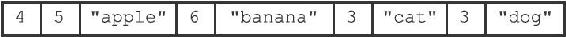

图10-29 保存HT编码集合的例子

结构中的第一个数字4记录了集合的大小，之后跟着的是集合的四个元素：

·第一个元素的长度为5，值为"apple"。

·第二个元素的长度为6，值为"banana"。

·第三个元素的长度为3，值为"cat"。

·第四个元素的长度为3，值为"dog"。

4.哈希表对象

如果TYPE的值为REDIS\_RDB\_TYPE\_HASH，那么value保存的就是一个REDIS\_ENCODING\_HT编码的集合对象，RDB文件保存这种对象的结构如图10-30所示：

·hash\_size记录了哈希表的大小，也即是这个哈希表保存了多少键值对，读入程序可以通过这个大小知道自己应该读入多少个键值对。

·以key\_value\_pair开头的部分代表哈希表中的键值对，键值对的键和值都是字符串对象，所以程序会以处理字符串对象的方式来保存和读入键值对。

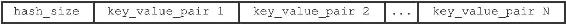

图10-30 HT编码哈希表对象的保存结构

结构中的每个键值对都以键紧挨着值的方式排列在一起，如图10-31所示。

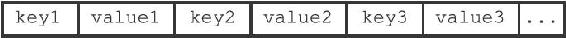

图10-31 键值对的保存结构

因此，从更详细的角度看，图10-30所展示的结构可以进一步修改为图10-32。

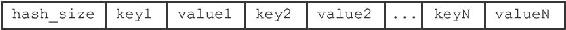

图10-32 更详细的HT编码哈希表对象的保存结构

作为示例，图10-33展示了一个包含两个键值对的哈希表。

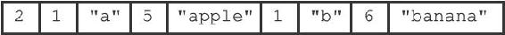

图10-33 保存HT编码哈希表的例子

在这个示例结构中，第一个数字2记录了哈希表的键值对数量，之后跟着的是两个键值对：

·第一个键值对的键是长度为1的字符串"a"，值是长度为5的字符串"apple"。

·第二个键值对的键是长度为1的字符串"b"，值是长度为6的字符串"banana"。

5.有序集合对象

如果TYPE的值为REDIS\_RDB\_TYPE\_ZSET，那么value保存的就是一个REDIS\_ENCODING\_SKIPLIST编码的有序集合对象，RDB文件保存这种对象的结构如图10-34所示。

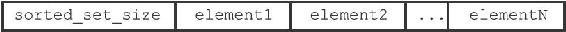

图10-34 SKIPLIST编码有序集合对象的保存结构

sorted\_set\_size记录了有序集合的大小，也即是这个有序集合保存了多少元素，读入程序需要根据这个值来决定应该读入多少有序集合元素。

以element开头的部分代表有序集合中的元素，每个元素又分为成员（member）和分值（score）两部分，成员是一个字符串对象，分值则是一个double类型的浮点数，程序在保存RDB文件时会先将分值转换成字符串对象，然后再用保存字符串对象的方法将分值保存起来。

有序集合中的每个元素都以成员紧挨着分值的方式排列，如图10-35所示。

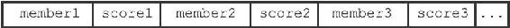

图10-35 成员和分值的保存结构

因此，从更详细的角度看，图10-34所展示的结构可以进一步修改为图10-36。

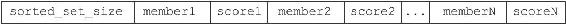

图10-36 更详细的SKIPLIST编码有序集合对象的保存结构

作为示例，图10-37展示了一个带有两个元素的有序集合。

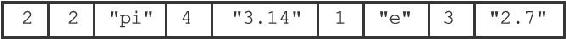

图10-37 保存SKIPLIST编码有序集合的例子

在这个示例结构中，第一个数字2记录了有序集合的元素数量，之后跟着的是两个有序集合元素：

·第一个元素的成员是长度为2的字符串"pi"，分值被转换成字符串之后变成了长度为4的字符串"3.14"。

·第二个元素的成员是长度为1的字符串"e"，分值被转换成字符串之后变成了长度为3的字符串"2.7"。

6.INTSET编码的集合

如果TYPE的值为REDIS\_RDB\_TYPE\_SET\_INTSET，那么value保存的就是一个整数集合对象，RDB文件保存这种对象的方法是，先将整数集合转换为字符串对象，然后将这个字符串对象保存到RDB文件里面。

如果程序在读入RDB文件的过程中，碰到由整数集合对象转换成的字符串对象，那么程序会根据TYPE值的指示，先读入字符串对象，再将这个字符串对象转换成原来的整数集合对象。

7.ZIPLIST编码的列表、哈希表或者有序集合

如果TYPE的值为REDIS\_RDB\_TYPE\_LIST\_ZIPLIST、REDIS\_RDB\_TYPE\_HASH\_ZIPLIST或者REDIS\_RDB\_TYPE\_ZSET\_ZIPLIST，那么value保存的就是一个压缩列表对象，RDB文件保存这种对象的方法是：

1）将压缩列表转换成一个字符串对象。

2）将转换所得的字符串对象保存到RDB文件。

如果程序在读入RDB文件的过程中，碰到由压缩列表对象转换成的字符串对象，那么程序会根据TYPE值的指示，执行以下操作：

1）读入字符串对象，并将它转换成原来的压缩列表对象。

2）根据TYPE的值，设置压缩列表对象的类型：如果TYPE的值为REDIS\_RDB\_TYPE\_LIST\_ZIPLIST，那么压缩列表对象的类型为列表；如果TYPE的值为REDIS\_RDB\_TYPE\_HASH\_ZIPLIST，那么压缩列表对象的类型为哈希表；如果TYPE的值为REDIS\_RDB\_TYPE\_ZSET\_ZIPLIST，那么压缩列表对象的类型为有序集合。

从步骤2可以看出，由于TYPE的存在，即使列表、哈希表和有序集合三种类型都使用压缩列表来保存，RDB读入程序也总可以将读入并转换之后得出的压缩列表设置成原来的类型。
