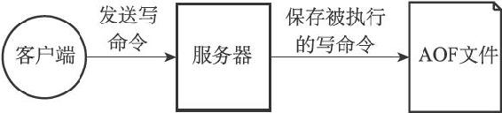

第11章 AOF持久化

除了RDB持久化功能之外，Redis还提供了AOF（Append Only File）持久化功能。与RDB持久化通过保存数据库中的键值对来记录数据库状态不同，AOF持久化是通过保存Redis服务器所执行的写命令来记录数据库状态的，如图11-1所示。

图11-1 AOF持久化

举个例子，如果我们对空白的数据库执行以下写命令，那么数据库中将包含三个键值对：

---

>  
> redis> SET msg "hello"  
> OK  
> redis> SADD fruits "apple" "banana" "cherry"  
> (integer) 3  
> redis> RPUSH numbers 128 256 512  
> (integer) 3  

---

RDB持久化保存数据库状态的方法是将msg、fruits、numbers三个键的键值对保存到RDB文件中，而AOF持久化保存数据库状态的方法则是将服务器执行的SET、SADD、RPUSH三个命令保存到AOF文件中。

被写入AOF文件的所有命令都是以Redis的命令请求协议格式保存的，因为Redis的命令请求协议是纯文本格式，所以我们可以直接打开一个AOF文件，观察里面的内容。

例如，对于之前执行的三个写命令来说，服务器将产生包含以下内容的AOF文件：

---

>  
> \*2\\r\\n$6\\r\\nSELECT\\r\\n$1\\r\\n0\\r\\n  
> \*3\\r\\n$3\\r\\nSET\\r\\n$3\\r\\nmsg\\r\\n$5\\r\\nhello\\r\\n  
> \*5\\r\\n$4\\r\\nSADD\\r\\n$6\\r\\nfruits\\r\\n$5\\r\\napple\\r\\n$6\\r\\nbanana\\r\\n$6\\r\\ncherry\\r\\n  
> \*5\\r\\n$5\\r\\nRPUSH\\r\\n$7\\r\\nnumbers\\r\\n$3\\r\\n128\\r\\n$3\\r\\n256\\r\\n$3\\r\\n512\\r\\n  

---

在这个AOF文件里面，除了用于指定数据库的SELECT命令是服务器自动添加的之外，其他都是我们之前通过客户端发送的命令。

服务器在启动时，可以通过载入和执行AOF文件中保存的命令来还原服务器关闭之前的数据库状态，以下就是服务器载入AOF文件并还原数据库状态时打印的日志：

---

>  
> \[8321\] 05 Sep 11:58:50.448 # Server started, Redisversion 2.9.11  
> \[8321\] 05 Sep 11:58:50.449 \* DB loaded from append only file: 0.000 seconds  
> \[8321\] 05 Sep 11:58:50.449 \* The server is now ready to accept connections on port 6379  

---

在本章接下来的内容中，我们将对AOF持久化功能的实现进行介绍，说明AOF文件的写入、保存、载入等操作的实现原理。

之后我们还会介绍用于减少AOF文件体积的AOF重写功能，以及该功能的实现原理。
