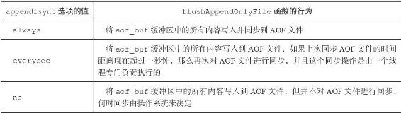

11.1 AOF持久化的实现

AOF持久化功能的实现可以分为命令追加（append）、文件写入、文件同步（sync）三个步骤。

11.1.1 命令追加

当AOF持久化功能处于打开状态时，服务器在执行完一个写命令之后，会以协议格式将被执行的写命令追加到服务器状态的aof\_buf缓冲区的末尾：

---

>  
> struct redisServer {  
> // ...  
> // AOF  
> 缓冲区  
> sds aof\_buf;  
> // ...  
> };  

---

举个例子，如果客户端向服务器发送以下命令：

---

>  
> redis> SET KEY VALUE  
> OK  

---

那么服务器在执行这个SET命令之后，会将以下协议内容追加到aof\_buf缓冲区的末尾：

---

>  
> \*3\\r\\n$3\\r\\nSET\\r\\n$3\\r\\nKEY\\r\\n$5\\r\\nVALUE\\r\\n  

---

又例如，如果客户端向服务器发送以下命令：

---

>  
> redis> RPUSH NUMBERS ONE TWO THREE  
> (integer) 3  

---

那么服务器在执行这个RPUSH命令之后，会将以下协议内容追加到aof\_buf缓冲区的末尾：

---

>  
> \*5\\r\\n$5\\r\\nRPUSH\\r\\n$7\\r\\nNUMBERS\\r\\n$3\\r\\nONE\\r\\n$3\\r\\nTWO\\r\\n$5\\r\\nTHREE\\r\\n  

---

以上就是AOF持久化的命令追加步骤的实现原理。

11.1.2 AOF文件的写入与同步

Redis的服务器进程就是一个事件循环（loop），这个循环中的文件事件负责接收客户端的命令请求，以及向客户端发送命令回复，而时间事件则负责执行像serverCron函数这样需要定时运行的函数。

因为服务器在处理文件事件时可能会执行写命令，使得一些内容被追加到aof\_buf缓冲区里面，所以在服务器每次结束一个事件循环之前，它都会调用flushAppendOnlyFile函数，考虑是否需要将aof\_buf缓冲区中的内容写入和保存到AOF文件里面，这个过程可以用以下伪代码表示：

---

>  
> def eventLoop():  
> while True:  
> \#   
> 处理文件事件，接收命令请求以及发送命令回复  
> \#   
> 处理命令请求时可能会有新内容被追加到 aof\_buf   
> 缓冲区中  
> processFileEvents()  
> \#   
> 处理时间事件  
> processTimeEvents()  
> \#   
> 考虑是否要将 aof\_buf   
> 中的内容写入和保存到 AOF   
> 文件里面  
> flushAppendOnlyFile()  

---

flushAppendOnlyFile函数的行为由服务器配置的appendfsync选项的值来决定，各个不同值产生的行为如表11-1所示。

表11-1 不同appendfsync值产生不同的持久化行为

如果用户没有主动为appendfsync选项设置值，那么appendfsync选项的默认值为everysec，关于appendfsync选项的更多信息，请参考Redis项目附带的示例配置文件redis.conf。

> 文件的写入和同步

> 为了提高文件的写入效率，在现代操作系统中，当用户调用write函数，将一些数据写入到文件的时候，操作系统通常会将写入数据暂时保存在一个内存缓冲区里面，等到缓冲区的空间被填满、或者超过了指定的时限之后，才真正地将缓冲区中的数据写入到磁盘里面。

> 这种做法虽然提高了效率，但也为写入数据带来了安全问题，因为如果计算机发生停机，那么保存在内存缓冲区里面的写入数据将会丢失。

> 为此，系统提供了fsync和fdatasync两个同步函数，它们可以强制让操作系统立即将缓冲区中的数据写入到硬盘里面，从而确保写入数据的安全性。

举个例子，假设服务器在处理文件事件期间，执行了以下三个写入命令：

---

>  
> 1) SADD databases "Redis" "MongoDB" "MariaDB"   
> 2) SET date "2013-9-5"   
> 3) INCR click\_counter 10086  

---

那么aof\_buf缓冲区将包含这三个命令的协议内容：

---

>  
> \*5\\r\\n$4\\r\\nSADD\\r\\n$9\\r\\ndatabases\\r\\n$5\\r\\nRedis\\r\\n$7\\r\\nMongoDB\\r\\n$7\\r\\nMariaDB\\r\\n  
> \*3\\r\\n$3\\r\\nSET\\r\\n$4\\r\\ndate\\r\\n$8\\r\\n2013-9-5\\r\\n  
> \*3\\r\\n$4\\r\\nINCR\\r\\n$13\\r\\nclick\_counter\\r\\n$5\\r\\n10086\\r\\n  

---

如果这时flushAppendOnlyFile函数被调用，假设服务器当前appendfsync选项的值为everysec，并且距离上次同步AOF文件已经超过一秒钟，那么服务器会先将aof\_buf中的内容写入到AOF文件中，然后再对AOF文件进行同步。

以上就是对AOF持久化功能的文件写入和文件同步这两个步骤的介绍。

> AOF持久化的效率和安全性

> 服务器配置appendfsync选项的值直接决定AOF持久化功能的效率和安全性。

> ·当appendfsync的值为always时，服务器在每个事件循环都要将aof\_buf缓冲区中的所有内容写入到AOF文件，并且同步AOF文件，所以always的效率是appendfsync选项三个值当中最慢的一个，但从安全性来说，always也是最安全的，因为即使出现故障停机，AOF持久化也只会丢失一个事件循环中所产生的命令数据。

> ·当appendfsync的值为everysec时，服务器在每个事件循环都要将aof\_buf缓冲区中的所有内容写入到AOF文件，并且每隔一秒就要在子线程中对AOF文件进行一次同步。从效率上来讲，everysec模式足够快，并且就算出现故障停机，数据库也只丢失一秒钟的命令数据。

> ·当appendfsync的值为no时，服务器在每个事件循环都要将aof\_buf缓冲区中的所有内容写入到AOF文件，至于何时对AOF文件进行同步，则由操作系统控制。因为处于no模式下的flushAppendOnlyFile调用无须执行同步操作，所以该模式下的AOF文件写入速度总是最快的，不过因为这种模式会在系统缓存中积累一段时间的写入数据，所以该模式的单次同步时长通常是三种模式中时间最长的。从平摊操作的角度来看，no模式和everysec模式的效率类似，当出现故障停机时，使用no模式的服务器将丢失上次同步AOF文件之后的所有写命令数据。
