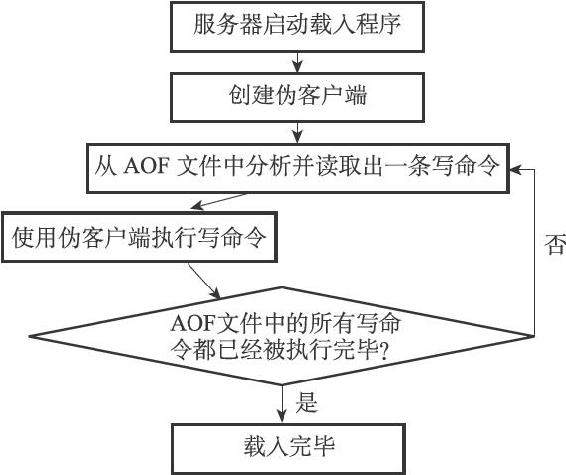

11.2 AOF文件的载入与数据还原

因为AOF文件里面包含了重建数据库状态所需的所有写命令，所以服务器只要读入并重新执行一遍AOF文件里面保存的写命令，就可以还原服务器关闭之前的数据库状态。

Redis读取AOF文件并还原数据库状态的详细步骤如下：

1）创建一个不带网络连接的伪客户端（fake client）：因为Redis的命令只能在客户端上下文中执行，而载入AOF文件时所使用的命令直接来源于AOF文件而不是网络连接，所以服务器使用了一个没有网络连接的伪客户端来执行AOF文件保存的写命令，伪客户端执行命令的效果和带网络连接的客户端执行命令的效果完全一样。

2）从AOF文件中分析并读取出一条写命令。

3）使用伪客户端执行被读出的写命令。

4）一直执行步骤2和步骤3，直到AOF文件中的所有写命令都被处理完毕为止。

当完成以上步骤之后，AOF文件所保存的数据库状态就会被完整地还原出来，整个过程如图11-2所示。

图11-2 AOF文件载入过程

例如，对于以下AOF文件来说：

---

>  
> \*2\\r\\n$6\\r\\nSELECT\\r\\n$1\\r\\n0\\r\\n  
> \*3\\r\\n$3\\r\\nSET\\r\\n$3\\r\\nmsg\\r\\n$5\\r\\nhello\\r\\n  
> \*5\\r\\n$4\\r\\nSADD\\r\\n$6\\r\\nfruits\\r\\n$5\\r\\napple\\r\\n$6\\r\\nbanana\\r\\n$6\\r\\ncherry\\r\\n  
> \*5\\r\\n$5\\r\\nRPUSH\\r\\n$7\\r\\nnumbers\\r\\n$3\\r\\n128\\r\\n$3\\r\\n256\\r\\n$3\\r\\n512\\r\\n  

---

服务器首先读入并执行SELECT 0命令，之后是SET msg hello命令，再之后是SADD fruits apple banana cherry命令，最后是RPUSH numbers 128 256 512命令，当这些命令都执行完毕之后，服务器的数据库就被还原到之前的状态了。

以上就是服务器读入AOF文件，并根据文件内容来还原数据库状态的原理。
