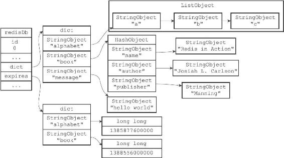
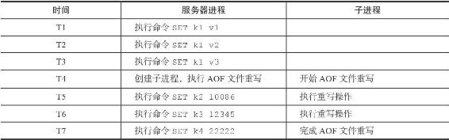
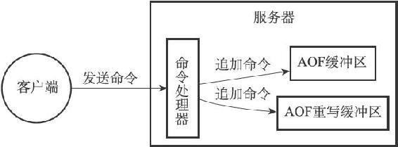
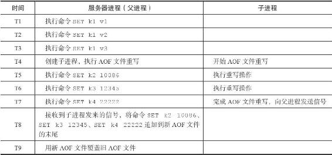

11.3 AOF重写

因为AOF持久化是通过保存被执行的写命令来记录数据库状态的，所以随着服务器运行时间的流逝，AOF文件中的内容会越来越多，文件的体积也会越来越大，如果不加以控制的话，体积过大的AOF文件很可能对Redis服务器、甚至整个宿主计算机造成影响，并且AOF文件的体积越大，使用AOF文件来进行数据还原所需的时间就越多。

举个例子，如果客户端执行了以下命令：

---

>  
> redis> RPUSH list "A" "B" // \["A", "B"\]  
> (integer) 2  
> redis> RPUSH list "C" // \["A", "B", "C"\]  
> (integer) 3  
> redis> RPUSH list "D" "E" // \["A", "B", "C", "D", "E"\]  
> (integer) 5  
> redis> LPOP list // \["B", "C", "D", "E"\]  
> "A"  
> redis> LPOP list // \["C", "D", "E"\]  
> "B"  
> redis> RPUSH list "F" "G" // \["C", "D", "E", "F", "G"\]  
> (integer) 5  

---

那么光是为了记录这个list键的状态，AOF文件就需要保存六条命令。

对于实际的应用程度来说，写命令执行的次数和频率会比上面的简单示例要高得多，所以造成的问题也会严重得多。

为了解决AOF文件体积膨胀的问题，Redis提供了AOF文件重写（rewrite）功能。通过该功能，Redis服务器可以创建一个新的AOF文件来替代现有的AOF文件，新旧两个AOF文件所保存的数据库状态相同，但新AOF文件不会包含任何浪费空间的冗余命令，所以新AOF文件的体积通常会比旧AOF文件的体积要小得多。

在接下来的内容中，我们将介绍AOF文件重写的实现原理，以及BGREWEITEAOF命令的实现原理。

11.3.1 AOF文件重写的实现

虽然Redis将生成新AOF文件替换旧AOF文件的功能命名为“AOF文件重写”，但实际上，AOF文件重写并不需要对现有的AOF文件进行任何读取、分析或者写入操作，这个功能是通过读取服务器当前的数据库状态来实现的。

考虑这样一个情况，如果服务器对list键执行了以下命令：

---

>  
> redis> RPUSH list "A" "B" // \["A", "B"\]  
> (integer) 2  
> redis> RPUSH list "C" // \["A", "B", "C"\]  
> (integer) 3  
> redis> RPUSH list "D" "E" // \["A", "B", "C", "D", "E"\]  
> (integer) 5  
> redis> LPOP list // \["B", "C", "D", "E"\]  
> "A"  
> redis> LPOP list // \["C", "D", "E"\]  
> "B"  
> redis> RPUSH list "F" "G" // \["C", "D", "E", "F", "G"\]  
> (integer) 5  

---

那么服务器为了保存当前list键的状态，必须在AOF文件中写入六条命令。

如果服务器想要用尽量少的命令来记录list键的状态，那么最简单高效的办法不是去读取和分析现有AOF文件的内容，而是直接从数据库中读取键list的值，然后用一条RPUSH list"C""D""E""F""G"命令来代替保存在AOF文件中的六条命令，这样就可以将保存list键所需的命令从六条减少为一条了。

再考虑这样一个例子，如果服务器对animals键执行了以下命令：

---

>  
> redis> SADD animals "Cat"   
> // {"Cat"}  
> (integer) 1  
> redis> SADD animals "Dog" "Panda" "Tiger" // {"Cat", "Dog", "Panda", "Tiger"}  
> (integer) 3  
> redis> SREM animals "Cat" // {"Dog", "Panda", "Tiger"}  
> (integer) 1  
> redis> SADD animals "Lion" "Cat" // {"Dog", "Panda", "Tiger",   
> (integer) 2 "Lion", "Cat"}  

---

那么为了记录animals键的状态，AOF文件必须保存上面列出的四条命令。

如果服务器想减少保存animals键所需命令的数量，那么服务器可以通过读取animals键的值，然后用一条SADD animals"Dog""Panda""Tiger""Lion""Cat"命令来代替上面的四条命令，这样就将保存animals键所需的命令从四条减少为一条了。

除了上面列举的列表键和集合键之外，其他所有类型的键都可以用同样的方法去减少AOF文件中的命令数量。首先从数据库中读取键现在的值，然后用一条命令去记录键值对，代替之前记录这个键值对的多条命令，这就是AOF重写功能的实现原理。

整个重写过程可以用以下伪代码表示：

---

>  
> def aof\_rewrite(new\_aof\_file\_name):  
> \#   
> 创建新 AOF   
> 文件  
> f = create\_file(new\_aof\_file\_name)  
> \#   
> 遍历数据库  
> for db in redisServer.db:  
> \#   
> 忽略空数据库  
> if db.is\_empty(): continue  
> \#   
> 写入SELECT  
> 命令，指定数据库号码  
> f.write\_command("SELECT" + db.id)  
> \#   
> 遍历数据库中的所有键  
> for key in db:  
> \#   
> 忽略已过期的键  
> if key.is\_expired(): continue  
> \#   
> 根据键的类型对键进行重写  
> if key.type == String:  
> rewrite\_string(key)  
> elif key.type == List:  
> rewrite\_list(key)  
> elif key.type == Hash:  
> rewrite\_hash(key)  
> elif key.type == Set:  
> rewrite\_set(key)  
> elif key.type == SortedSet:  
> rewrite\_sorted\_set(key)  
> \#   
> 如果键带有过期时间，那么过期时间也要被重写  
> if key.have\_expire\_time():  
> rewrite\_expire\_time(key)  
> \#   
> 写入完毕，关闭文件  
> f.close()  
> def rewrite\_string(key):  
> \#   
> 使用GET  
> 命令获取字符串键的值  
> value = GET(key)  
> \#   
> 使用SET  
> 命令重写字符串键  
> f.write\_command(SET, key, value)  
> def rewrite\_list(key):  
> \#   
> 使用LRANGE  
> 命令获取列表键包含的所有元素  
> item1, item2, ..., itemN = LRANGE(key, 0, -1)  
> \#   
> 使用RPUSH  
> 命令重写列表键  
> f.write\_command(RPUSH, key, item1, item2, ..., itemN)  
> def rewrite\_hash(key):  
> \#   
> 使用HGETALL  
> 命令获取哈希键包含的所有键值对  
> field1, value1, field2, value2, ..., fieldN, valueN = HGETALL(key)  
> \#   
> 使用HMSET  
> 命令重写哈希键  
> f.write\_command(HMSET, key, field1, value1, field2, value2, ..., fieldN, valueN)  
> def rewrite\_set(key);  
> \#   
> 使用SMEMBERS  
> 命令获取集合键包含的所有元素  
> elem1, elem2, ..., elemN = SMEMBERS(key)  
> \#   
> 使用SADD  
> 命令重写集合键  
> f.write\_command(SADD, key, elem1, elem2, ..., elemN)  
> def rewrite\_sorted\_set(key):  
> \#   
> 使用ZRANGE  
> 命令获取有序集合键包含的所有元素  
> member1, score1, member2, score2, ..., memberN, scoreN = ZRANGE(key, 0, -1, "WITHSCORES")  
> \#   
> 使用ZADD  
> 命令重写有序集合键  
> f.write\_command(ZADD, key, score1, member1, score2, member2, ..., scoreN, memberN)  
> def rewrite\_expire\_time(key):  
> \#   
> 获取毫秒精度的键过期时间戳  
> timestamp = get\_expire\_time\_in\_unixstamp(key)  
> \#   
> 使用PEXPIREAT  
> 命令重写键的过期时间  
> f.write\_command(PEXPIREAT, key, timestamp)  

---

因为aof\_rewrite函数生成的新AOF文件只包含还原当前数据库状态所必须的命令，所以新AOF文件不会浪费任何硬盘空间。

图11-3 一个数据库

例如，对于图11-3所示的数据库，aof\_rewrite函数产生的新AOF文件将包含以下命令：

---

>  
> SELECT 0  
> RPUSH alphabet "a" "b" "c"  
> EXPIREAT alphabet 1385877600000  
> HMSET book "name" "Redisin Action"  
> "author" "Josiah L. Carlson"  
> "publisher" "Manning"  
> EXPIREAT book 1388556000000  
> SET message "hello world"  

---

以上命令就是还原图11-3所示的数据库所必须的命令，它们没有一条是多余的。

注意

在实际中，为了避免在执行命令时造成客户端输入缓冲区溢出，重写程序在处理列表、哈希表、集合、有序集合这四种可能会带有多个元素的键时，会先检查键所包含的元素数量，如果元素的数量超过了redis.h/REDIS\_AOF\_REWRITE\_ITEMS\_PER\_CMD常量的值，那么重写程序将使用多条命令来记录键的值，而不单单使用一条命令。

在目前版本中，REDIS\_AOF\_REWRITE\_ITEMS\_PER\_CMD常量的值为64，这也就是说，如果一个集合键包含了超过64个元素，那么重写程序会用多条SADD命令来记录这个集合，并且每条命令设置的元素数量也为64个：

---

>  
> SADD <set-key> <elem1> <elem2> ... <elem64>  
> SADD <set-key> <elem65> <elem66> ... <elem128>  
> SADD <set-key> <elem129> <elem130> ... <elem192>  
> ...  

---

另一方面如果一个列表键包含了超过64个项，那么重写程序会用多条RPUSH命令来保存这个列表，并且每条命令设置的项数量也为64个：

---

>  
> RPUSH <list-key> <item1> <item2> ... <item64>  
> RPUSH <list-key> <item65> <item66> ... <item128>  
> RPUSH <list-key> <item129> <item130> ... <item192>  
> ...  

---

重写程序使用类似的方法处理包含多个元素的有序集合键，以及包含多个键值对的哈希表键。

11.3.2 AOF后台重写

上面介绍的AOF重写程序aof\_rewrite函数可以很好地完成创建一个新AOF文件的任务，但是，因为这个函数会进行大量的写入操作，所以调用这个函数的线程将被长时间阻塞，因为Redis服务器使用单个线程来处理命令请求，所以如果由服务器直接调用aof\_rewrite函数的话，那么在重写AOF文件期间，服务期将无法处理客户端发来的命令请求。

很明显，作为一种辅佐性的维护手段，Redis不希望AOF重写造成服务器无法处理请求，所以Redis决定将AOF重写程序放到子进程里执行，这样做可以同时达到两个目的：

·子进程进行AOF重写期间，服务器进程（父进程）可以继续处理命令请求。

·子进程带有服务器进程的数据副本，使用子进程而不是线程，可以在避免使用锁的情况下，保证数据的安全性。

不过，使用子进程也有一个问题需要解决，因为子进程在进行AOF重写期间，服务器进程还需要继续处理命令请求，而新的命令可能会对现有的数据库状态进行修改，从而使得服务器当前的数据库状态和重写后的AOF文件所保存的数据库状态不一致。

表11-2展示了一个AOF文件重写例子，当子进程开始进行文件重写时，数据库中只有k1一个键，但是当子进程完成AOF文件重写之后，服务器进程的数据库中已经新设置了k2、k3、k4三个键，因此，重写后的AOF文件和服务器当前的数据库状态并不一致，新的AOF文件只保存了k1一个键的数据，而服务器数据库现在却有k1、k2、k3、k4四个键。

表11-2 AOF文件重写时的服务器进程和子进程

为了解决这种数据不一致问题，Redis服务器设置了一个AOF重写缓冲区，这个缓冲区在服务器创建子进程之后开始使用，当Redis服务器执行完一个写命令之后，它会同时将这个写命令发送给AOF缓冲区和AOF重写缓冲区，如图11-4所示。

图11-4 服务器同时将命令发送给AOF文件和AOF重写缓冲区

这也就是说，在子进程执行AOF重写期间，服务器进程需要执行以下三个工作：

1）执行客户端发来的命令。

2）将执行后的写命令追加到AOF缓冲区。

3）将执行后的写命令追加到AOF重写缓冲区。

这样一来可以保证：

·AOF缓冲区的内容会定期被写入和同步到AOF文件，对现有AOF文件的处理工作会如常进行。

·从创建子进程开始，服务器执行的所有写命令都会被记录到AOF重写缓冲区里面。

当子进程完成AOF重写工作之后，它会向父进程发送一个信号，父进程在接到该信号之后，会调用一个信号处理函数，并执行以下工作：

1）将AOF重写缓冲区中的所有内容写入到新AOF文件中，这时新AOF文件所保存的数据库状态将和服务器当前的数据库状态一致。

2）对新的AOF文件进行改名，原子地（atomic）覆盖现有的AOF文件，完成新旧两个AOF文件的替换。

这个信号处理函数执行完毕之后，父进程就可以继续像往常一样接受命令请求了。

在整个AOF后台重写过程中，只有信号处理函数执行时会对服务器进程（父进程）造成阻塞，在其他时候，AOF后台重写都不会阻塞父进程，这将AOF重写对服务器性能造成的影响降到了最低。

举个例子，表11-3展示了一个AOF文件后台重写的执行过程：

·当子进程开始重写时，服务器进程（父进程）的数据库中只有k1一个键，当子进程完成AOF文件重写之后，服务器进程的数据库中已经多出了k2、k3、k4三个新键。

·在子进程向服务器进程发送信号之后，服务器进程会将保存在AOF重写缓冲区里面记录的k2、k3、k4三个键的命令追加到新AOF文件的末尾，然后用新AOF文件替换旧AOF文件，完成AOF文件后台重写操作。

表11-3 AOF文件后台重写过程

以上就是AOF后台重写，也即是BGREWRITEAOF命令的实现原理。
