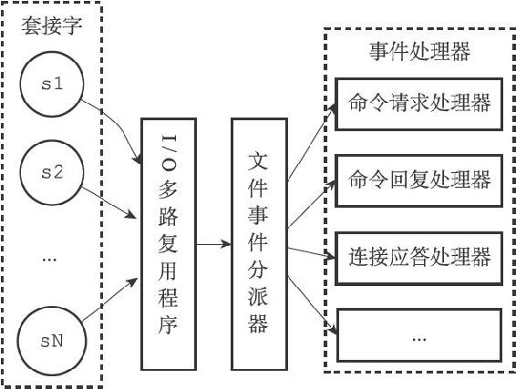
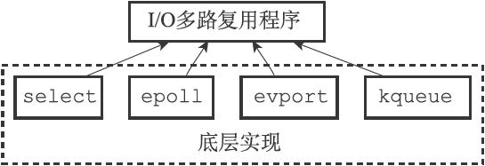
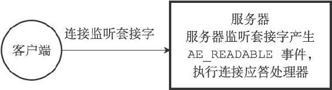
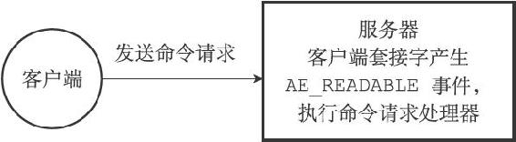
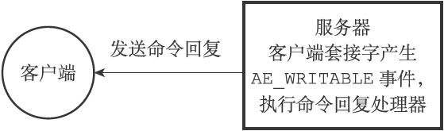
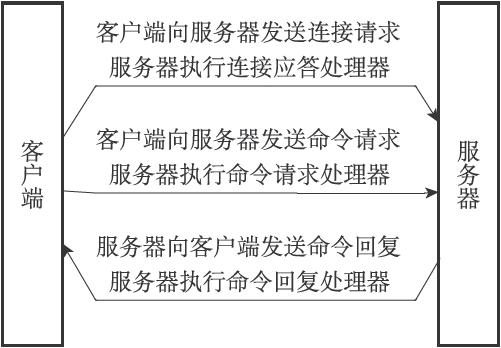

12.1 文件事件

Redis基于Reactor模式开发了自己的网络事件处理器：这个处理器被称为文件事件处理器（file event handler）：

·文件事件处理器使用I/O多路复用（multiplexing）程序来同时监听多个套接字，并根据套接字目前执行的任务来为套接字关联不同的事件处理器。

·当被监听的套接字准备好执行连接应答（accept）、读取（read）、写入（write）、关闭（close）等操作时，与操作相对应的文件事件就会产生，这时文件事件处理器就会调用套接字之前关联好的事件处理器来处理这些事件。

虽然文件事件处理器以单线程方式运行，但通过使用I/O多路复用程序来监听多个套接字，文件事件处理器既实现了高性能的网络通信模型，又可以很好地与Redis服务器中其他同样以单线程方式运行的模块进行对接，这保持了Redis内部单线程设计的简单性。

12.1.1 文件事件处理器的构成

图12-1展示了文件事件处理器的四个组成部分，它们分别是套接字、I/O多路复用程序、文件事件分派器（dispatcher），以及事件处理器。

图12-1 文件事件处理器的四个组成部分

文件事件是对套接字操作的抽象，每当一个套接字准备好执行连接应答（accept）、写入、读取、关闭等操作时，就会产生一个文件事件。因为一个服务器通常会连接多个套接字，所以多个文件事件有可能会并发地出现。

I/O多路复用程序负责监听多个套接字，并向文件事件分派器传送那些产生了事件的套接字。

尽管多个文件事件可能会并发地出现，但I/O多路复用程序总是会将所有产生事件的套接字都放到一个队列里面，然后通过这个队列，以有序（sequentially）、同步（synchronously）、每次一个套接字的方式向文件事件分派器传送套接字。当上一个套接字产生的事件被处理完毕之后（该套接字为事件所关联的事件处理器执行完毕），I/O多路复用程序才会继续向文件事件分派器传送下一个套接字，如图12-2所示。

图12-2 I/O多路复用程序通过队列向文件事件分派器传送套接字

文件事件分派器接收I/O多路复用程序传来的套接字，并根据套接字产生的事件的类型，调用相应的事件处理器。

服务器会为执行不同任务的套接字关联不同的事件处理器，这些处理器是一个个函数，它们定义了某个事件发生时，服务器应该执行的动作。

12.1.2 I/O多路复用程序的实现

Redis的I/O多路复用程序的所有功能都是通过包装常见的select、epoll、evport和kqueue这些I/O多路复用函数库来实现的，每个I/O多路复用函数库在Redis源码中都对应一个单独的文件，比如ae\_select.c、ae\_epoll.c、ae\_kqueue.c，诸如此类。

因为Redis为每个I/O多路复用函数库都实现了相同的API，所以I/O多路复用程序的底层实现是可以互换的，如图12-3所示。

图12-3 Redis的I/O多路复用程序有多个I/O多路复用库实现可选

Redis在I/O多路复用程序的实现源码中用#include宏定义了相应的规则，程序会在编译时自动选择系统中性能最高的I/O多路复用函数库来作为Redis的I/O多路复用程序的底层实现：

---

>  
> /\* Include the best multiplexing layer supported by this system.  
> \* The following should be ordered by performances, descending. \*/  
> \# ifdef HAVE\_EVPORT  
> \# include "ae\_evport.c"  
> \# else  
> \# ifdef HAVE\_EPOLL  
> \# include "ae\_epoll.c"  
> \# else  
> \# ifdef HAVE\_KQUEUE  
> \# include "ae\_kqueue.c"  
> \# else  
> \# include "ae\_select.c"  
> \# endif  
> \# endif  
> \# endif  

---

12.1.3 事件的类型

I/O多路复用程序可以监听多个套接字的ae.h/AE\_READABLE事件和ae.h/AE\_WRITABLE事件，这两类事件和套接字操作之间的对应关系如下：

·当套接字变得可读时（客户端对套接字执行write操作，或者执行close操作），或者有新的可应答（acceptable）套接字出现时（客户端对服务器的监听套接字执行connect操作），套接字产生AE\_READABLE事件。

·当套接字变得可写时（客户端对套接字执行read操作），套接字产生AE\_WRITABLE事件。

I/O多路复用程序允许服务器同时监听套接字的AE\_READABLE事件和AE\_WRITABLE事件，如果一个套接字同时产生了这两种事件，那么文件事件分派器会优先处理AE\_READABLE事件，等到AE\_READABLE事件处理完之后，才处理AE\_WRITABLE事件。

这也就是说，如果一个套接字又可读又可写的话，那么服务器将先读套接字，后写套接字。

12.1.4 API

ae.c/aeCreateFileEvent函数接受一个套接字描述符、一个事件类型，以及一个事件处理器作为参数，将给定套接字的给定事件加入到I/O多路复用程序的监听范围之内，并对事件和事件处理器进行关联。

ae.c/aeDeleteFileEvent函数接受一个套接字描述符和一个监听事件类型作为参数，让I/O多路复用程序取消对给定套接字的给定事件的监听，并取消事件和事件处理器之间的关联。

ae.c/aeGetFileEvents函数接受一个套接字描述符，返回该套接字正在被监听的事件类型：

·如果套接字没有任何事件被监听，那么函数返回AE\_NONE。

·如果套接字的读事件正在被监听，那么函数返回AE\_READABLE。

·如果套接字的写事件正在被监听，那么函数返回AE\_WRITABLE。

·如果套接字的读事件和写事件正在被监听，那么函数返回AE\_READABLE|AE\_WRITABLE。

ae.c/aeWait函数接受一个套接字描述符、一个事件类型和一个毫秒数为参数，在给定的时间内阻塞并等待套接字的给定类型事件产生，当事件成功产生，或者等待超时之后，函数返回。

ae.c/aeApiPoll函数接受一个sys/time.h/struct timeval结构为参数，并在指定的时间內，阻塞并等待所有被aeCreateFileEvent函数设置为监听状态的套接字产生文件事件，当有至少一个事件产生，或者等待超时后，函数返回。

ae.c/aeProcessEvents函数是文件事件分派器，它先调用aeApiPoll函数来等待事件产生，然后遍历所有已产生的事件，并调用相应的事件处理器来处理这些事件。

ae.c/aeGetApiName函数返回I/O多路复用程序底层所使用的I/O多路复用函数库的名称：返回"epoll"表示底层为epoll函数库，返回"select"表示底层为select函数库，诸如此类。

12.1.5 文件事件的处理器

Redis为文件事件编写了多个处理器，这些事件处理器分别用于实现不同的网络通信需求，比如说：

·为了对连接服务器的各个客户端进行应答，服务器要为监听套接字关联连接应答处理器。

·为了接收客户端传来的命令请求，服务器要为客户端套接字关联命令请求处理器。

·为了向客户端返回命令的执行结果，服务器要为客户端套接字关联命令回复处理器。

·当主服务器和从服务器进行复制操作时，主从服务器都需要关联特别为复制功能编写的复制处理器。

在这些事件处理器里面，服务器最常用的要数与客户端进行通信的连接应答处理器、命令请求处理器和命令回复处理器。

1.连接应答处理器

networking.c/acceptTcpHandler函数是Redis的连接应答处理器，这个处理器用于对连接服务器监听套接字的客户端进行应答，具体实现为sys/socket.h/accept函数的包装。

当Redis服务器进行初始化的时候，程序会将这个连接应答处理器和服务器监听套接字的AE\_READABLE事件关联起来，当有客户端用sys/socket.h/connect函数连接服务器监听套接字的时候，套接字就会产生AE\_READABLE事件，引发连接应答处理器执行，并执行相应的套接字应答操作，如图12-4所示。

图12-4 服务器对客户端的连接请求进行应答

2.命令请求处理器

networking.c/readQueryFromClient函数是Redis的命令请求处理器，这个处理器负责从套接字中读入客户端发送的命令请求内容，具体实现为unistd.h/read函数的包装。

当一个客户端通过连接应答处理器成功连接到服务器之后，服务器会将客户端套接字的AE\_READABLE事件和命令请求处理器关联起来，当客户端向服务器发送命令请求的时候，套接字就会产生AE\_READABLE事件，引发命令请求处理器执行，并执行相应的套接字读入操作，如图12-5所示。

图12-5 服务器接收客户端发来的命令请求

在客户端连接服务器的整个过程中，服务器都会一直为客户端套接字的AE\_READABLE事件关联命令请求处理器。

3.命令回复处理器

networking.c/sendReplyToClient函数是Redis的命令回复处理器，这个处理器负责将服务器执行命令后得到的命令回复通过套接字返回给客户端，具体实现为unistd.h/write函数的包装。

当服务器有命令回复需要传送给客户端的时候，服务器会将客户端套接字的AE\_WRITABLE事件和命令回复处理器关联起来，当客户端准备好接收服务器传回的命令回复时，就会产生AE\_WRITABLE事件，引发命令回复处理器执行，并执行相应的套接字写入操作，如图12-6所示。

图12-6 服务器向客户端发送命令回复

当命令回复发送完毕之后，服务器就会解除命令回复处理器与客户端套接字的AE\_WRITABLE事件之间的关联。

4.一次完整的客户端与服务器连接事件示例

让我们来追踪一次Redis客户端与服务器进行连接并发送命令的整个过程，看看在过程中会产生什么事件，而这些事件又是如何被处理的。

假设一个Redis服务器正在运作，那么这个服务器的监听套接字的AE\_READABLE事件应该正处于监听状态之下，而该事件所对应的处理器为连接应答处理器。

如果这时有一个Redis客户端向服务器发起连接，那么监听套接字将产生AE\_READABLE事件，触发连接应答处理器执行。处理器会对客户端的连接请求进行应答，然后创建客户端套接字，以及客户端状态，并将客户端套接字的AE\_READABLE事件与命令请求处理器进行关联，使得客户端可以向主服务器发送命令请求。

之后，假设客户端向主服务器发送一个命令请求，那么客户端套接字将产生AE\_READABLE事件，引发命令请求处理器执行，处理器读取客户端的命令内容，然后传给相关程序去执行。

执行命令将产生相应的命令回复，为了将这些命令回复传送回客户端，服务器会将客户端套接字的AE\_WRITABLE事件与命令回复处理器进行关联。当客户端尝试读取命令回复的时候，客户端套接字将产生AE\_WRITABLE事件，触发命令回复处理器执行，当命令回复处理器将命令回复全部写入到套接字之后，服务器就会解除客户端套接字的AE\_WRITABLE事件与命令回复处理器之间的关联。

图12-7总结了上面描述的整个通信过程，以及通信时用到的事件处理器。

图12-7 客户端和服务器的通信过程
