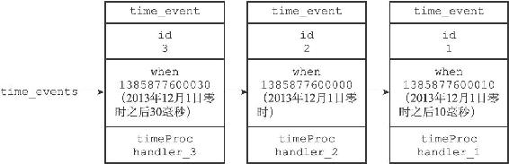
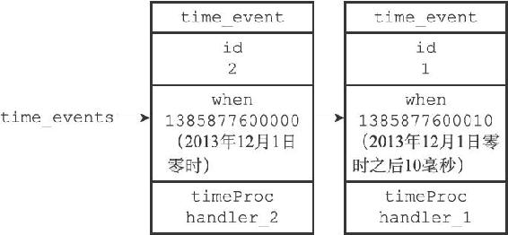

12.2 时间事件

Redis的时间事件分为以下两类：

·定时事件：让一段程序在指定的时间之后执行一次。比如说，让程序X在当前时间的30毫秒之后执行一次。

·周期性事件：让一段程序每隔指定时间就执行一次。比如说，让程序Y每隔30毫秒就执行一次。

一个时间事件主要由以下三个属性组成：

·id：服务器为时间事件创建的全局唯一ID（标识号）。ID号按从小到大的顺序递增，新事件的ID号比旧事件的ID号要大。

·when：毫秒精度的UNIX时间戳，记录了时间事件的到达（arrive）时间。

·timeProc：时间事件处理器，一个函数。当时间事件到达时，服务器就会调用相应的处理器来处理事件。

一个时间事件是定时事件还是周期性事件取决于时间事件处理器的返回值：

·如果事件处理器返回ae.h/AE\_NOMORE，那么这个事件为定时事件：该事件在达到一次之后就会被删除，之后不再到达。

·如果事件处理器返回一个非AE\_NOMORE的整数值，那么这个事件为周期性时间：当一个时间事件到达之后，服务器会根据事件处理器返回的值，对时间事件的when属性进行更新，让这个事件在一段时间之后再次到达，并以这种方式一直更新并运行下去。比如说，如果一个时间事件的处理器返回整数值30，那么服务器应该对这个时间事件进行更新，让这个事件在30毫秒之后再次到达。

目前版本的Redis只使用周期性事件，而没有使用定时事件。

12.2.1 实现

服务器将所有时间事件都放在一个无序链表中，每当时间事件执行器运行时，它就遍历整个链表，查找所有已到达的时间事件，并调用相应的事件处理器。

图12-8展示了一个保存时间事件的链表的例子，链表中包含了三个不同的时间事件：因为新的时间事件总是插入到链表的表头，所以三个时间事件分别按ID逆序排序，表头事件的ID为3，中间事件的ID为2，表尾事件的ID为1。

图12-8 用链表连接起来的三个时间事件

注意，我们说保存时间事件的链表为无序链表，指的不是链表不按ID排序，而是说，该链表不按when属性的大小排序。正因为链表没有按when属性进行排序，所以当时间事件执行器运行的时候，它必须遍历链表中的所有时间事件，这样才能确保服务器中所有已到达的时间事件都会被处理。

> 无序链表并不影响时间事件处理器的性能

> 在目前版本中，正常模式下的Redis服务器只使用serverCron一个时间事件，而在benchmark模式下，服务器也只使用两个时间事件。在这种情况下，服务器几乎是将无序链表退化成一个指针来使用，所以使用无序链表来保存时间事件，并不影响事件执行的性能。

12.2.2 API

ae.c/aeCreateTimeEvent函数接受一个毫秒数milliseconds和一个时间事件处理器proc作为参数，将一个新的时间事件添加到服务器，这个新的时间事件将在当前时间的milliseconds毫秒之后到达，而事件的处理器为proc。

例如，如果服务器当前所保存的时间事件如图12-9所示。

图12-9 用链表连接起来的两个时间事件

那么当程序以50毫秒和handler\_3处理器为参数，在时间1385877599980（2013年12月1日零时前20毫秒）时调用aeCreateTimeEvent函数，服务器将创建ID为3的时间事件，这时服务器所保存的时间事件将如图12-8所示。

ae.c/aeDeleteFileEvent函数接受一个时间事件ID作为参数，然后从服务器中删除该ID所对应的时间事件。

举个例子，如果服务器当前保存的时间事件如图12-8所示，那么当程序调用aeDeleteFileEvent（3）之后，服务器保存的时间事件将变成图12-9所示的样子。

ae.c/aeSearchNearestTimer函数返回到达时间距离当前时间最接近的那个时间事件。

举个例子，如果当前时间为1385877599980（2013年12月1日零时前20毫秒），而服务器当前保存的时间事件如图12-8所示，那么调用aeSearchNearestTimer函数将返回ID为2的事件。

ae.c/processTimeEvents函数是时间事件的执行器，这个函数会遍历所有已到达的时间事件，并调用这些事件的处理器。已到达指的是，时间事件的when属性记录的UNIX时间戳等于或小于当前时间的UNIX时间戳。

举个例子，如果服务器保存的时间事件如图12-8所示，并且当前时间为1385877600010（2013年12月1日零时之后10毫秒），那么processTimeEvents函数将处理图中ID为2和1的时间事件，因为这两个事件的到达时间都大于等于1385877600010。

processTimeEvents函数的定义可以用以下伪代码来描述：

---

>  
> def processTimeEvents():  
> \#   
> 遍历服务器中的所有时间事件  
> for time\_event in all\_time\_event():  
> \#   
> 检查事件是否已经到达  
> if time\_event.when <= unix\_ts\_now():  
> \#   
> 事件已到达  
> \#   
> 执行事件处理器，并获取返回值  
> retval = time\_event.timeProc()  
> \#   
> 如果这是一个定时事件  
> if retval == AE\_NOMORE:  
> \#   
> 那么将该事件从服务器中删除  
> delete\_time\_event\_from\_server(time\_event)  
> \#   
> 如果这是一个周期性事件  
> else:  
> \#   
> 那么按照事件处理器的返回值更新时间事件的 when   
> 属性  
> \#   
> 让这个事件在指定的时间之后再次到达  
> update\_when(time\_event, retval)  

---

12.2.3 时间事件应用实例：serverCron函数

持续运行的Redis服务器需要定期对自身的资源和状态进行检查和调整，从而确保服务器可以长期、稳定地运行，这些定期操作由redis.c/serverCron函数负责执行，它的主要工作包括：

·更新服务器的各类统计信息，比如时间、内存占用、数据库占用情况等。

·清理数据库中的过期键值对。

·关闭和清理连接失效的客户端。

·尝试进行AOF或RDB持久化操作。

·如果服务器是主服务器，那么对从服务器进行定期同步。

·如果处于集群模式，对集群进行定期同步和连接测试。

Redis服务器以周期性事件的方式来运行serverCron函数，在服务器运行期间，每隔一段时间，serverCron就会执行一次，直到服务器关闭为止。

在Redis2.6版本，服务器默认规定serverCron每秒运行10次，平均每间隔100毫秒运行一次。

从Redis2.8开始，用户可以通过修改hz选项来调整serverCron的每秒执行次数，具体信息请参考示例配置文件redis.conf关于hz选项的说明。
