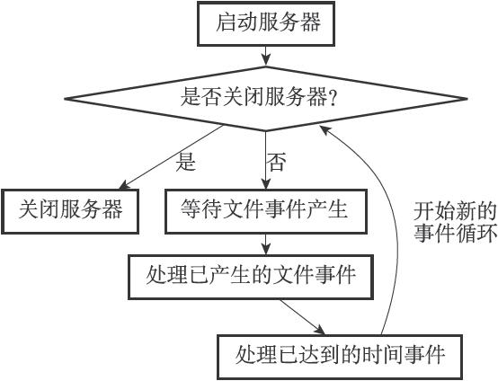
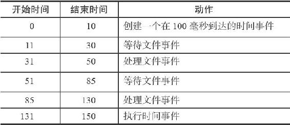

12.3 事件的调度与执行

因为服务器中同时存在文件事件和时间事件两种事件类型，所以服务器必须对这两种事件进行调度，决定何时应该处理文件事件，何时又应该处理时间事件，以及花多少时间来处理它们等等。

事件的调度和执行由ae.c/aeProcessEvents函数负责，以下是该函数的伪代码表示：

---

>  
> def aeProcessEvents():  
> \#   
> 获取到达时间离当前时间最接近的时间事件  
> time\_event = aeSearchNearestTimer()  
> \#   
> 计算最接近的时间事件距离到达还有多少毫秒  
> remaind\_ms = time\_event.when - unix\_ts\_now()  
> \#   
> 如果事件已到达，那么remaind\_ms  
> 的值可能为负数，将它设定为0  
> if remaind\_ms < 0:  
> remaind\_ms = 0  
> \#   
> 根据remaind\_ms  
> 的值，创建timeval  
> 结构  
> timeval = create\_timeval\_with\_ms(remaind\_ms)  
> \#   
> 阻塞并等待文件事件产生，最大阻塞时间由传入的timeval  
> 结构决定  
> \#   
> 如果remaind\_ms  
> 的值为0  
> ，那么aeApiPoll  
> 调用之后马上返回，不阻塞  
> aeApiPoll(timeval)  
> \#   
> 处理所有已产生的文件事件  
> processFileEvents()  
> \#   
> 处理所有已到达的时间事件  
> processTimeEvents()  

---

注意

前面的12.1节在介绍文件事件API的时候，并没有讲到processFileEvents这个函数，因为它并不存在，在实际中，处理已产生文件事件的代码是直接写在aeProcessEvents函数里面的，这里为了方便讲述，才虚构了processFileEvents函数。

将aeProcessEvents函数置于一个循环里面，加上初始化和清理函数，这就构成了Redis服务器的主函数，以下是该函数的伪代码表示：

---

>  
> def main():  
> \#   
> 初始化服务器  
> init\_server()  
> \#   
> 一直处理事件，直到服务器关闭为止  
> while server\_is\_not\_shutdown():  
> aeProcessEvents()  
> \#   
> 服务器关闭，执行清理操作  
> clean\_server()  

---

从事件处理的角度来看，Redis服务器的运行流程可以用流程图12-10来概括。

图12-10 事件处理角度下的服务器运行流程

以下是事件的调度和执行规则：

1）aeApiPoll函数的最大阻塞时间由到达时间最接近当前时间的时间事件决定，这个方法既可以避免服务器对时间事件进行频繁的轮询（忙等待），也可以确保aeApiPoll函数不会阻塞过长时间。

2）因为文件事件是随机出现的，如果等待并处理完一次文件事件之后，仍未有任何时间事件到达，那么服务器将再次等待并处理文件事件。随着文件事件的不断执行，时间会逐渐向时间事件所设置的到达时间逼近，并最终来到到达时间，这时服务器就可以开始处理到达的时间事件了。

3）对文件事件和时间事件的处理都是同步、有序、原子地执行的，服务器不会中途中断事件处理，也不会对事件进行抢占，因此，不管是文件事件的处理器，还是时间事件的处理器，它们都会尽可地减少程序的阻塞时间，并在有需要时主动让出执行权，从而降低造成事件饥饿的可能性。比如说，在命令回复处理器将一个命令回复写入到客户端套接字时，如果写入字节数超过了一个预设常量的话，命令回复处理器就会主动用break跳出写入循环，将余下的数据留到下次再写；另外，时间事件也会将非常耗时的持久化操作放到子线程或者子进程执行。

4）因为时间事件在文件事件之后执行，并且事件之间不会出现抢占，所以时间事件的实际处理时间，通常会比时间事件设定的到达时间稍晚一些。

表12-1记录了一次完整的事件调度和执行过程。

表12-1 一次完整的事件调度和执行过程

表12-1记录的事件执行过程凸显了上面列举的事件调度规则中的规则2、3、4：

·因为时间事件尚未到达，所以在处理时间事件之前，服务器已经等待并处理了两次文件事件。

·因为处理事件的过程中不会出现抢占，所以实际处理时间事件的时间比预定的100毫秒慢了30毫秒。
