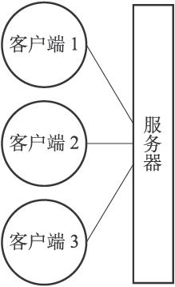
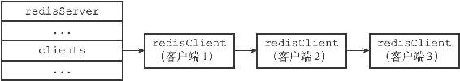

第13章 客户端

Redis服务器是典型的一对多服务器程序：一个服务器可以与多个客户端建立网络连接，每个客户端可以向服务器发送命令请求，而服务器则接收并处理客户端发送的命令请求，并向客户端返回命令回复。

通过使用由I/O多路复用技术实现的文件事件处理器，Redis服务器使用单线程单进程的方式来处理命令请求，并与多个客户端进行网络通信。

对于每个与服务器进行连接的客户端，服务器都为这些客户端建立了相应的redis.h/redisClient结构（客户端状态），这个结构保存了客户端当前的状态信息，以及执行相关功能时需要用到的数据结构，其中包括：

·客户端的套接字描述符。

·客户端的名字。

·客户端的标志值（flag）。

·指向客户端正在使用的数据库的指针，以及该数据库的号码。

·客户端当前要执行的命令、命令的参数、命令参数的个数，以及指向命令实现函数的指针。

·客户端的输入缓冲区和输出缓冲区。

·客户端的复制状态信息，以及进行复制所需的数据结构。

·客户端执行BRPOP、BLPOP等列表阻塞命令时使用的数据结构。

·客户端的事务状态，以及执行WATCH命令时用到的数据结构。

·客户端执行发布与订阅功能时用到的数据结构。

·客户端的身份验证标志。

·客户端的创建时间，客户端和服务器最后一次通信的时间，以及客户端的输出缓冲区大小超出软性限制（soft limit）的时间。

Redis服务器状态结构的clients属性是一个链表，这个链表保存了所有与服务器连接的客户端的状态结构，对客户端执行批量操作，或者查找某个指定的客户端，都可以通过遍历clients链表来完成：

---

>  
> struct redisServer {  
> // ...  
> //   
> 一个链表，保存了所有客户端状态  
> list \*clients;  
> // ...  
> };  

---

作为例子，图13-1展示了一个与三个客户端进行连接的服务器，而图13-2则展示了这个服务器的clients链表的样子。

图13-1 客户端与服务器

图13-2 clients链表

本章将对客户端状态的各个属性进行介绍，并讲述服务器创建并关闭各种不同类型的客户端的方法。
