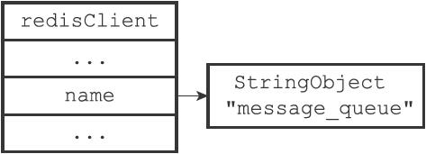
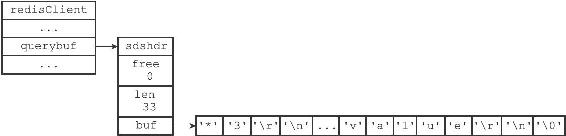
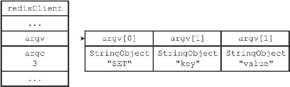
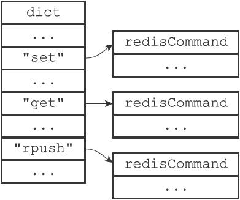
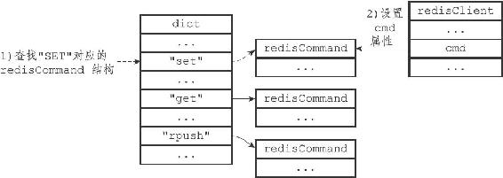
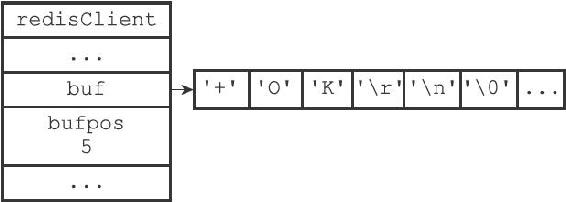
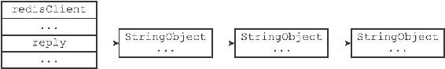
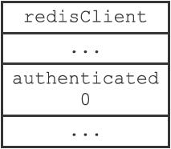
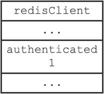

13.1 客户端属性

客户端状态包含的属性可以分为两类：

·一类是比较通用的属性，这些属性很少与特定功能相关，无论客户端执行的是什么工作，它们都要用到这些属性。

·另外一类是和特定功能相关的属性，比如操作数据库时需要用到的db属性和dictid属性，执行事务时需要用到的mstate属性，以及执行WATCH命令时需要用到的watched\_keys属性等等。

本章将对客户端状态中比较通用的那部分属性进行介绍，至于那些和特定功能相关的属性，则会在相应的章节进行介绍。

13.1.1 套接字描述符

客户端状态的fd属性记录了客户端正在使用的套接字描述符：

---

>  
> typedef struct redisClient {  
> // ...  
> int fd;  
> // ...  
> } redisClient;  

---

根据客户端类型的不同，fd属性的值可以是-1或者是大于-1的整数：

·伪客户端（fake client）的fd属性的值为-1：伪客户端处理的命令请求来源于AOF文件或者Lua脚本，而不是网络，所以这种客户端不需要套接字连接，自然也不需要记录套接字描述符。目前Redis服务器会在两个地方用到伪客户端，一个用于载入AOF文件并还原数据库状态，而另一个则用于执行Lua脚本中包含的Redis命令。

·普通客户端的fd属性的值为大于-1的整数：普通客户端使用套接字来与服务器进行通信，所以服务器会用fd属性来记录客户端套接字的描述符。因为合法的套接字描述符不能是-1，所以普通客户端的套接字描述符的值必然是大于-1的整数。

执行CLIENT list命令可以列出目前所有连接到服务器的普通客户端，命令输出中的fd域显示了服务器连接客户端所使用的套接字描述符：

---

>  
> redis> CLIENT list  
> addr=127.0.0.1:53428 fd=6 name= age=1242 idle=0 ...  
> addr=127.0.0.1:53469 fd=7 name= age=4 idle=4 ...  

---

13.1.2 名字

在默认情况下，一个连接到服务器的客户端是没有名字的。

比如在下面展示的CLIENT list命令示例中，两个客户端的name域都是空白的：

---

>  
> redis> CLIENT list  
> addr=127.0.0.1:53428 fd=6 name= age=1242 idle=0 ...  
> addr=127.0.0.1:53469 fd=7 name= age=4 idle=4 ...  

---

使用CLIENT setname命令可以为客户端设置一个名字，让客户端的身份变得更清晰。

以下展示的是客户端执行CLIENT setname命令之后的客户端列表：

---

>  
> redis> CLIENT list  
> addr=127.0.0.1:53428 fd=6 name=message\_queue age=2093 idle=0 ...  
> addr=127.0.0.1:53469 fd=7 name=user\_relationship age=855 idle=2 ...  

---

其中，第一个客户端的名字是message\_queue，我们可以猜测它是负责处理消息队列的客户端；第二个客户端的名字是user\_relationship，我们可以猜测它为负责处理用户关系的客户端。

客户端的名字记录在客户端状态的name属性里面：

---

>  
> typedef struct redisClient {  
> // ...  
> robj \*name;  
> // ...  
> } redisClient;  

---

如果客户端没有为自己设置名字，那么相应客户端状态的name属性指向NULL指针；相反地，如果客户端为自己设置了名字，那么name属性将指向一个字符串对象，而该对象就保存着客户端的名字。

图13-3展示了一个客户端状态示例，根据name属性显示，客户端的名字为"message\_queue"。

图13-3 name属性示例

13.1.3 标志

客户端的标志属性flags记录了客户端的角色（role），以及客户端目前所处的状态：

---

>  
> typedef struct redisClient {  
> // ...  
> int flags;  
> // ...  
> } redisClient;  

---

flags属性的值可以是单个标志：

---

>  
> flags = <flag>  

---

也可以是多个标志的二进制或，比如：

---

>  
> flags = <flag1> | <flag2> | ...  

---

每个标志使用一个常量表示，一部分标志记录了客户端的角色：

·在主从服务器进行复制操作时，主服务器会成为从服务器的客户端，而从服务器也会成为主服务器的客户端。REDIS\_MASTER标志表示客户端代表的是一个主服务器，REDIS\_SLAVE标志表示客户端代表的是一个从服务器。

·REDIS\_PRE\_PSYNC标志表示客户端代表的是一个版本低于Redis2.8的从服务器，主服务器不能使用PSYNC命令与这个从服务器进行同步。这个标志只能在REDIS\_SLAVE标志处于打开状态时使用。

·REDIS\_LUA\_CLIENT标识表示客户端是专门用于处理Lua脚本里面包含的Redis命令的伪客户端。

而另外一部分标志则记录了客户端目前所处的状态：

·REDIS\_MONITOR标志表示客户端正在执行MONITOR命令。

·REDIS\_UNIX\_SOCKET标志表示服务器使用UNIX套接字来连接客户端。

·REDIS\_BLOCKED标志表示客户端正在被BRPOP、BLPOP等命令阻塞。

·REDIS\_UNBLOCKED标志表示客户端已经从REDIS\_BLOCKED标志所表示的阻塞状态中脱离出来，不再阻塞。REDIS\_UNBLOCKED标志只能在REDIS\_BLOCKED标志已经打开的情况下使用。

·REDIS\_MULTI标志表示客户端正在执行事务。

·REDIS\_DIRTY\_CAS标志表示事务使用WATCH命令监视的数据库键已经被修改，REDIS\_DIRTY\_EXEC标志表示事务在命令入队时出现了错误，以上两个标志都表示事务的安全性已经被破坏，只要这两个标记中的任意一个被打开，EXEC命令必然会执行失败。这两个标志只能在客户端打开了REDIS\_MULTI标志的情况下使用。

·REDIS\_CLOSE\_ASAP标志表示客户端的输出缓冲区大小超出了服务器允许的范围，服务器会在下一次执行serverCron函数时关闭这个客户端，以免服务器的稳定性受到这个客户端影响。积存在输出缓冲区中的所有内容会直接被释放，不会返回给客户端。

·REDIS\_CLOSE\_AFTER\_REPLY标志表示有用户对这个客户端执行了CLIENT KILL命令，或者客户端发送给服务器的命令请求中包含了错误的协议内容。服务器会将客户端积存在输出缓冲区中的所有内容发送给客户端，然后关闭客户端。

·REDIS\_ASKING标志表示客户端向集群节点（运行在集群模式下的服务器）发送了ASKING命令。

·REDIS\_FORCE\_AOF标志强制服务器将当前执行的命令写入到AOF文件里面，REDIS\_FORCE\_REPL标志强制主服务器将当前执行的命令复制给所有从服务器。执行PUBSUB命令会使客户端打开REDIS\_FORCE\_AOF标志，执行SCRIPT LOAD命令会使客户端打开REDIS\_FORCE\_AOF标志和REDIS\_FORCE\_REPL标志。

·在主从服务器进行命令传播期间，从服务器需要向主服务器发送REPLICATION ACK命令，在发送这个命令之前，从服务器必须打开主服务器对应的客户端的REDIS\_MASTER\_FORCE\_REPLY标志，否则发送操作会被拒绝执行。

以上提到的所有标志都定义在redis.h文件里面。

> PUBSUB命令和SCRIPT LOAD命令的特殊性

> 通常情况下，Redis只会将那些对数据库进行了修改的命令写入到AOF文件，并复制到各个从服务器。如果一个命令没有对数据库进行任何修改，那么它就会被认为是只读命令，这个命令不会被写入到AOF文件，也不会被复制到从服务器。

> 以上规则适用于绝大部分Redis命令，但PUBSUB命令和SCRIPT LOAD命令是其中的例外。PUBSUB命令虽然没有修改数据库，但PUBSUB命令向频道的所有订阅者发送消息这一行为带有副作用，接收到消息的所有客户端的状态都会因为这个命令而改变。因此，服务器需要使用REDIS\_FORCE\_AOF标志，强制将这个命令写入AOF文件，这样在将来载入AOF文件时，服务器就可以再次执行相同的PUBSUB命令，并产生相同的副作用。SCRIPT LOAD命令的情况与PUBSUB命令类似：虽然SCRIPT LOAD命令没有修改数据库，但它修改了服务器状态，所以它是一个带有副作用的命令，服务器需要使用REDIS\_FORCE\_AOF标志，强制将这个命令写入AOF文件，使得将来在载入AOF文件时，服务器可以产生相同的副作用。

> 另外，为了让主服务器和从服务器都可以正确地载入SCRIPT LOAD命令指定的脚本，服务器需要使用REDIS\_FORCE\_REPL标志，强制将SCRIPT LOAD命令复制给所有从服务器。

以下是一些flags属性的例子：

---

>  
> \#   
> 客户端是一个主服务器  
> REDIS\_MASTER  
> \#   
> 客户端正在被列表命令阻塞  
> REDIS\_BLOCKED  
> \#   
> 客户端正在执行事务，但事务的安全性已被破坏  
> REDIS\_MULTI | REDIS\_DIRTY\_CAS  
> \#   
> 客户端是一个从服务器，并且版本低于Redis 2.8   
> REDIS\_SLAVE | REDIS\_PRE\_PSYNC  
> \#   
> 这是专门用于执行Lua  
> 脚本包含的Redis  
> 命令的伪客户端  
> \#   
> 它强制服务器将当前执行的命令写入AOF  
> 文件，并复制给从服务器  
> REDIS\_LUA\_CLIENT | REDIS\_FORCE\_AOF| REDIS\_FORCE\_REPL  

---

13.1.4 输入缓冲区

客户端状态的输入缓冲区用于保存客户端发送的命令请求：

---

>  
> typedef struct redisClient {  
> // ...  
> sds querybuf;  
> // ...  
> } redisClient;  

---

举个例子，如果客户端向服务器发送了以下命令请求：

---

>  
> SET key value  

---

那么客户端状态的querybuf属性将是一个包含以下内容的SDS值：

---

>  
> \*3\\r\\n$3\\r\\nSET\\r\\n$3\\r\\nkey\\r\\n$5\\r\\nvalue\\r\\n  

---

图13-4展示了这个SDS值以及querybuf属性的样子。

输入缓冲区的大小会根据输入内容动态地缩小或者扩大，但它的最大大小不能超过1GB，否则服务器将关闭这个客户端。

图13-4 querybuf属性示例

13.1.5 命令与命令参数

在服务器将客户端发送的命令请求保存到客户端状态的querybuf属性之后，服务器将对命令请求的内容进行分析，并将得出的命令参数以及命令参数的个数分别保存到客户端状态的argv属性和argc属性：

---

>  
> typedef struct redisClient {  
> // ...  
> robj \*\*argv;  
> int argc;  
> // ...  
> } redisClient;  

---

argv属性是一个数组，数组中的每个项都是一个字符串对象，其中argv\[0\]是要执行的命令，而之后的其他项则是传给命令的参数。

argc属性则负责记录argv数组的长度。

举个例子，对于图13-4所示的querybuf属性来说，服务器将分析并创建图13-5所示的argv属性和argc属性。

图13-5 argv属性和argc属性示例

注意，在图13-5展示的客户端状态中，argc属性的值为3，而不是2，因为命令的名字"SET"本身也是一个参数。

13.1.6 命令的实现函数

当服务器从协议内容中分析并得出argv属性和argc属性的值之后，服务器将根据项argv\[0\]的值，在命令表中查找命令所对应的命令实现函数。

图13-6展示了一个命令表示例，该表是一个字典，字典的键是一个SDS结构，保存了命令的名字，字典的值是命令所对应的redisCommand结构，这个结构保存了命令的实现函数、命令的标志、命令应该给定的参数个数、命令的总执行次数和总消耗时长等统计信息。

图13-6 命令表

当程序在命令表中成功找到argv\[0\]所对应的redisCommand结构时，它会将客户端状态的cmd指针指向这个结构：

---

>  
> typedef struct redisClient {  
> // ...  
> struct redisCommand \*cmd;  
> // ...  
> } redisClient;  

---

之后，服务器就可以使用cmd属性所指向的redisCommand结构，以及argv、argc属性中保存的命令参数信息，调用命令实现函数，执行客户端指定的命令。

图13-7演示了服务器在argv\[0\]为"SET"时，查找命令表并将客户端状态的cmd指针指向目标redisCommand结构的整个过程。

图13-7 查找命令并设置cmd属性

针对命令表的查找操作不区分输入字母的大小写，所以无论argv\[0\]是"SET"、"set"、或者"SeT"等等，查找的结果都是相同的。

13.1.7 输出缓冲区

执行命令所得的命令回复会被保存在客户端状态的输出缓冲区里面，每个客户端都有两个输出缓冲区可用，一个缓冲区的大小是固定的，另一个缓冲区的大小是可变的：

·固定大小的缓冲区用于保存那些长度比较小的回复，比如OK、简短的字符串值、整数值、错误回复等等。

·可变大小的缓冲区用于保存那些长度比较大的回复，比如一个非常长的字符串值，一个由很多项组成的列表，一个包含了很多元素的集合等等。

客户端的固定大小缓冲区由buf和bufpos两个属性组成：

---

>  
> typedef struct redisClient {  
> // ...  
> char buf\[REDIS\_REPLY\_CHUNK\_BYTES\];  
> int bufpos;  
> // ...  
> } redisClient;  

---

buf是一个大小为REDIS\_REPLY\_CHUNK\_BYTES字节的字节数组，而bufpos属性则记录了buf数组目前已使用的字节数量。

REDIS\_REPLY\_CHUNK\_BYTES常量目前的默认值为16\*1024，也即是说，buf数组的默认大小为16KB。

图13-8展示了一个使用固定大小缓冲区来保存返回值+OK\\r\\n的例子。

图13-8 固定大小缓冲区示例

当buf数组的空间已经用完，或者回复因为太大而没办法放进buf数组里面时，服务器就会开始使用可变大小缓冲区。

可变大小缓冲区由reply链表和一个或多个字符串对象组成：

---

>  
> typedef struct redisClient {  
> // ...  
> list \*reply;  
> // ...  
> } redisClient;  

---

通过使用链表来连接多个字符串对象，服务器可以为客户端保存一个非常长的命令回复，而不必受到固定大小缓冲区16KB大小的限制。

图13-9展示了一个包含三个字符串对象的reply链表。

图13-9 可变大小缓冲区示例

13.1.8 身份验证

客户端状态的authenticated属性用于记录客户端是否通过了身份验证：

---

>  
> typedef struct redisClient {  
> // ...  
> int authenticated;  
> // ...  
> } redisClient;  

---

如果authenticated的值为0，那么表示客户端未通过身份验证；如果authenticated的值为1，那么表示客户端已经通过了身份验证。

举个例子，对于一个尚未进行身份验证的客户端来说，客户端状态的authenticated属性将如图13-10所示。

图13-10 未验证身份时的客户端状态

当客户端authenticated属性的值为0时，除了AUTH命令之外，客户端发送的所有其他命令都会被服务器拒绝执行：

---

>  
> redis> PING  
> (error) NOAUTH Authentication required.  
> redis> SET msg "hello world"  
> (error) NOAUTH Authentication required.  

---

当客户端通过AUTH命令成功进行身份验证之后，客户端状态authenticated属性的值就会从0变为1，如图13-11所示，这时客户端就可以像往常一样向服务器发送命令请求了：

---

>  
> \# authenticated  
> 属性的值从0  
> 变为1  
> redis> AUTH 123321  
> OK  
> redis> PING  
> PONG  
> redis> SET msg "hello world"  
> OK  

---

图13-11 已经通过身份验证的客户端状态

authenticated属性仅在服务器启用了身份验证功能时使用。如果服务器没有启用身份验证功能的话，那么即使authenticated属性的值为0（这是默认值），服务器也不会拒绝执行客户端发送的命令请求。

关于服务器身份验证的更多信息可以参考示例配置文件对requirepass选项的相关说明。

13.1.9 时间

最后，客户端还有几个和时间有关的属性：

---

>  
> typedef struct redisClient {  
> // ...  
> time\_t ctime;  
> time\_t lastinteraction;  
> time\_t obuf\_soft\_limit\_reached\_time;  
> // ...  
> } redisClient;  

---

ctime属性记录了创建客户端的时间，这个时间可以用来计算客户端与服务器已经连接了多少秒，CLIENT list命令的age域记录了这个秒数：

---

>  
> redis> CLIENT list  
> addr=127.0.0.1:53428 ... age=1242 ...  

---

lastinteraction属性记录了客户端与服务器最后一次进行互动（interaction）的时间，这里的互动可以是客户端向服务器发送命令请求，也可以是服务器向客户端发送命令回复。

lastinteraction属性可以用来计算客户端的空转（idle）时间，也即是，距离客户端与服务器最后一次进行互动以来，已经过去了多少秒，CLIENT list命令的idle域记录了这个秒数：

---

>  
> redis> CLIENT list  
> addr=127.0.0.1:53428 ... idle=12 ...  

---

obuf\_soft\_limit\_reached\_time属性记录了输出缓冲区第一次到达软性限制（soft limit）的时间，稍后介绍输出缓冲区大小限制的时候会详细说明这个属性的作用。
