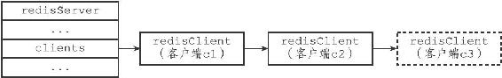

13.2 客户端的创建与关闭

服务器使用不同的方式来创建和关闭不同类型的客户端，本节将介绍服务器创建和关闭客户端的方法。

13.2.1 创建普通客户端

如果客户端是通过网络连接与服务器进行连接的普通客户端，那么在客户端使用connect函数连接到服务器时，服务器就会调用连接事件处理器（在第12章有介绍），为客户端创建相应的客户端状态，并将这个新的客户端状态添加到服务器状态结构clients链表的末尾。

举个例子，假设当前有c1和c2两个普通客户端正在连接服务器，那么当一个新的普通客户端c3连接到服务器之后，服务器会将c3所对应的客户端状态添加到clients链表的末尾，如图13-12所示，其中用虚线包围的就是服务器为c3新创建的客户端状态。

图13-12 服务器状态结构的clients链表

13.2.2 关闭普通客户端

一个普通客户端可以因为多种原因而被关闭：

·如果客户端进程退出或者被杀死，那么客户端与服务器之间的网络连接将被关闭，从而造成客户端被关闭。

·如果客户端向服务器发送了带有不符合协议格式的命令请求，那么这个客户端也会被服务器关闭。

·如果客户端成为了CLIENT KILL命令的目标，那么它也会被关闭。

·如果用户为服务器设置了timeout配置选项，那么当客户端的空转时间超过timeout选项设置的值时，客户端将被关闭。不过timeout选项有一些例外情况：如果客户端是主服务器（打开了REDIS\_MASTER标志），从服务器（打开了REDIS\_SLAVE标志），正在被BLPOP等命令阻塞（打开了REDIS\_BLOCKED标志），或者正在执行SUBSCRIBE、PSUBSCRIBE等订阅命令，那么即使客户端的空转时间超过了timeout选项的值，客户端也不会被服务器关闭。

·如果客户端发送的命令请求的大小超过了输入缓冲区的限制大小（默认为1 GB），那么这个客户端会被服务器关闭。

·如果要发送给客户端的命令回复的大小超过了输出缓冲区的限制大小，那么这个客户端会被服务器关闭。

前面介绍输出缓冲区的时候提到过，可变大小缓冲区由一个链表和任意多个字符串对象组成，理论上来说，这个缓冲区可以保存任意长的命令回复。

但是，为了避免客户端的回复过大，占用过多的服务器资源，服务器会时刻检查客户端的输出缓冲区的大小，并在缓冲区的大小超出范围时，执行相应的限制操作。

服务器使用两种模式来限制客户端输出缓冲区的大小：

·硬性限制（hard limit）：如果输出缓冲区的大小超过了硬性限制所设置的大小，那么服务器立即关闭客户端。

·软性限制（soft limit）：如果输出缓冲区的大小超过了软性限制所设置的大小，但还没超过硬性限制，那么服务器将使用客户端状态结构的obuf\_soft\_limit\_reached\_time属性记录下客户端到达软性限制的起始时间；之后服务器会继续监视客户端，如果输出缓冲区的大小一直超出软性限制，并且持续时间超过服务器设定的时长，那么服务器将关闭客户端；相反地，如果输出缓冲区的大小在指定时间之内，不再超出软性限制，那么客户端就不会被关闭，并且obuf\_soft\_limit\_reached\_time属性的值也会被清零。

使用client-output-buffer-limit选项可以为普通客户端、从服务器客户端、执行发布与订阅功能的客户端分别设置不同的软性限制和硬性限制，该选项的格式为：

---

>  
> client-output-buffer-limit <class> <hard limit> <soft limit> <soft seconds>  

---

以下是三个设置示例：

---

>  
> client-output-buffer-limit normal 0 0 0  
> client-output-buffer-limit slave 256mb 64mb 60  
> client-output-buffer-limit pubsub 32mb 8mb 60  

---

第一行设置将普通客户端的硬性限制和软性限制都设置为0，表示不限制客户端的输出缓冲区大小。

第二行设置将从服务器客户端的硬性限制设置为256MB，而软性限制设置为64MB，软性限制的时长为60秒。

第三行设置将执行发布与订阅功能的客户端的硬性限制设置为32MB，软性限制设置为8MB，软性限制的时长为60秒。

关于client-output-buffer-limit选项的更多用法，可以参考示例配置文件redis.conf。

13.2.3 Lua脚本的伪客户端

服务器会在初始化时创建负责执行Lua脚本中包含的Redis命令的伪客户端，并将这个伪客户端关联在服务器状态结构的lua\_client属性中：

---

>  
> struct redisServer {  
> // ...  
> redisClient \*lua\_client;  
> // ...  
> };  

---

lua\_client伪客户端在服务器运行的整个生命期中会一直存在，只有服务器被关闭时，这个客户端才会被关闭。

13.2.4 AOF文件的伪客户端

服务器在载入AOF文件时，会创建用于执行AOF文件包含的Redis命令的伪客户端，并在载入完成之后，关闭这个伪客户端。
