14.1 命令请求的执行过程

一个命令请求从发送到获得回复的过程中，客户端和服务器需要完成一系列操作。举个例子，如果我们使用客户端执行以下命令：

---

>  
> redis> SET KEY VALUE  
> OK  

---

那么从客户端发送SET KEY VALUE命令到获得回复OK期间，客户端和服务器共需要执行以下操作：

1）客户端向服务器发送命令请求SET KEY VALUE。

2）服务器接收并处理客户端发来的命令请求SET KEY VALUE，在数据库中进行设置操作，并产生命令回复OK。

3）服务器将命令回复OK发送给客户端。

4）客户端接收服务器返回的命令回复OK，并将这个回复打印给用户观看。

本节接下来的内容将对这些操作的执行细节进行补充，详细地说明客户端和服务器在执行命令请求时所做的各种工作。

14.1.1 发送命令请求

Redis服务器的命令请求来自Redis客户端，当用户在客户端中键入一个命令请求时，客户端会将这个命令请求转换成协议格式，然后通过连接到服务器的套接字，将协议格式的命令请求发送给服务器，如图14-1所示。

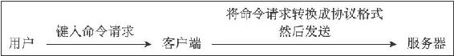

图14-1 客户端接收并发送命令请求的过程

举个例子，假设用户在客户端键入了命令：

---

>  
> SET KEY VALUE  

---

那么客户端会将这个命令转换成协议：

---

>  
> \*3\\r\\n$3\\r\\nSET\\r\\n$3\\r\\nKEY\\r\\n$5\\r\\nVALUE\\r\\n  

---

然后将这段协议内容发送给服务器。

14.1.2 读取命令请求

当客户端与服务器之间的连接套接字因为客户端的写入而变得可读时，服务器将调用命令请求处理器来执行以下操作：

1）读取套接字中协议格式的命令请求，并将其保存到客户端状态的输入缓冲区里面。

2）对输入缓冲区中的命令请求进行分析，提取出命令请求中包含的命令参数，以及命令参数的个数，然后分别将参数和参数个数保存到客户端状态的argv属性和argc属性里面。

3）调用命令执行器，执行客户端指定的命令。

继续用上一个小节的SET命令为例子，图14-2展示了程序将命令请求保存到客户端状态的输入缓冲区之后，客户端状态的样子。

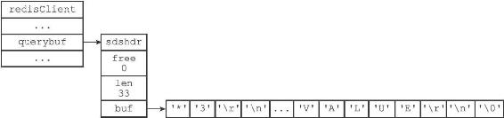

图14-2 客户端状态中的命令请求

之后，分析程序将对输入缓冲区中的协议进行分析：

---

>  
> \*3\\r\\n$3\\r\\nSET\\r\\n$3\\r\\nKEY\\r\\n$5\\r\\nVALUE\\r\\n  

---

并将得出的分析结果保存到客户端状态的argv属性和argc属性里面，如图14-3所示。

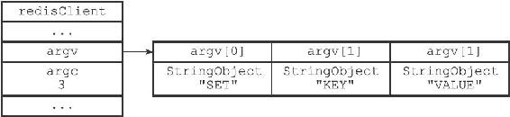

图14-3 客户端状态的argv属性和argc属性

之后，服务器将通过调用命令执行器来完成执行命令所需的余下步骤，以下几个小节将分别介绍命令执行器所执行的工作。

14.1.3 命令执行器（1）：查找命令实现

命令执行器要做的第一件事就是根据客户端状态的argv\[0\]参数，在命令表（command table）中查找参数所指定的命令，并将找到的命令保存到客户端状态的cmd属性里面。

命令表是一个字典，字典的键是一个个命令名字，比如"set"、"get"、"del"等等；而字典的值则是一个个redisCommand结构，每个redisCommand结构记录了一个Redis命令的实现信息，表14-1记录了这个结构的各个主要属性的类型和作用。

表14-1 redisCommand结构的主要属性

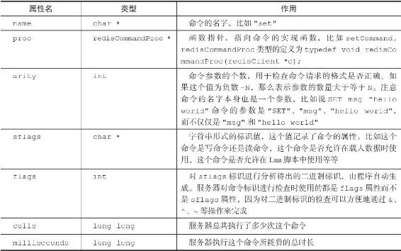

表14-2列出了sflags属性可以使用的标识值，以及这些标识的意义。

表14-2 sflags属性的标识

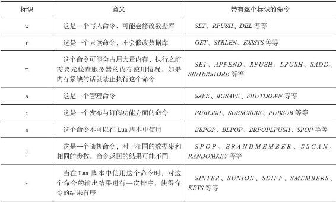

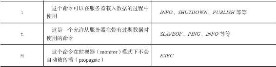

图14-4展示了命令表的样子，并且以SET命令和GET命令作为例子，展示了redisCommand结构：

·SET命令的名字为"set"，实现函数为setCommand；命令的参数个数为-3，表示命令接受三个或以上数量的参数；命令的标识为"wm"，表示SET命令是一个写入命令，并且在执行这个命令之前，服务器应该对占用内存状况进行检查，因为这个命令可能会占用大量内存。

·GET命令的名字为"get"，实现函数为getCommand函数；命令的参数个数为2，表示命令只接受两个参数；命令的标识为"r"，表示这是一个只读命令。

继续之前SET命令的例子，当程序以图14-3中的argv\[0\]作为输入，在命令表中进行查找时，命令表将返回"set"键所对应的redisCommand结构，客户端状态的cmd指针会指向这个redisCommand结构，如图14-5所示。

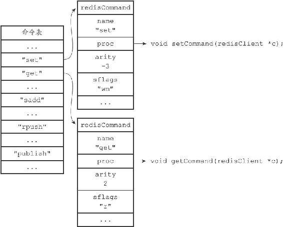

图14-4 命令表

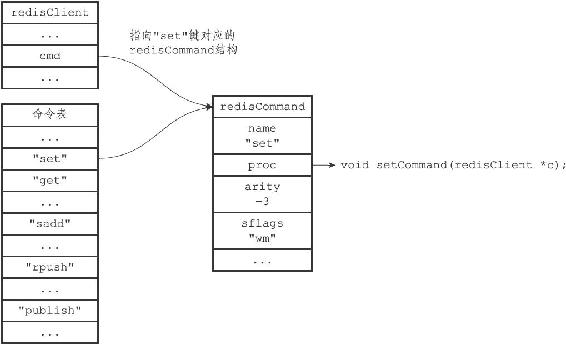

图14-5 设置客户端状态的cmd指针

> 命令名字的大小写不影响命令表的查找结果

> 因为命令表使用的是大小写无关的查找算法，无论输入的命令名字是大写、小写或者混合大小写，只要命令的名字是正确的，就能找到相应的redisCommand结构。比如说，无论用户输入的命令名字是"SET"、"set"、"SeT"又或者"sEt"，命令表返回的都是同一个redisCommand结构。这也是Redis客户端可以发送不同大小写的命令，并且获得相同执行结果的原因：

---

>  
> \#   
> 以下四个命令的执行效果完全一样  
> redis> SET msg "hello world"  
> OK  
> redis> set msg "hello world"  
> OK  
> redis> SeT msg "hello world"  
> OK  
> redis> sEt msg "hello world"  
> OK  

---

14.1.4 命令执行器（2）：执行预备操作

到目前为止，服务器已经将执行命令所需的命令实现函数（保存在客户端状态的cmd属性）、参数（保存在客户端状态的argv属性）、参数个数（保存在客户端状态的argc属性）都收集齐了，但是在真正执行命令之前，程序还需要进行一些预备操作，从而确保命令可以正确、顺利地被执行，这些操作包括：

·检查客户端状态的cmd指针是否指向NULL，如果是的话，那么说明用户输入的命令名字找不到相应的命令实现，服务器不再执行后续步骤，并向客户端返回一个错误。

·根据客户端cmd属性指向的redisCommand结构的arity属性，检查命令请求所给定的参数个数是否正确，当参数个数不正确时，不再执行后续步骤，直接向客户端返回一个错误。比如说，如果redisCommand结构的arity属性的值为-3，那么用户输入的命令参数个数必须大于等于3个才行。

·检查客户端是否已经通过了身份验证，未通过身份验证的客户端只能执行AUTH命令，如果未通过身份验证的客户端试图执行除AUTH命令之外的其他命令，那么服务器将向客户端返回一个错误。

·如果服务器打开了maxmemory功能，那么在执行命令之前，先检查服务器的内存占用情况，并在有需要时进行内存回收，从而使得接下来的命令可以顺利执行。如果内存回收失败，那么不再执行后续步骤，向客户端返回一个错误。

·如果服务器上一次执行BGSAVE命令时出错，并且服务器打开了stop-writes-on-bgsave-error功能，而且服务器即将要执行的命令是一个写命令，那么服务器将拒绝执行这个命令，并向客户端返回一个错误。

·如果客户端当前正在用SUBSCRIBE命令订阅频道，或者正在用PSUBSCRIBE命令订阅模式，那么服务器只会执行客户端发来的SUBSCRIBE、PSUBSCRIBE、UNSUBSCRIBE、PUNSUBSCRIBE四个命令，其他命令都会被服务器拒绝。

·如果服务器正在进行数据载入，那么客户端发送的命令必须带有l标识（比如INFO、SHUTDOWN、PUBLISH等等）才会被服务器执行，其他命令都会被服务器拒绝。

·如果服务器因为执行Lua脚本而超时并进入阻塞状态，那么服务器只会执行客户端发来的SHUTDOWN nosave命令和SCRIPT KILL命令，其他命令都会被服务器拒绝。

·如果客户端正在执行事务，那么服务器只会执行客户端发来的EXEC、DISCARD、MULTI、WATCH四个命令，其他命令都会被放进事务队列中。

·如果服务器打开了监视器功能，那么服务器会将要执行的命令和参数等信息发送给监视器。当完成了以上预备操作之后，服务器就可以开始真正执行命令了。

注意

以上只列出了服务器在单机模式下执行命令时的检查操作，当服务器在复制或者集群模式下执行命令时，预备操作还会更多一些。

14.1.5 命令执行器（3）：调用命令的实现函数

在前面的操作中，服务器已经将要执行命令的实现保存到了客户端状态的cmd属性里面，并将命令的参数和参数个数分别保存到了客户端状态的argv属性和argv属性里面，当服务器决定要执行命令时，它只要执行以下语句就可以了：

---

>  
> // client  
> 是指向客户端状态的指针  
> client->cmd->proc(client);  

---

因为执行命令所需的实际参数都已经保存到客户端状态的argv属性里面了，所以命令的实现函数只需要一个指向客户端状态的指针作为参数即可。

继续以之前的SET命令为例子，图14-6展示了客户端包含了命令实现、参数和参数个数的样子。

对于这个例子来说，执行语句：

---

>  
> client->cmd->proc(client);  

---

等于执行语句：

---

>  
> setCommand(client);  

---

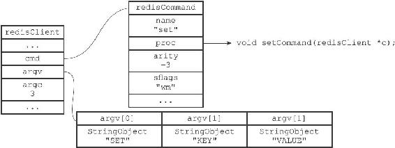

图14-6 客户端状态

被调用的命令实现函数会执行指定的操作，并产生相应的命令回复，这些回复会被保存在客户端状态的输出缓冲区里面（buf属性和reply属性），之后实现函数还会为客户端的套接字关联命令回复处理器，这个处理器负责将命令回复返回给客户端。

对于前面SET命令的例子来说，函数调用setCommand（client）将产生一个"+OK\\r\\n"回复，这个回复会被保存到客户端状态的buf属性里面，如图14-7所示。

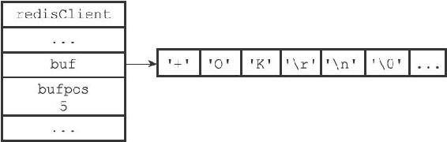

图14-7 保存了命令回复的客户端状态

14.1.6 命令执行器（4）：执行后续工作

在执行完实现函数之后，服务器还需要执行一些后续工作：

·如果服务器开启了慢查询日志功能，那么慢查询日志模块会检查是否需要为刚刚执行完的命令请求添加一条新的慢查询日志。

·根据刚刚执行命令所耗费的时长，更新被执行命令的redisCommand结构的milliseconds属性，并将命令的redisCommand结构的calls计数器的值增一。

·如果服务器开启了AOF持久化功能，那么AOF持久化模块会将刚刚执行的命令请求写入到AOF缓冲区里面。

·如果有其他从服务器正在复制当前这个服务器，那么服务器会将刚刚执行的命令传播给所有从服务器。

当以上操作都执行完了之后，服务器对于当前命令的执行到此就告一段落了，之后服务器就可以继续从文件事件处理器中取出并处理下一个命令请求了。

14.1.7 将命令回复发送给客户端

前面说过，命令实现函数会将命令回复保存到客户端的输出缓冲区里面，并为客户端的套接字关联命令回复处理器，当客户端套接字变为可写状态时，服务器就会执行命令回复处理器，将保存在客户端输出缓冲区中的命令回复发送给客户端。

当命令回复发送完毕之后，回复处理器会清空客户端状态的输出缓冲区，为处理下一个命令请求做好准备。

以图14-7所示的客户端状态为例子，当客户端的套接字变为可写状态时，命令回复处理器会将协议格式的命令回复"+OK\\r\\n"发送给客户端。

14.1.8 客户端接收并打印命令回复

当客户端接收到协议格式的命令回复之后，它会将这些回复转换成人类可读的格式，并打印给用户观看（假设我们使用的是Redis自带的redis-cli客户端），如图14-8所示。

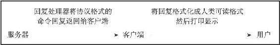

图14-8 客户端接收并打印命令回复的过程

继续以之前的SET命令为例子，当客户端接到服务器发来的"+OK\\r\\n"协议回复时，它会将这个回复转换成"OK\\n"，然后打印给用户看：

---

>  
> redis> SET KEY VALUE  
> OK  

---

以上就是Redis客户端和服务器执行命令请求的整个过程了。
