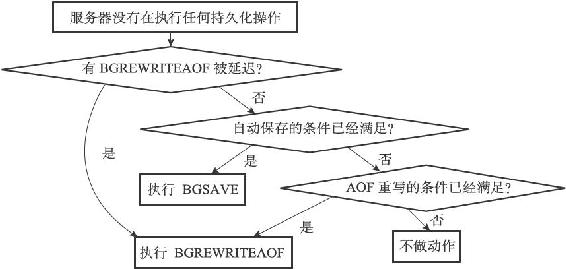

14.2 serverCron函数

Redis服务器中的serverCron函数默认每隔100毫秒执行一次，这个函数负责管理服务器的资源，并保持服务器自身的良好运转。

本节接下来的内容将对serverCron函数执行的操作进行完整介绍，并介绍redisServer结构（服务器状态）中和serverCron函数有关的属性。

14.2.1 更新服务器时间缓存

Redis服务器中有不少功能需要获取系统的当前时间，而每次获取系统的当前时间都需要执行一次系统调用，为了减少系统调用的执行次数，服务器状态中的unixtime属性和mstime属性被用作当前时间的缓存：

---

>  
> struct redisServer {  
> // ...  
> //   
> 保存了秒级精度的系统当前UNIX  
> 时间戳  
> time\_t unixtime;  
> //   
> 保存了毫秒级精度的系统当前UNIX  
> 时间戳  
> long long mstime;  
> // ...  
> };  

---

因为serverCron函数默认会以每100毫秒一次的频率更新unixtime属性和mstime属性，所以这两个属性记录的时间的精确度并不高：

·服务器只会在打印日志、更新服务器的LRU时钟、决定是否执行持久化任务、计算服务器上线时间（uptime）这类对时间精确度要求不高的功能上。

·对于为键设置过期时间、添加慢查询日志这种需要高精确度时间的功能来说，服务器还是会再次执行系统调用，从而获得最准确的系统当前时间。

14.2.2 更新LRU时钟

服务器状态中的lruclock属性保存了服务器的LRU时钟，这个属性和上面介绍的unixtime属性、mstime属性一样，都是服务器时间缓存的一种：

---

>  
> struct redisServer {  
> // ...  
> //   
> 默认每10  
> 秒更新一次的时钟缓存，  
> //   
> 用于计算键的空转（idle  
> ）时长。  
> unsigned lruclock:22;  
> // ...  
> };  

---

每个Redis对象都会有一个lru属性，这个lru属性保存了对象最后一次被命令访问的时间：

---

>  
> typedef struct redisObject {  
> // ...  
> unsigned lru:22;  
> // ...  
> } robj;  

---

当服务器要计算一个数据库键的空转时间（也即是数据库键对应的值对象的空转时间），程序会用服务器的lruclock属性记录的时间减去对象的lru属性记录的时间，得出的计算结果就是这个对象的空转时间：

---

>  
> redis> SET msg "hello world"  
> OK  
> \#   
> 等待一小段时间  
> redis> OBJECT IDLETIME msg  
> (integer)20  
> \#   
> 等待一阵子  
> redis> OBJECT IDLETIME msg  
> (integer)180  
> \#   
> 访问msg  
> 键的值  
> redis> GET msg  
> "hello world"  
> \#   
> 键处于活跃状态，空转时长为0  
> redis> OBJECT IDLETIME msg  
> (integer)0  

---

serverCron函数默认会以每10秒一次的频率更新lruclock属性的值，因为这个时钟不是实时的，所以根据这个属性计算出来的LRU时间实际上只是一个模糊的估算值。

lruclock时钟的当前值可以通过INFO server命令的lru\_clock域查看：

---

>  
> redis> INFO server  
> \# Server  
> ...  
> lru\_clock:55923  
> ...  

---

14.2.3 更新服务器每秒执行命令次数

serverCron函数中的trackOperationsPerSecond函数会以每100毫秒一次的频率执行，这个函数的功能是以抽样计算的方式，估算并记录服务器在最近一秒钟处理的命令请求数量，这个值可以通过INFO status命令的instantaneous\_ops\_per\_sec域查看：

---

>  
> redis> INFO stats  
> \# Stats  
> ...  
> instantaneous\_ops\_per\_sec:6  
> ...  

---

上面的命令结果显示，在最近的一秒钟内，服务器处理了大概六个命令。

trackOperationsPerSecond函数和服务器状态中四个ops\_sec\_开头的属性有关：

---

>  
> struct redisServer {  
> // ...  
> //   
> 上一次进行抽样的时间  
> long long ops\_sec\_last\_sample\_time;  
> //   
> 上一次抽样时，服务器已执行命令的数量  
> long long ops\_sec\_last\_sample\_ops;  
> // REDIS\_OPS\_SEC\_SAMPLES  
> 大小（默认值为16  
> ）的环形数组，  
> //   
> 数组中的每个项都记录了一次抽样结果。  
> long long ops\_sec\_samples\[REDIS\_OPS\_SEC\_SAMPLES\];  
> // ops\_sec\_samples  
> 数组的索引值，  
> //   
> 每次抽样后将值自增一，  
> //   
> 在值等于16  
> 时重置为0  
> ，  
> //   
> 让ops\_sec\_samples  
> 数组构成一个环形数组。  
> int ops\_sec\_idx;  
> // ...  
> };  

---

trackOperationsPerSecond函数每次运行，都会根据ops\_sec\_last\_sample\_time记录的上一次抽样时间和服务器的当前时间，以及ops\_sec\_last\_sample\_ops记录的上一次抽样的已执行命令数量和服务器当前的已执行命令数量，计算出两次trackOperationsPerSecond调用之间，服务器平均每一毫秒处理了多少个命令请求，然后将这个平均值乘以1000，这就得到了服务器在一秒钟内能处理多少个命令请求的估计值，这个估计值会被作为一个新的数组项被放进ops\_sec\_samples环形数组里面。

当客户端执行INFO命令时，服务器就会调用getOperationsPerSecond函数，根据ops\_sec\_samples环形数组中的抽样结果，计算出instantaneous\_ops\_per\_sec属性的值，以下是getOperationsPerSecond函数的实现代码：

---

>  
> long long getOperationsPerSecond(void){  
> int j;  
> long long sum = 0;  
> //   
> 计算所有取样值的总和  
> for (j = 0; j < REDIS\_OPS\_SEC\_SAMPLES; j++)  
> sum += server.ops\_sec\_samples\[j\];  
> //   
> 计算取样的平均值  
> return sum / REDIS\_OPS\_SEC\_SAMPLES;  
> }  

---

根据getOperationsPerSecond函数的定义可以看出，instantaneous\_ops\_per\_sec属性的值是通过计算最近REDIS\_OPS\_SEC\_SAMPLES次取样的平均值来计算得出的，它只是一个估算值。

14.2.4 更新服务器内存峰值记录

服务器状态中的stat\_peak\_memory属性记录了服务器的内存峰值大小：

---

>  
> struct redisServer {  
> // ...  
> //   
> 已使用内存峰值  
> size\_t stat\_peak\_memory;  
> // ...  
> };  

---

每次serverCron函数执行时，程序都会查看服务器当前使用的内存数量，并与stat\_peak\_memory保存的数值进行比较，如果当前使用的内存数量比stat\_peak\_memory属性记录的值要大，那么程序就将当前使用的内存数量记录到stat\_peak\_memory属性里面。

INFO memory命令的used\_memory\_peak和used\_memory\_peak\_human两个域分别以两种格式记录了服务器的内存峰值：

---

>  
> redis> INFO memory  
> \# Memory  
> ...  
> used\_memory\_peak:501824  
> used\_memory\_peak\_human:490.06K  
> ...  

---

14.2.5 处理SIGTERM信号

在启动服务器时，Redis会为服务器进程的SIGTERM信号关联处理器sigtermHandler函数，这个信号处理器负责在服务器接到SIGTERM信号时，打开服务器状态的shutdown\_asap标识：

---

>  
> // SIGTERM  
> 信号的处理器  
> static void sigtermHandler(int sig) {  
> //   
> 打印日志  
> redisLogFromHandler(REDIS\_WARNING,"Received SIGTERM, scheduling shutdown...");  
> //   
> 打开关闭标识  
> server.shutdown\_asap = 1;  
> }  

---

每次serverCron函数运行时，程序都会对服务器状态的shutdown\_asap属性进行检查，并根据属性的值决定是否关闭服务器：

---

>  
> struct redisServer {  
> // ...  
> //   
> 关闭服务器的标识：  
> //   
> 值为1  
> 时，关闭服务器，  
> //   
> 值为0  
> 时，不做动作。  
> int shutdown\_asap;  
> // ...  
> };  

---

以下代码展示了服务器在接到SIGTERM信号之后，关闭服务器并打印相关日志的过程：

---

>  
> \[6794 | signal handler\] (1384435690) Received SIGTERM, scheduling shutdown...  
> \[6794\] 14 Nov 21:28:10.108 # User requested shutdown...  
> \[6794\] 14 Nov 21:28:10.108 \* Saving the final RDB snapshot before exiting.  
> \[6794\] 14 Nov 21:28:10.161 \* DB saved on disk  
> \[6794\] 14 Nov 21:28:10.161 # Redisis now ready to exit, bye bye...  

---

从日志里面可以看到，服务器在关闭自身之前会进行RDB持久化操作，这也是服务器拦截SIGTERM信号的原因，如果服务器一接到SIGTERM信号就立即关闭，那么它就没办法执行持久化操作了。

14.2.6 管理客户端资源

serverCron函数每次执行都会调用clientsCron函数，clientsCron函数会对一定数量的客户端进行以下两个检查：

·如果客户端与服务器之间的连接已经超时（很长一段时间里客户端和服务器都没有互动），那么程序释放这个客户端。

·如果客户端在上一次执行命令请求之后，输入缓冲区的大小超过了一定的长度，那么程序会释放客户端当前的输入缓冲区，并重新创建一个默认大小的输入缓冲区，从而防止客户端的输入缓冲区耗费了过多的内存。

14.2.7 管理数据库资源

serverCron函数每次执行都会调用databasesCron函数，这个函数会对服务器中的一部分数据库进行检查，删除其中的过期键，并在有需要时，对字典进行收缩操作，第9章经对这些操作进行了详细的说明。

14.2.8 执行被延迟的BGREWRITEAOF

在服务器执行BGSAVE命令的期间，如果客户端向服务器发来BGREWRITEAOF命令，那么服务器会将BGREWRITEAOF命令的执行时间延迟到BGSAVE命令执行完毕之后。

服务器的aof\_rewrite\_scheduled标识记录了服务器是否延迟了BGREWRITEAOF命令：

---

>  
> struct redisServer {  
> // ...  
> //   
> 如果值为1  
> ，那么表示有 BGREWRITEAOF  
> 命令被延迟了。  
> int aof\_rewrite\_scheduled;  
> // ...  
> };  

---

每次serverCron函数执行时，函数都会检查BGSAVE命令或者BGREWRITEAOF命令是否正在执行，如果这两个命令都没在执行，并且aof\_rewrite\_scheduled属性的值为1，那么服务器就会执行之前被推延的BGREWRITEAOF命令。

14.2.9 检查持久化操作的运行状态

服务器状态使用rdb\_child\_pid属性和aof\_child\_pid属性记录执行BGSAVE命令和BGREWRITEAOF命令的子进程的ID，这两个属性也可以用于检查BGSAVE命令或者BGREWRITEAOF命令是否正在执行：

---

>  
> struct redisServer {  
> // ...  
> //   
> 记录执行BGSAVE  
> 命令的子进程的ID  
> ：  
> //   
> 如果服务器没有在执行BGSAVE  
> ，  
> //   
> 那么这个属性的值为-1  
> 。  
> pid\_t rdb\_child\_pid; /\* PID of RDB saving child \*/  
> //   
> 记录执行BGREWRITEAOF  
> 命令的子进程的ID  
> ：  
> //   
> 如果服务器没有在执行BGREWRITEAOF  
> ，  
> //   
> 那么这个属性的值为-1  
> 。  
> pid\_t aof\_child\_pid; /\* PID if rewriting process \*/  
> // ...  
> };  

---

每次serverCron函数执行时，程序都会检查rdb\_child\_pid和aof\_child\_pid两个属性的值，只要其中一个属性的值不为-1，程序就会执行一次wait3函数，检查子进程是否有信号发来服务器进程：

·如果有信号到达，那么表示新的RDB文件已经生成完毕（对于BGSAVE命令来说），或者AOF文件已经重写完毕（对于BGREWRITEAOF命令来说），服务器需要进行相应命令的后续操作，比如用新的RDB文件替换现有的RDB文件，或者用重写后的AOF文件替换现有的AOF文件。

·如果没有信号到达，那么表示持久化操作未完成，程序不做动作。

另一方面，如果rdb\_child\_pid和aof\_child\_pid两个属性的值都为-1，那么表示服务器没有在进行持久化操作，在这种情况下，程序执行以下三个检查：

1）查看是否有BGREWRITEAOF被延迟了，如果有的话，那么开始一次新的BGREWRITEAOF操作（这就是上一个小节我们说到的检查）。

2）检查服务器的自动保存条件是否已经被满足，如果条件满足，并且服务器没有在执行其他持久化操作，那么服务器开始一次新的BGSAVE操作（因为条件1可能会引发一次BGREWRITEAOF，所以在这个检查中，程序会再次确认服务器是否已经在执行持久化操作了）。

3）检查服务器设置的AOF重写条件是否满足，如果条件满足，并且服务器没有在执行其他持久化操作，那么服务器将开始一次新的BGREWRITEAOF操作（因为条件1和条件2都可能会引起新的持久化操作，所以在这个检查中，我们要再次确认服务器是否已经在执行持久化操作了）。

图14-9以流程图的方式展示了这个检查过程。

图14-9 判断是否需要执行持久化操作

14.2.10 将AOF缓冲区中的内容写入AOF文件

如果服务器开启了AOF持久化功能，并且AOF缓冲区里面还有待写入的数据，那么serverCron函数会调用相应的程序，将AOF缓冲区中的内容写入到AOF文件里面，第11章对此有详细的说明。

14.2.11 关闭异步客户端

在这一步，服务器会关闭那些输出缓冲区大小超出限制的客户端，第13章对此有详细的说明。

14.2.12 增加cronloops计数器的值

服务器状态的cronloops属性记录了serverCron函数执行的次数：

---

>  
> struct redisServer {  
> // ...  
> // serverCron  
> 函数的运行次数计数器  
> // serverCron  
> 函数每执行一次，这个属性的值就增一。  
> int cronloops;  
> // ...  
> };  

---

cronloops属性目前在服务器中的唯一作用，就是在复制模块中实现“每执行serverCron函数N次就执行一次指定代码”的功能，方法如以下伪代码所示：

---

>  
> if cronloops % N == 0:   
> \#   
> 执行指定代码...   

---
