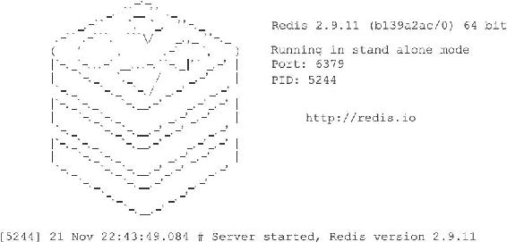

14.3 初始化服务器

一个Redis服务器从启动到能够接受客户端的命令请求，需要经过一系列的初始化和设置过程，比如初始化服务器状态，接受用户指定的服务器配置，创建相应的数据结构和网络连接等等，本节接下来的内容将对服务器的整个初始化过程进行详细的介绍。

14.3.1 初始化服务器状态结构

初始化服务器的第一步就是创建一个struct redisServer类型的实例变量server作为服务器的状态，并为结构中的各个属性设置默认值。

初始化server变量的工作由redis.c/initServerConfig函数完成，以下是这个函数最开头的一部分代码：

---

>  
> void initServerConfig(void){  
> //   
> 设置服务器的运行id   
> getRandomHexChars(server.runid,REDIS\_RUN\_ID\_SIZE);  
> //   
> 为运行id  
> 加上结尾字符  
> server.runid\[REDIS\_RUN\_ID\_SIZE\] = '\\0';  
> //   
> 设置默认配置文件路径  
> server.configfile = NULL;  
> //   
> 设置默认服务器频率  
> server.hz = REDIS\_DEFAULT\_HZ;  
> //   
> 设置服务器的运行架构  
> server.arch\_bits = (sizeof(long) == 8) ? 64 : 32;  
> //   
> 设置默认服务器端口号  
> server.port = REDIS\_SERVERPORT;  
> // ...  
> }  

---

以下是initServerConfig函数完成的主要工作：

·设置服务器的运行ID。

·设置服务器的默认运行频率。

·设置服务器的默认配置文件路径。

·设置服务器的运行架构。

·设置服务器的默认端口号。

·设置服务器的默认RDB持久化条件和AOF持久化条件。

·初始化服务器的LRU时钟。

·创建命令表。

initServerConfig函数设置的服务器状态属性基本都是一些整数、浮点数、或者字符串属性，除了命令表之外，initServerConfig函数没有创建服务器状态的其他数据结构，数据库、慢查询日志、Lua环境、共享对象这些数据结构在之后的步骤才会被创建出来。

当initServerConfig函数执行完毕之后，服务器就可以进入初始化的第二个阶段——载入配置选项。

14.3.2 载入配置选项

在启动服务器时，用户可以通过给定配置参数或者指定配置文件来修改服务器的默认配置。举个例子，如果我们在终端中输入：

---

>  
> $ redis-server --port 10086  

---

那么我们就通过给定配置参数的方式，修改了服务器的运行端口号。另外，如果我们在终端中输入：

---

>  
> $ redis-server redis.conf  

---

并且redis.conf文件中包含以下内容：

---

>  
> \#   
> 将服务器的数据库数量设置为 32   
> 个  
> databases 32  
> \#   
> 关闭 RDB   
> 文件的压缩功能  
> rdbcompression no  

---

那么我们就通过指定配置文件的方式修改了服务器的数据库数量，以及RDB持久化模块的压缩功能。

服务器在用initServerConfig函数初始化完server变量之后，就会开始载入用户给定的配置参数和配置文件，并根据用户设定的配置，对server变量相关属性的值进行修改。

例如，在初始化server变量时，程序会为决定服务器端口号的port属性设置默认值：

---

>  
> void initServerConfig(void){  
> // ...  
> //   
> 默认值为6379   
> server.port = REDIS\_SERVERPORT;  
> // ...  
> }  

---

不过，如果用户在启动服务器时为配置选项port指定了新值10086，那么server.port属性的值就会被更新为10086，这将使得服务器的端口号从默认的6379变为用户指定的10086。

例如，在初始化server变量时，程序会为决定数据库数量的dbnum属性设置默认值：

---

>  
> void initServerConfig(void){  
> // ...  
> //   
> 默认值为16  
> server.dbnum = REDIS\_DEFAULT\_DBNUM;  
> // ...  
> }  

---

不过，如果用户在启动服务器时为选项databases设置了值32，那么server.dbnum属性的值就会被更新为32，这将使得服务器的数据库数量从默认的16个变为用户指定的32个。

其他配置选项相关的服务器状态属性的情况与上面列举的port属性和dbnum属性一样：

·如果用户为这些属性的相应选项指定了新的值，那么服务器就使用用户指定的值来更新相应的属性。

·如果用户没有为属性的相应选项设置新的值，那么服务器就沿用之前initServerConfig函数为属性设置的默认值。

服务器在载入用户指定的配置选项，并对server状态进行更新之后，服务器就可以进入初始化的第三个阶段——初始化服务器数据结构。

14.3.3 初始化服务器数据结构

在之前执行initServerConfig函数初始化server状态时，程序只创建了命令表一个数据结构，不过除了命令表之外，服务器状态还包含其他数据结构，比如：

·server.clients链表，这个链表记录了所有与服务器相连的客户端的状态结构，链表的每个节点都包含了一个redisClient结构实例。

·server.db数组，数组中包含了服务器的所有数据库。

·用于保存频道订阅信息的server.pubsub\_channels字典，以及用于保存模式订阅信息的server.pubsub\_patterns链表。

·用于执行Lua脚本的Lua环境server.lua。

·用于保存慢查询日志的server.slowlog属性。

当初始化服务器进行到这一步，服务器将调用initServer函数，为以上提到的数据结构分配内存，并在有需要时，为这些数据结构设置或者关联初始化值。

服务器到现在才初始化数据结构的原因在于，服务器必须先载入用户指定的配置选项，然后才能正确地对数据结构进行初始化。如果在执行initServerConfig函数时就对数据结构进行初始化，那么一旦用户通过配置选项修改了和数据结构有关的服务器状态属性，服务器就要重新调整和修改已创建的数据结构。为了避免出现这种麻烦的情况，服务器选择了将server状态的初始化分为两步进行，initServerConfig函数主要负责初始化一般属性，而initServer函数主要负责初始化数据结构。

除了初始化数据结构之外，initServer还进行了一些非常重要的设置操作，其中包括：

·为服务器设置进程信号处理器。

·创建共享对象：这些对象包含Redis服务器经常用到的一些值，比如包含"OK"回复的字符串对象，包含"ERR"回复的字符串对象，包含整数1到10000的字符串对象等等，服务器通过重用这些共享对象来避免反复创建相同的对象。

·打开服务器的监听端口，并为监听套接字关联连接应答事件处理器，等待服务器正式运行时接受客户端的连接。

·为serverCron函数创建时间事件，等待服务器正式运行时执行serverCron函数。

·如果AOF持久化功能已经打开，那么打开现有的AOF文件，如果AOF文件不存在，那么创建并打开一个新的AOF文件，为AOF写入做好准备。

·初始化服务器的后台I/O模块（bio），为将来的I/O操作做好准备。

当initServer函数执行完毕之后，服务器将用ASCII字符在日志中打印出Redis的图标，以及Redis的版本号信息：

14.3.4 还原数据库状态

在完成了对服务器状态server变量的初始化之后，服务器需要载入RDB文件或者AOF文件，并根据文件记录的内容来还原服务器的数据库状态。

根据服务器是否启用了AOF持久化功能，服务器载入数据时所使用的目标文件会有所不同：

·如果服务器启用了AOF持久化功能，那么服务器使用AOF文件来还原数据库状态。

·相反地，如果服务器没有启用AOF持久化功能，那么服务器使用RDB文件来还原数据库状态。

当服务器完成数据库状态还原工作之后，服务器将在日志中打印出载入文件并还原数据库状态所耗费的时长：

---

>  
> \[5244\] 21 Nov 22:43:49.084 \* DB loaded from disk: 0.068 seconds  

---

14.3.5 执行事件循环

在初始化的最后一步，服务器将打印出以下日志：

---

>  
> \[5244\] 21 Nov 22:43:49.084 \* The server is now ready to accept connections on port 6379  

---

并开始执行服务器的事件循环（loop）。

至此，服务器的初始化工作圆满完成，服务器现在开始可以接受客户端的连接请求，并处理客户端发来的命令请求了。
