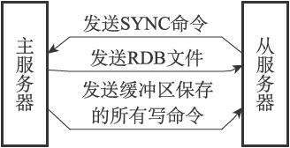
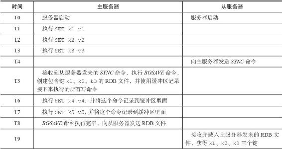
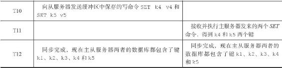
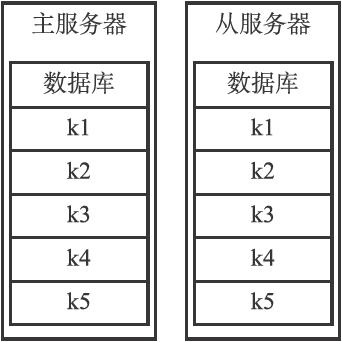
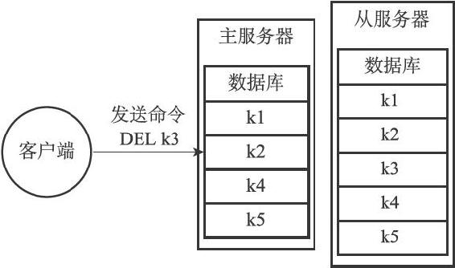
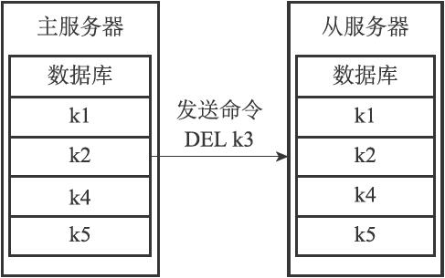

15.1 旧版复制功能的实现

Redis的复制功能分为同步（sync）和命令传播（command propagate）两个操作：

·同步操作用于将从服务器的数据库状态更新至主服务器当前所处的数据库状态。

·命令传播操作则用于在主服务器的数据库状态被修改，导致主从服务器的数据库状态出现不一致时，让主从服务器的数据库重新回到一致状态。

本节接下来将对同步和命令传播两个操作进行详细的介绍。

15.1.1 同步

当客户端向从服务器发送SLAVEOF命令，要求从服务器复制主服务器时，从服务器首先需要执行同步操作，也即是，将从服务器的数据库状态更新至主服务器当前所处的数据库状态。

从服务器对主服务器的同步操作需要通过向主服务器发送SYNC命令来完成，以下是SYNC命令的执行步骤：

1）从服务器向主服务器发送SYNC命令。

2）收到SYNC命令的主服务器执行BGSAVE命令，在后台生成一个RDB文件，并使用一个缓冲区记录从现在开始执行的所有写命令。

3）当主服务器的BGSAVE命令执行完毕时，主服务器会将BGSAVE命令生成的RDB文件发送给从服务器，从服务器接收并载入这个RDB文件，将自己的数据库状态更新至主服务器执行BGSAVE命令时的数据库状态。

4）主服务器将记录在缓冲区里面的所有写命令发送给从服务器，从服务器执行这些写命令，将自己的数据库状态更新至主服务器数据库当前所处的状态。

图15-2展示了SYNC命令执行期间，主从服务器的通信过程。

图15-2 主从服务器在执行SYNC命令期间的通信过程

表15-1展示了一个主从服务器进行同步的例子。

表15-1 主从服务器的同步过程

15.1.2 命令传播

在同步操作执行完毕之后，主从服务器两者的数据库将达到一致状态，但这种一致并不是一成不变的，每当主服务器执行客户端发送的写命令时，主服务器的数据库就有可能会被修改，并导致主从服务器状态不再一致。

举个例子，假设一个主服务器和一个从服务器刚刚完成同步操作，它们的数据库都保存了相同的五个键k1至k5，如图15-3所示。

如果这时，客户端向主服务器发送命令DEL k3，那么主服务器在执行完这个DEL命令之后，主从服务器的数据库将出现不一致：主服务器的数据库已经不再包含键k3，但这个键却仍然包含在从服务器的数据库里面，如图15-4所示。

图15-3 处于一致状态的主从服务器

图15-4 处于不一致状态的主从服务器

为了让主从服务器再次回到一致状态，主服务器需要对从服务器执行命令传播操作：主服务器会将自己执行的写命令，也即是造成主从服务器不一致的那条写命令，发送给从服务器执行，当从服务器执行了相同的写命令之后，主从服务器将再次回到一致状态。

在上面的例子中，主服务器因为执行了命令DEL k3而导致主从服务器不一致，所以主服务器将向从服务器发送相同的命令DEL k3。当从服务器执行完这个命令之后，主从服务器将再次回到一致状态，现在主从服务器两者的数据库都不再包含键k3了，如图15-5所示。

图15-5 主服务器向从服务器发送命令
