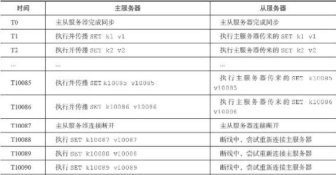
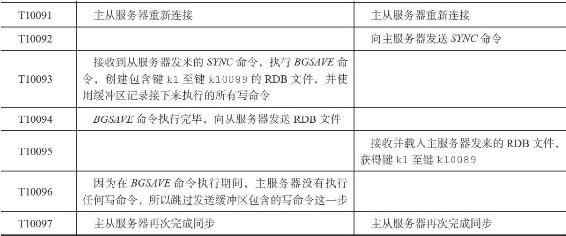

15.2 旧版复制功能的缺陷

在Redis中，从服务器对主服务器的复制可以分为以下两种情况：

·初次复制：从服务器以前没有复制过任何主服务器，或者从服务器当前要复制的主服务器和上一次复制的主服务器不同。

·断线后重复制：处于命令传播阶段的主从服务器因为网络原因而中断了复制，但从服务器通过自动重连接重新连上了主服务器，并继续复制主服务器。

对于初次复制来说，旧版复制功能能够很好地完成任务，但对于断线后重复制来说，旧版复制功能虽然也能让主从服务器重新回到一致状态，但效率却非常低。

要理解这一情况，请看表15-2展示的断线后重复制例子。

表15-2 从服务器在断线之后重新复制主服务器的例子

在时间T10091，从服务器终于重新连接上主服务器，因为这时主从服务器的状态已经不再一致，所以从服务器将向主服务器发送SYNC命令，而主服务器会将包含键k1至键k10089的RDB文件发送给从服务器，从服务器通过接收和载入这个RDB文件来将自己的数据库更新至主服务器数据库当前所处的状态。

虽然再次发送SYNC命令可以让主从服务器重新回到一致状态，但如果我们仔细研究这个断线重复制过程，就会发现传送RDB文件这一步实际上并不是非做不可的：

·主从服务器在时间T0至时间T10086中一直处于一致状态，这两个服务器保存的数据大部分都是相同的。

·从服务器想要将自己更新至主服务器当前所处的状态，真正需要的是主从服务器连接中断期间，主服务器新添加的k10087、k10088、k10089三个键的数据。

·可惜的是，旧版复制功能并没有利用以上列举的两点条件，而是继续让主服务器生成并向从服务器发送包含键k1至键k10089的RDB文件，但实际上RDB文件包含的键k1至键k10086的数据对于从服务器来说都是不必要的。

上面给出的例子可能有一点理想化，因为在主从服务器断线期间，主服务器执行的写命令可能会有成百上千个之多，而不仅仅是两三个写命令。但总的来说，主从服务器断开的时间越短，主服务器在断线期间执行的写命令就越少，而执行少量写命令所产生的数据量通常比整个数据库的数据量要少得多，在这种情况下，为了让从服务器补足一小部分缺失的数据，却要让主从服务器重新执行一次SYNC命令，这种做法无疑是非常低效的。

> SYNC命令是一个非常耗费资源的操作

> 每次执行SYNC命令，主从服务器需要执行以下动作：

> 1）主服务器需要执行BGSAVE命令来生成RDB文件，这个生成操作会耗费主服务器大量的CPU、内存和磁盘I/O资源。

> 2）主服务器需要将自己生成的RDB文件发送给从服务器，这个发送操作会耗费主从服务器大量的网络资源（带宽和流量），并对主服务器响应命令请求的时间产生影响。

> 3）接收到RDB文件的从服务器需要载入主服务器发来的RDB文件，并且在载入期间，从服务器会因为阻塞而没办法处理命令请求。

> 因为SYNC命令是一个如此耗费资源的操作，所以Redis有必要保证在真正有需要时才执行SYNC命令。
