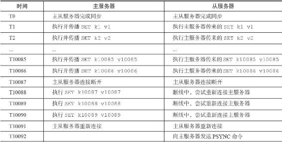
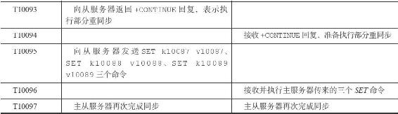
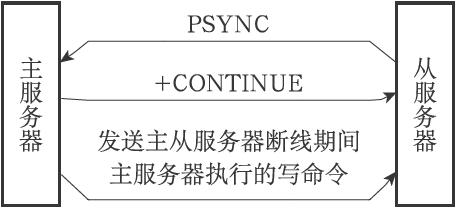

15.3 新版复制功能的实现

为了解决旧版复制功能在处理断线重复制情况时的低效问题，Redis从2.8版本开始，使用PSYNC命令代替SYNC命令来执行复制时的同步操作。

PSYNC命令具有完整重同步（full resynchronization）和部分重同步（partial resynchronization）两种模式：

·其中完整重同步用于处理初次复制情况：完整重同步的执行步骤和SYNC命令的执行步骤基本一样，它们都是通过让主服务器创建并发送RDB文件，以及向从服务器发送保存在缓冲区里面的写命令来进行同步。

·而部分重同步则用于处理断线后重复制情况：当从服务器在断线后重新连接主服务器时，如果条件允许，主服务器可以将主从服务器连接断开期间执行的写命令发送给从服务器，从服务器只要接收并执行这些写命令，就可以将数据库更新至主服务器当前所处的状态。

PSYNC命令的部分重同步模式解决了旧版复制功能在处理断线后重复制时出现的低效情况，表15-3展示了如何使用PSYNC命令高效地处理上一节展示的断线后复制情况。

表15-3 使用PSYNC命令来进行断线后重复制

对比一下SYNC命令和PSYNC命令处理断线重复制的方法，不难看出，虽然SYNC命令和PSYNC命令都可以让断线的主从服务器重新回到一致状态，但执行部分重同步所需的资源比起执行SYNC命令所需的资源要少得多，完成同步的速度也快得多。执行SYNC命令需要生成、传送和载入整个RDB文件，而部分重同步只需要将从服务器缺少的写命令发送给从服务器执行就可以了。

图15-6展示了主从服务器在执行部分重同步时的通信过程。

图15-6 主从服务器执行部分重同步的过程
