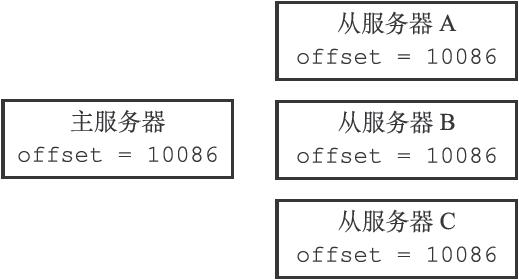
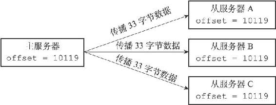
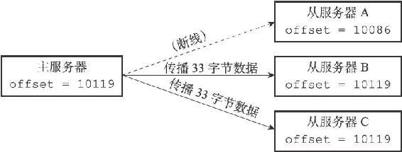
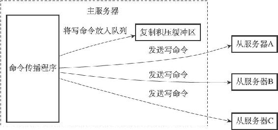
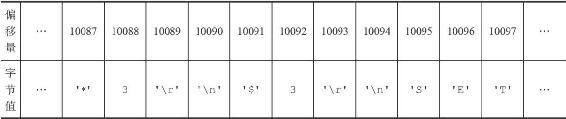
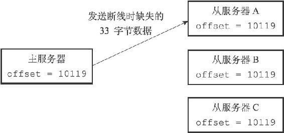

15.4 部分重同步的实现

在了解了PSYNC命令的由来，以及部分重同步的工作方式之后，是时候来介绍一下部分重同步的实现细节了。

部分重同步功能由以下三个部分构成：

·主服务器的复制偏移量（replication offset）和从服务器的复制偏移量。

·主服务器的复制积压缓冲区（replication backlog）。

·服务器的运行ID（run ID）。

以下三个小节将分别介绍这三个部分。

15.4.1 复制偏移量

执行复制的双方——主服务器和从服务器会分别维护一个复制偏移量：

·主服务器每次向从服务器传播N个字节的数据时，就将自己的复制偏移量的值加上N。

·从服务器每次收到主服务器传播来的N个字节的数据时，就将自己的复制偏移量的值加上N。

在图15-7所示的例子中，主从服务器的复制偏移量的值都为10086。

图15-7 拥有相同偏移量的主服务器和它的三个从服务器

如果这时主服务器向三个从服务器传播长度为33字节的数据，那么主服务器的复制偏移量将更新为10086+33=10119，而三个从服务器在接收到主服务器传播的数据之后，也会将复制偏移量更新为10119，如图15-8所示。

图15-8 更新偏移量之后的主从服务器

通过对比主从服务器的复制偏移量，程序可以很容易地知道主从服务器是否处于一致状态：

·如果主从服务器处于一致状态，那么主从服务器两者的偏移量总是相同的。

·相反，如果主从服务器两者的偏移量并不相同，那么说明主从服务器并未处于一致状态。

考虑以下这个例子：假设如图15-7所示，主从服务器当前的复制偏移量都为10086，但是就在主服务器要向从服务器传播长度为33字节的数据之前，从服务器A断线了，那么主服务器传播的数据将只有从服务器B和从服务器C能收到，在这之后，主服务器、从服务器B和从服务器C三个服务器的复制偏移量都将更新为10119，而断线的从服务器A的复制偏移量仍然停留在10086，这说明从服务器A与主服务器并不一致，如图15-9所示。

图15-9 因为断线而处于不一致状态的从服务器A

假设从服务器A在断线之后就立即重新连接主服务器，并且成功，那么接下来，从服务器将向主服务器发送PSYNC命令，报告从服务器A当前的复制偏移量为10086，那么这时，主服务器应该对从服务器执行完整重同步还是部分重同步呢？如果执行部分重同步的话，主服务器又如何补偿从服务器A在断线期间丢失的那部分数据呢？以上问题的答案都和复制积压缓冲区有关。

15.4.2 复制积压缓冲区

复制积压缓冲区是由主服务器维护的一个固定长度（fixed-size）先进先出（FIFO）队列，默认大小为1MB。

> 固定长度先进先出队列

> 固定长度先进先出队列的入队和出队规则跟普通的先进先出队列一样：新元素从一边进入队列，而旧元素从另一边弹出队列。

> 和普通先进先出队列随着元素的增加和减少而动态调整长度不同，固定长度先进先出队列的长度是固定的，当入队元素的数量大于队列长度时，最先入队的元素会被弹出，而新元素会被放入队列。

> 举个例子，如果我们要将'h'、'e'、'l'、'l'、'o'五个字符放进一个长度为3的固定长度先进先出队列里面，那么'h'、'e'、'l'三个字符将首先被放入队列：

> \['h'，'e'，'l'\]

> 但是当后一个'l'字符要进入队列时，队首的'h'字符将被弹出，队列变成：

> \['e'，'l'，'l'\]

> 接着，'o'的入队会引起'e'的出队，队列变成：

> \['l'，'l'，'o'\]

> 以上就是固定长度先进先出队列的运作方式。

当主服务器进行命令传播时，它不仅会将写命令发送给所有从服务器，还会将写命令入队到复制积压缓冲区里面，如图15-10所示。

图15-10 主服务器向复制积压缓冲区和所有从服务器传播写命令数据

因此，主服务器的复制积压缓冲区里面会保存着一部分最近传播的写命令，并且复制积压缓冲区会为队列中的每个字节记录相应的复制偏移量，就像表15-4展示的那样。

表15-4 复制积压缓冲区的构造

当从服务器重新连上主服务器时，从服务器会通过PSYNC命令将自己的复制偏移量offset发送给主服务器，主服务器会根据这个复制偏移量来决定对从服务器执行何种同步操作：

·如果offset偏移量之后的数据（也即是偏移量offset+1开始的数据）仍然存在于复制积压缓冲区里面，那么主服务器将对从服务器执行部分重同步操作。

·相反，如果offset偏移量之后的数据已经不存在于复制积压缓冲区，那么主服务器将对从服务器执行完整重同步操作。

回到之前图15-9展示的断线后重连接例子：

·当从服务器A断线之后，它立即重新连接主服务器，并向主服务器发送PSYNC命令，报告自己的复制偏移量为10086。

·主服务器收到从服务器发来的PSYNC命令以及偏移量10086之后，主服务器将检查偏移量10086之后的数据是否存在于复制积压缓冲区里面，结果发现这些数据仍然存在，于是主服务器向从服务器发送+CONTINUE回复，表示数据同步将以部分重同步模式来进行。

·接着主服务器会将复制积压缓冲区10086偏移量之后的所有数据（偏移量为10087至10119）都发送给从服务器。

·从服务器只要接收这33字节的缺失数据，就可以回到与主服务器一致的状态，如图15-11所示。

图15-11 主服务器向从服务器发送缺失的数据

> 根据需要调整复制积压缓冲区的大小

> Redis为复制积压缓冲区设置的默认大小为1MB，如果主服务器需要执行大量写命令，又或者主从服务器断线后重连接所需的时间比较长，那么这个大小也许并不合适。如果复制积压缓冲区的大小设置得不恰当，那么PSYNC命令的复制重同步模式就不能正常发挥作用，因此，正确估算和设置复制积压缓冲区的大小非常重要。

> 复制积压缓冲区的最小大小可以根据公式second\*write\_size\_per\_second来估算：

> ·其中second为从服务器断线后重新连接上主服务器所需的平均时间（以秒计算）。

> ·而write\_size\_per\_second则是主服务器平均每秒产生的写命令数据量（协议格式的写命令的长度总和）。

> 例如，如果主服务器平均每秒产生1 MB的写数据，而从服务器断线之后平均要5秒才能重新连接上主服务器，那么复制积压缓冲区的大小就不能低于5MB。

> 为了安全起见，可以将复制积压缓冲区的大小设为2\*second\*write\_size\_per\_second，这样可以保证绝大部分断线情况都能用部分重同步来处理。

> 至于复制积压缓冲区大小的修改方法，可以参考配置文件中关于repl-backlog-size选项的说明。

15.4.3 服务器运行ID

除了复制偏移量和复制积压缓冲区之外，实现部分重同步还需要用到服务器运行ID（run ID）：

·每个Redis服务器，不论主服务器还是从服务，都会有自己的运行ID。

·运行ID在服务器启动时自动生成，由40个随机的十六进制字符组成，例如53b9b28df8042fdc9ab5e3fcbbbabff1d5dce2b3。

当从服务器对主服务器进行初次复制时，主服务器会将自己的运行ID传送给从服务器，而从服务器则会将这个运行ID保存起来。

当从服务器断线并重新连上一个主服务器时，从服务器将向当前连接的主服务器发送之前保存的运行ID：

·如果从服务器保存的运行ID和当前连接的主服务器的运行ID相同，那么说明从服务器断线之前复制的就是当前连接的这个主服务器，主服务器可以继续尝试执行部分重同步操作。

·相反地，如果从服务器保存的运行ID和当前连接的主服务器的运行ID并不相同，那么说明从服务器断线之前复制的主服务器并不是当前连接的这个主服务器，主服务器将对从服务器执行完整重同步操作。

举个例子，假设从服务器原本正在复制一个运行ID为53b9b28df8042fdc9ab5e3fcbbbabff1d5dce2b3的主服务器，那么在网络断开，从服务器重新连接上主服务器之后，从服务器将向主服务器发送这个运行ID，主服务器根据自己的运行ID是否53b9b28df8042fdc9ab5e3fcbbbabff1d5dce2b3来判断是执行部分重同步还是执行完整重同步。
