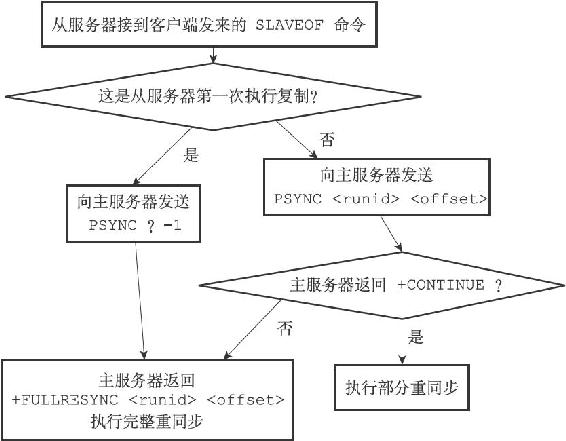

15.5 PSYNC命令的实现

到目前为止，本章在介绍PSYNC命令时一直没有说明PSYNC命令的参数以及返回值，因为那时我们还未了解服务器运行ID、复制偏移量、复制积压缓冲区这些东西，在学习了部分重同步的实现原理之后，我们现在可以来了解PSYNC命令的完整细节了。

PSYNC命令的调用方法有两种：

·如果从服务器以前没有复制过任何主服务器，或者之前执行过SLAVEOF no one命令，那么从服务器在开始一次新的复制时将向主服务器发送PSYNC ? -1命令，主动请求主服务器进行完整重同步（因为这时不可能执行部分重同步）。

·相反地，如果从服务器已经复制过某个主服务器，那么从服务器在开始一次新的复制时将向主服务器发送PSYNC <runid> <offset>命令：其中runid是上一次复制的主服务器的运行ID，而offset则是从服务器当前的复制偏移量，接收到这个命令的主服务器会通过这两个参数来判断应该对从服务器执行哪种同步操作。

根据情况，接收到PSYNC命令的主服务器会向从服务器返回以下三种回复的其中一种：

·如果主服务器返回+FULLRESYNC <runid> <offset>回复，那么表示主服务器将与从服务器执行完整重同步操作：其中runid是这个主服务器的运行ID，从服务器会将这个ID保存起来，在下一次发送PSYNC命令时使用；而offset则是主服务器当前的复制偏移量，从服务器会将这个值作为自己的初始化偏移量。

·如果主服务器返回+CONTINUE回复，那么表示主服务器将与从服务器执行部分重同步操作，从服务器只要等着主服务器将自己缺少的那部分数据发送过来就可以了。

·如果主服务器返回-ERR回复，那么表示主服务器的版本低于Redis 2.8，它识别不了PSYNC命令，从服务器将向主服务器发送SYNC命令，并与主服务器执行完整同步操作。

流程图15-12总结了PSYNC命令执行完整重同步和部分重同步时可能遇上的情况。

图15-12 PSYNC执行完整重同步和部分重同步时可能遇上的情况

为了熟悉PSYNC命令的用法，让我们来看一个完整的复制——网络中断——重复制例子。

首先，假设有两个Redis服务器，它们的版本都是Redis 2.8，其中主服务器的地址为127.0.0.1:6379，从服务器的地址为127.0.0.1:12345。

如果客户端向从服务器发送命令SLAVEOF 127.0.0.1 6379，并且假设从服务器是第一次执行复制操作，那么从服务器将向主服务器发送PSYNC ? -1命令，请求主服务器执行完整重同步操作。

主服务器在收到完整重同步请求之后，将在后台执行BGSAVE命令，并向从服务器返回+FULLRESYNC 53b9b28df8042fdc9ab5e3fcbbbabff1d5dce2b3 10086回复，其中53b9b28df8042fdc9ab5e3fcbbbabff1d5dce2b3是主服务器的运行ID，而10086则是主服务器当前的复制偏移量。

假设完整重同步成功执行，并且主从服务器在一段时间之后仍然保持一致，但是在复制偏移量为20000的时候，主从服务器之间的网络连接中断了，这时从服务器将重新连接主服务器，并再次对主服务器进行复制。

因为之前曾经对主服务器进行过复制，所以从服务器将向主服务器发送命令PSYNC 53b9b28df8042fdc9ab5e3fcbbbabff1d5dce2b3 20000，请求进行部分重同步。

主服务器在接收到从服务器的PSYNC命令之后，首先对比从服务器传来的运行ID53b9b28df8042fdc9ab5e3fcbbbabff1d5dce2b3和主服务器自身的运行ID，结果显示该ID和主服务器的运行ID相同，于是主服务器继续读取从服务器传来的偏移量20000，检查偏移量为20000之后的数据是否存在于复制积压缓冲区里面，结果发现数据仍然存在。

确认运行ID相同并且数据存在之后，主服务器将向从服务器返回+CONTINUE回复，表示将与从服务器执行部分重同步操作，之后主服务器会将保存在复制积压缓冲区20000偏移量之后的所有数据发送给从服务器，主从服务器将再次回到一致状态。
